# Hermes Agent - Setup and Basic Usage
* [Youtube Link: Hermes Agent - Full Course & Setup Guide - For COMPLETE Beginners](https://www.youtube.com/watch?v=mTYxpIRK7xA)

---

## Table of Contents
* [What is Hermes Agent?](#what-is-hermes-agent)
* [How Hermes Agent Works](#how-hermes-agent-works)
* [Security Disclosure & Risks](#security-disclosure--risks)
* [VPS Setup & Deployment](#vps-setup--deployment)
* [Hermes Setup Options](#hermes-setup-options)
* [Telegram Message Setup](#telegram-message-setup)
* [Browser Tools & Setup](#browser-tools--setup)
* [Basic Usage and TUI](#basic-usage-and-tui-terminal-user-interface)
* [Telegram Usage](#telegram-usage)
* [Setting the User Preferences & Soul](#setting-the-user-preferences--soul)
* [GitHub Backup & Setting Credentials](#github-backup--setting-credentials)
* [How to Connect ANY Tool (Gmail, Meta, etc.)](#how-to-connect-any-tool-gmail-meta-etc)
* [Scheduled Automations](#scheduled-automations)

---
 

## What is Hermes Agent?
- A personal AI assistant that **runs 24/7 on a server** you control - reads your email, manages your calendar, and **gets smarter every day**.
- Writes its **own skills** & runs **scheduled automations**.
- Works with **any LLM** - OpenAI, Anthropic, Google, OpenRouter, Ollama

---
 

## How Hermes Agent Works?
### 5 Core Concepts
1. **Memory** - knows who you are
2. **Skills** - reusable recipes
3. **Soul** - personal & tone
4. **Crons** - scheduled jobs
5. **Self-loop** - improves itself

#### Example Directory Structure:

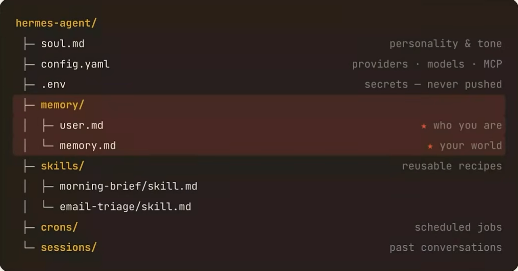

### Memory
- **Inside the two files:**

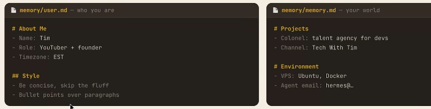

### Skills

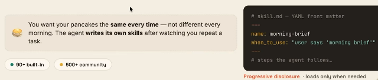

### Agent Soul
- **soul.md** shapes the tone & vibe of your agent. Pick one - or invent your own.

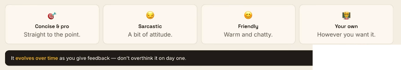

### Cron (Scheduled Automations)

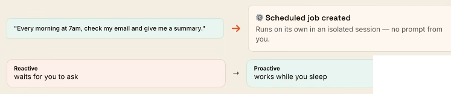

### The Loop
- It gets better as you use it.

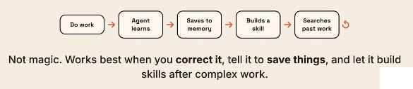

---
 

## Security Disclosure & Risks
### What could actually go wrong?
- You're giving an AI access to your email, calendar & money.
- Treat it like a new intern - every risk has a guardrail.

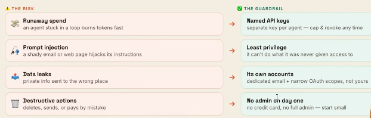

### Lock it down!

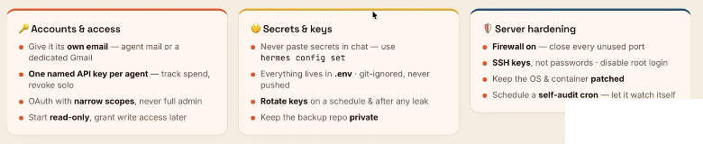

---
 

## VPS Setup & Deployment
### Your VPS checklist
1. Spin up the VPS - Ubuntu 24.4
2. One-click Hermes deploy (Docker)
3. Run the setup wizard - provider + model
4. Connect Telegram via BotFather
5. Onboard - build memory + soul
6. Back up to a private GitHub repo
7. Create your first skill
8. Add tools - browser, voice, vision
9. Connect Composio - email + calendar
10. Schedule your daily crons

---
 

## Hermes Setup Options

1. Select **Full setup**.

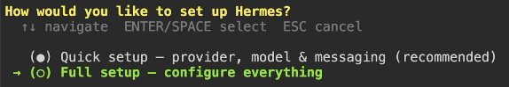

2. Select your **provider** then press **Enter**.
3. Depending on the provider that you selected, follow its steps (Example: OpenAI)

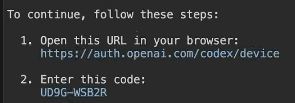

4. Select your **default model**.
5. Select **TTS provider**. You can select here the default: **Keep current (Edge TTS)**.
6. Select **terminal backend**: **Keep current (local)**
7. **Agent Settings** 
    - `Max iterations [90]: 90` (Note: Iterations is essentially how many times the LLM will be called in one task. Default value is 90.)
    - `Tool progress mode [all]: all` (Note: Default is 'all' - it will show you the activity of what the LLM is doing.)
8. **Context Compression**
    - `Compression threshold (0.5-0.95) [0.5]: 0.8` (Note: I suggest that you set this around 0.8. Now this is when it's going to automatically compress what's happening in the conversation.)
9. **Session reset mode:** Inactivity + daily reset (recommended - reset whichever comes first)

---
 

## Telegram Message Setup
- **Configure this agent** so you can message it from something other than this UI.
1. Press `Space` to put a checkmark, then press `Enter` when you're done selecting. In this example, we only selected `Telegram`.
2. Go to your telegram app.
    - Search for `@botfather`, select the one with the **blue checkmark** then click `Open`
    - Type and enter `/newbot` - to setup a new telegram bot
    - Name your bot, example: `HermesAgent`
    - Create a username, make sure it ends with 'bot', example: `hermesagent_bot`
    - This will provide you the bot token, copy it.
3. Go back to hermes and paste there the bot token.

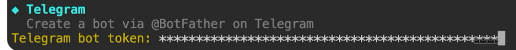

4. Follow the below steps to allow only your **user ID** to chat with the agent. (Note: type and enter `/start` after the steps below if it doesn't automatically shows up)

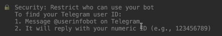

---
 

## Browser Tools & Setup
1. You can just press `Enter` here to proceed with the default selected tools.
2. If you do a lot of browser related stuff, select **Browserbase or Firecrawl** bu they are **paid**. If not just use the default **Local Browser** so it's free.

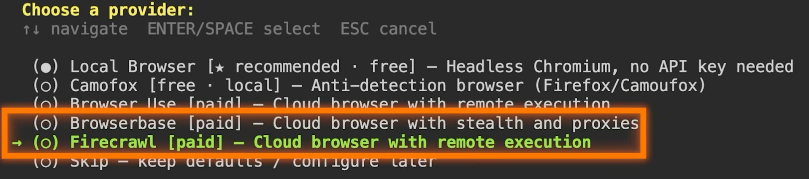

3. Choose your provider for **image generation**. Depending on what you selected as your model earlier, you can select it here for free.

4. Choose your provider for TTS, you can select again the default free one (Microsoft Edge TTS)

5. Select a choose provider for a search engine. Select again the default free one (Firecrawl Self-Hosted). Just press `Enter` for the proceeding steps.

---
 

## Basic Usage and TUI (Terminal User Interface)
- `hermes` - to enter Hermes Agent TUI
- `ctrl + c` - to quit Hermes
- `hermes setup` - to get back on the setup, press 'ctrl + c' to exit this setup

---
 

## Telegram Usage
- In the telegram app, enter the `BotFather` chat, then click the hermes username that you created earlier. Example:

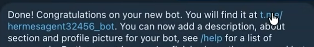

- Type and enter `/start`, then `hello`. (Note: If hermes did not respond, go back to Hermes TUI, then tell it the problem and ask it to fix it.)

---
 

## Setting the User Preferences & Soul
- Go to Hermes TUI or Telegram app.
- Message it to setup its soul. 
- Example: "Hey, my name is <your_name>. I'm interested in <your_interest> and my goal for you is to <your_goal>. I want you to update your soul MD so that you're always concise to the point and direct. Don't give me any fluff, just give me all of the information and explain to me why it is that you're doing something, and the steps and processes that you follow, so that I know what's going wrong and I can help kind of debug some of your responses. That's what I appreciate in a bot, and that's what I want your soul to be."

---
 

## GitHub Backup & Setting Credentials
1. Go to your github account.
2. Click `Create new... - > New repository`

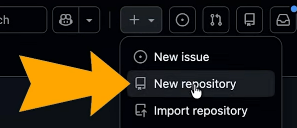

3. Provide a **Repository name**, and choose the visibility to **Private**. Then click the **Create repository**.
4. Go to your `Settings -> Profile -> Developer Settings`
5. Click `Personal access tokens -> Fine-grained tokens`, then click the `Generate new token` button.
    - Provide the **Token name**, example: `hermes-backup-repo`
    - Change to `No expiration`
    - As for the **Repository access** select `Only select repositories` then choose the repository that you created in **Step 3**.
    - Click the **Add permissions** button, then only select **Contents**, then choose **Read and write**

    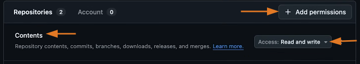

    - Click **Generate token**
    - Copy your **personal access token**
6. Go to your VPS Terminal, run `hermes config set GITHUB_TOKEN <paste_your_key_here>`
7. If successful, it will bes stored in a `.env` file.

8. In the terminal, run `hermes` to enter the Hermes TUI.
9. Message it to test the github backup repo. Example: "Hi. I've given you access to a fine grained GitHub personal access token. This has access to one GitHub repo. I'm going to share the URL, <paste_your_github_url>. What I would like you to do is backup the current Hermes configuration and state without saving any secret keys, credentials, or things that are sensitive to GitHub. You have the ability to push to this GitHub repository. Go ahead."
10. Check the github repo, if all is good go back again to Hermes TUI and message: "Okay, this is great. I'd like you to update the memory now. So whenever you make any significant changes I'd like you to make a new commit or a new save to GitHub."

---
 

## How to Connect ANY Tool (Gmail, Meta, etc.)
1. Go to https://composio.dev/ then create an account.
2. After creating an account, go to your dashboard, https://dashboard.composio.dev/, then click **Connect Apps**

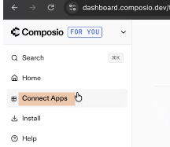

3. In this example, let's connect to **Gmail**.
    - Click the **Connect** button for **Gmail**.
    - Click **Select all**, then click **Continue**
4. Go to **Install**, then the click the **Install** button for **OpenClaw**.

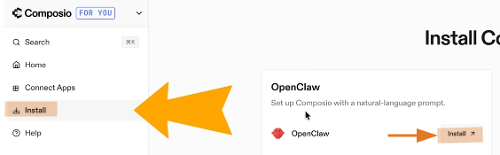

5. Copy the instructions and paste it in Hermes, and message: "Can you run these instructions and help me connect to composio?"

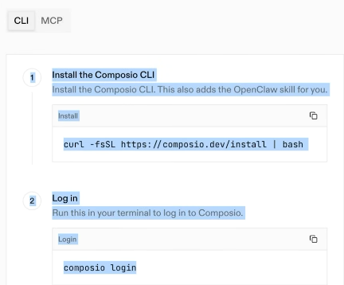

6. Follow the instructions that the hermes will provide.
7. After you connected them, test it by messaging hermes, "Tell me what the two last emails were in my inbox."

---
 

## Scheduled Automations
- After connecting your tools like Gmail, you can then message hermes, "Hey, everyday at 7 a.m., I want you to read through my emails from the night before and just give me a quick summary of any action items."
- You can also check this in your Github account.

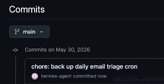

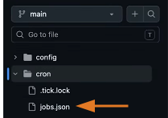