# n8n Tutorial – Zero to Hero Course
- [Youtube Link: n8n Tutorial – Zero to Hero Course](https://www.youtube.com/watch?v=UIf-SlmMays)

---

## Table of Contents
* [Foundations of n8n: Nodes, Architecture, and Data Types](#foundations-of-n8n-nodes-architecture-and-data-types)
* [Building Your First AI Agent Workflow (Chatbot/Email Agent Demo)](#building-your-first-ai-agent-workflow-chatbotemail-agent-demo)
* [Authentication Best Practices for HTTP Request Node](#authentication-best-practices-for-http-request-node)
* [Google Drive/Sheets/Docs Authentication Setup via Google Cloud Console](#google-drivesheetsdocs-authentication-setup-via-google-cloud-console)
* [Multi-Agent Research Workflow with Perplexity & OpenAI](#multi-agent-research-workflow-with-perplexity--openai)
* [Slack API Setup and Integration](#slack-api-setup-and-integration)
* [Fun Slack Use Case - Let AI Do Your Job](#fun-slack-use-case---let-ai-do-your-job)
* [HTTP Request Node and API Call Scenarios (Cat Facts, Weather, Web Scraper)](#http-request-node-and-api-call-scenarios-cat-facts-weather-web-scraper)
* [Text-to-Image Workflow with AI Prompt Generation](#text-to-image-workflow-with-ai-prompt-generation)

---
<br>

## Foundations of n8n: Nodes, Architecture, and Data Types

### Introduction to n8n and Nodes
- **n8n** is a free and open workflow automation tool that lets you connect different apps and services with ease.
- **Nodes** are the individual, visual building blocks that connect together to form an automation workflow.
    - **Trigger node** starts an automation workflow when a specific event happens.
    - **Action node** performs a task or processes data inside or at the end of that workflow.


### Explore AI Agent architecture and API flow


### Automate a full email-to-Slack use case


### Work with input formats and expressions
- **Every node has an input and an output data**, and the output data of this node will be the input payload of the next node. And that's how the logic strings the entire workflow.
- **Input and Output Formats** - Schema, Table, and JSON (Note: JSON is the most common.)


- **Fixed vs Expression:** 
    - **Fixed** - treats your input as literal text or static configuration data.
    - **Expression** - allow your workflow to adapt to real-time inputs instead of being hardcoded in.

### Understand how n8n handles data types
- **String:** `Hello world"`
- **Numbers:** `42, 3.14, -100`
- **Boolean:** `True or False`
- **Arrays:** `[1,2,300], ["James","Tony","Samantha"]`
- **Object:**
```
{
"user":{
    "name":"John",
    "email":"john@gmail.com"
    }
}
```

### Community Nodes
- **Extensions and custom integrations** built by the n8n user community to provide functionality not available in n8n's built-in nodes.

---
<br>

## Building Your First AI Agent Workflow (Chatbot/Email Agent Demo)

1. Open nodes panel or press `N`. It will generate a list of options or possible **trigger nodes** that you can start your workflow with.
2. The usual option to choose here is **Trigger Manually**, but for this current task, select **On chat message**.
3. You can type **"hello"** on the chatbox to interact with it. Note: One way to differentiate between a normal node and a trigger node is that **trigger nodes have a lightning icon**. Open this newly created node by clicking it (click the image below)


4. Since this is a trigger node, you'll only have an **OUTPUT** as shown below. You can also see the types of data here (Schema, Table, JSON). Click **JSON** as this is the coommnly used.


5. Click the `+` to create the next node, then select the **AI -> AI Chatbot**


Notice from the image below that the previous **OUTPUT** node now becomes the **INPUT** node. Click the **Chat model** to select an LLM for the brain of this AI chatbot node.


 Then click the `+ Create new credential` to put your API key. Depending on the LLM that you selected, choose a **model**.

6. Now click `+` for **Memory -> Simple Memory**. Note: This is basically the persistent memory so that the AI Agent can remember your conversation.


Once the **Simple Memory** is added, the **AI Agent node** becomes **yellow**. This means that you need to re-populate the chats. This should turn the node to **green**.

7. Now click the last `+` for **Tools -> Gmail Tool**.
    - Click the `+ Create new credential` to input your gmail account. Since the **To, Subject, Message** are not fixed and will be decided depending on what you chat, click the ✨.
    - Change the **Email Type** to **Text**.
    - Click the **Options** on the bottom and select **Append n8n Attribution** then **Toggle OFF**. Note: This option will remove the part of the email that it came from an AI automation.


8. Now that the you configured the Tools element, the **AI chatbot** node becomes **yellow** again. Click the node. 
    - Source for Prompt (User Message): **Define below**
    - Drag and drop the `chatinput` variable on Prompt
    - Click the **Expression** because the information will change depending our input in the chat.
    - Change the **User Message** to **System Message**


9. Now test the chat by giving its needed info (Your name, to whom you want to send your email, and the email body message). If you want to re-run the flow that you already created, you can click the **Play (Execute Step)** button.


10. Open up the **chat node** and go to the top right hand corner you can see that there's an option to **pin the data**. Now this is super useful because now you don't have to key in or populate this particular node with new data all the time. And this is extremely valuable when you're running a workflow that uses API tokens or might cost you for every run of the workflow. **So that every single demo run or every single trial run is using the data that's already been populated**.


11. Toggle ON the **Activate** so that your workflow will be pushed to production.


12. To make this workflow available to the public, in the **chat node**, toggle ON **Make Chat Publicly Available**, and this will give you a **url that you can share**.


---
<br>

## Authentication Best Practices for HTTP Request Node
- The HTTP request node is a very convenient way for us to **replicate an API call without configuring everything**.

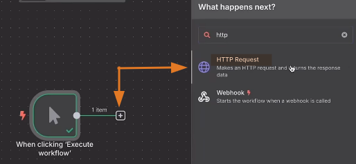

- And it's especially useful when we can just **go to an API documentation and hit the import curl**.

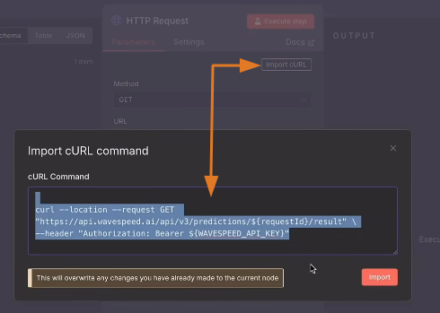

- After you've imported the curl command, it automatically configures the header section and populate it with the name and the value format of the API keys for authorization.
- Now you can do it this way **or you can actually set up a credential type** here (see image below).

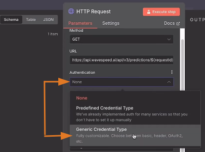

- There are **two main reasons** why you would want to do it this way.
    - **For reusability:** The moment you have set this up, you can just pick from the list of credential you've created in the next upcoming nodes or even in another workflow.
    - **For security reasons:** Setting up **credential type** allows you to approach the authentication without hard coding the API key into the parameters. All your credentials is going to be stored under credential tab.

    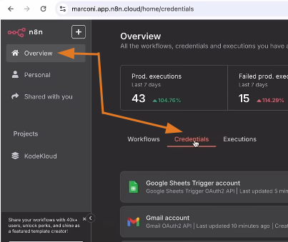

---
<br>

## Google Drive/Sheets/Docs Authentication Setup via Google Cloud Console

### Google Drive Node

- We're going to start with here is the Google Drive node.
- The way to connect it is going to be similar across all nodes.
- Once you've connected it once, everything else would just be a simple matter of enabling APIs through your Google Cloud console.

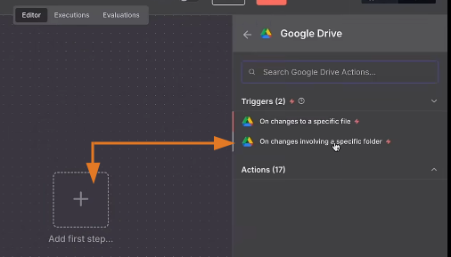

- Create a new credential.

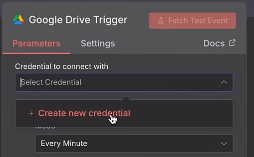

- Go to https://console.cloud.google.com/ to get your **client ID** and **client secret**
- Click **Select a project**, then click **New project**, name it (example) **n8n-test**, then click **Create**. **Select this project**.

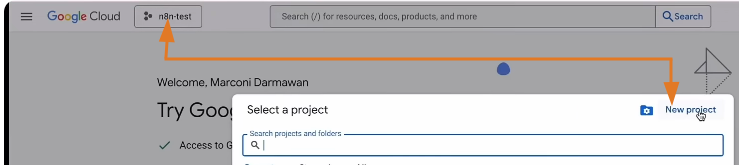

- On the left select **APIs & Services** -> **OAuth consent screen**
    - On the middle, click **Get started**
    - Fill up the **App Information, Audience, Contact Information**
    - Click **Finish** then **Create**
    - Under **OAuth Overview** -> **Metrics**, click **Create OAuth client**
        - Applicattion type: **Web application**
        - Name: **n8n-demo**
        - Under **Authorized redirect URIs** click **Add URI**
        - Go back to **n8n** to copy the **OAuth redirect URI**, go back to Google console to paste it. Then click **Create**

        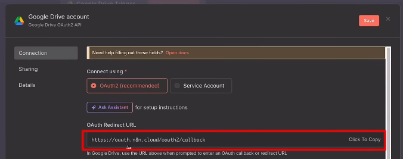

        - Now you'll have the **Client ID** to copy  then paste in on n8n.
    - Go back to Google cloud console, and click the your client ID.

    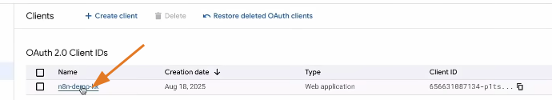

    - Copy the **Client secret** to paste it on your n8n workflow.

    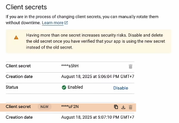

    - DO NOT click the **Sign in with Google**

    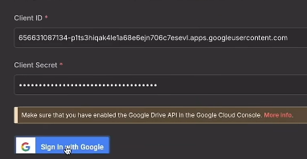

    - Go back to Google cloud console, on the left click **Branding**, then click **Add domain**, input **n8n.cloud**, then click **Save**. 
    - Go to search bar (on top), type **drive**, then click the result **Google Drive API**, then click **Enable**
    - On the left click **Audience**, then click **Publish app**
    - Go back to your n8n workflow and now you can click the **Sign in with Google**
        - You will be redirected to **Sign in with Google** page, select your account.
        - Click **Advanced** the click **Go to n8n.cloud (unsafe)**
        - Select what n8n.cloud can access: **Select all**
        - Click **Continue**. Go back to your n8n workflow to see that your **Account is connected**

- Once you've connected your account, you'll be able to see the list of folders that you have on your drive.

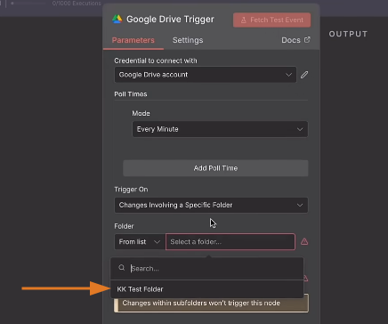

- So anytime a file is uploaded it's going to trigger this.

### Google Sheets, Google Docs, and other Google tools Nodes
- For the other nodes such as Google Sheet, Google Docs, what you need to do is just to **go back to your Google Cloud Console** and essentially **enable your APIs** by typing in the Google notes or the Google tool that you want to use on the **Search bar**

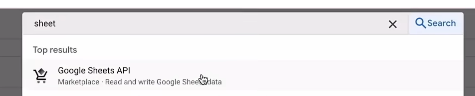

- Then click the **Enable** button.
- Then you can go back and connect that on your n8n and you're good to go.

---
<br>

## Multi-Agent Research Workflow with Perplexity & OpenAI
- We're going to build a simple workflow of an **AI research agent**:
    - It goes out to the internet and search for the latest AI news
    - Then send it across to you via email.
    - Logs those particular headlines so that the next day the workflow is going to check against the logs so that it doesn't repeat the same headlines.
- This is what the entire workflow will look like:

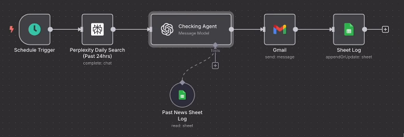

### 1. Schedule Trigger Node

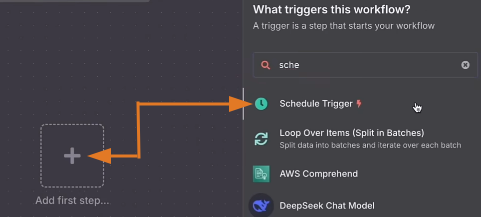

- Trigger Rules:
    - Trigger Interval: **Days**
    - Days Between Triggers: **1**
    - Trigger at Hour: **9 am**
- Click **Execute step** to populate the data.
- Click **Pin data**

<br>

### 2. Perplexity Node
- Click **Perplexity** then choose **Message a model**

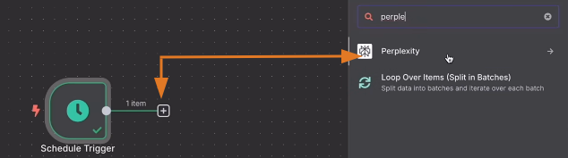

- Go to https://www.perplexity.ai/
    - On the left click **Account -> All settings**
    - On the left click **API billing** to top-up your account ($5 minimum) so that you'll have access to **API keyes**
    - On the left click **API keys**
        - Click **Create key** then copy it
    - Return to your n8n workflow
- In **Perplexity Node**, under **Parameters**
    - Create new credential:
        - Paste the API key here, then **Save**
    - Operation: **Message a Model**
    - Model: **Sonar Pro**
    - Messages
        - Text: **"You are an expert AI research analyst specialized in......"**
        - Role: **System**
        - Text: **"Find and summarize the most recent AI news within the last 24 hrs....."**

        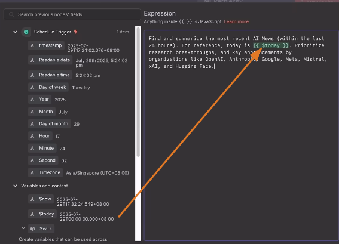

        - Role: **User**
    - Click **Add Option** (bottom part)
        - Select **Search Recency Filter** -> **Day**
    - Click **Execute step** when you're done.
- Click **Pin data** to save your API token.

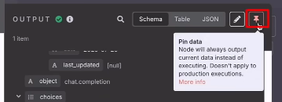

<br>

### 3. Checking Agent (using OpenAI Node)

- Click **OpenAI** then choose **Message a model**

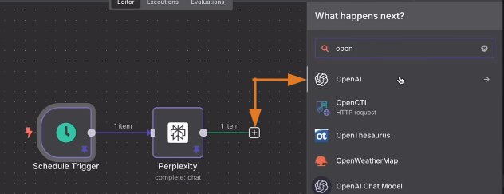

- In **OpenAI Node**, you can rename it to **News Checking Agent**

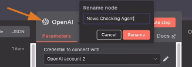

- Under the **Parameters** tab
    - Credential to connect with:
        - **Create new credential** or select the created credential from the prebious topic.
    - Resource: **Text**
    - Operation: **Message a model**
    - Model: **GPT-4**
    - Messages:
        - Prompt: Drag the summary from Perplexity in your prompt.

        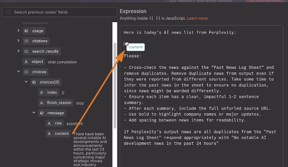

        - Role: **User**
        - Prompt: "You are an AI news formatter. Your role is to process, check and clean AI news results fetched from Perplexity, to ensure readability and that past headlines are not repeated."
        - Role: **System**
    - Click the `+` Tools (bottom part):
        - Select **Google Sheet** tool

- In **Google Sheet Node**, rename it to **Past AI News Log**
- Under **Parameters** tab:
    - Credential to connect with: **Google Sheets account** (account created from previous topic)
    - Tool Description: **Set Automatically**
    - Resource: **Sheet Within Document**
    - Operation: **Get Row(s)**
    - Document: Select the google sheet file that you created like the example below.
    
    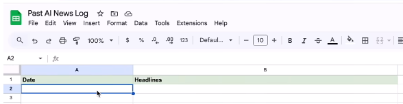

    - Sheet: Select the sheet name from your file.
- Go back to the workflow, click the **Play** for the **News Checking Agent**

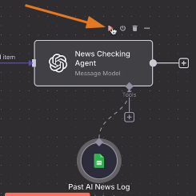

<br>

### 4. Gmail Node

- Click **Gmail** then choose **Send a message**

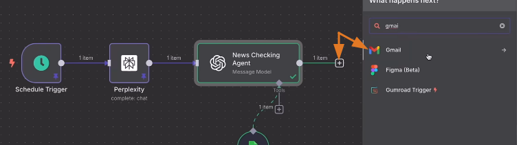

- Follow the parameters from the example below: (Note: Make sure to turn off the **Append the Attribution** like we did in a previous topic)

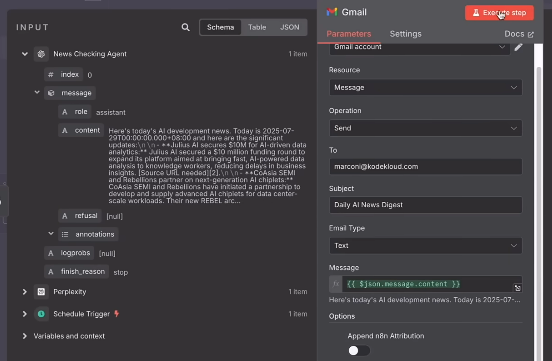

- Click **Execute step**

<br>

### 5. Sheet Log (using Google Sheet Node)

- Click **Google Sheets** then choose **Append row in sheet**

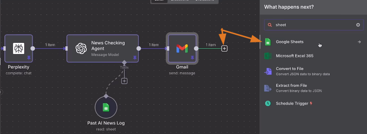

- In **Google Sheets Node**, under the **Parameters** tab:
    - Credential to connect with: **Google Sheets account**
    - Resource: **Sheet Within Document**
    - Operation: **Append Row**
    - Document: **Past AI News Log**
    - Sheet: **Sheet1**
    - Values to Send:
        - Date: Drag the **today** variable from the **Schedule Trigger**
        - Hedalines: Drag the **content** variable from the **News Checking Agent**

    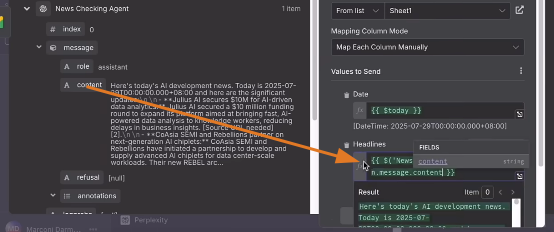
    - Click **Execute step**

---
<br>

## Slack API Setup and Integration
- Go to https://api.slack.com/apps/
- Click **Create New App** button
    - Name: **n8n-demo-bot**
    - Pick a workspace to develop your app in: **Slack Automation Lab**
    - Click **Create App**
- On the left click **OAuth & Permissions**
    - Scroll down to **Scopes** section
    - Under **Bot Token Scopes** click the **Add an OAuth Scope** button, then add these:
        - app_mentions:read
        - chat:write
        - channels:read
        - groups:read
        - users.profile:read
        - users:read
    - Scroll up and go to **OAuth Tokens** section
        - Click the **Install to Slack Automation Lab** button
        - Click **Allow** button 
        - Now a **Bot User OAuth Token** has been generated, copy it.
- Go back to your n8n workflow.

### 1. Slack Trigger Node
- Click **Slack** then choose **On bot app mention**

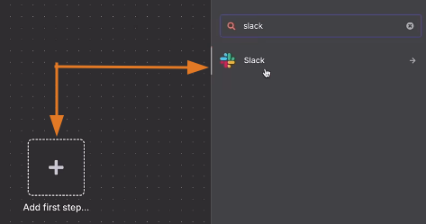

- Under the **Parameters** tab:
    - Credential to connect with: **Create new credential**
        - Paste here the **Bot User OAuth Token**, click **Save**
    - Webhook URLs:
        - For now, click the **Test URL** (**Important Note:** When you're done with your workflow, select **Production URL** and paste here the **public URL** of your project -- refer to **steps 11 & 12** in [Building Your First AI Agent Workflow](#building-your-first-ai-agent-workflow-chatbotemail-agent-demo))
            - Copy the URL from the **Test URL**
    - Channel to watch: 
        - From list: **all-slack-automation-lab**
    - Click **Execute step**

- Go back to your browser https://api.slack.com/apps/
    - On the left click **Event Subscriptions**
        - Toggle ON the **Enable Events**
        - Paste the **Test URL** to **Request URL**
        - Click the **Subscribe to bot events**
            - Click **Add Bot User Event**
                - Add `app_mention`
                - Click **Save Changes**

- Go to your Slack App.
    - Click the **View all members of this channel**
        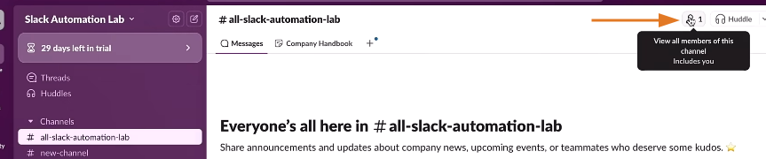

        - Click the **Integrations** tab.
            - Add your **n8n-demo-bot**

- Go back to your n8n workflow, and click **Execute step** button.
    
    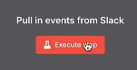

- Go back to your Slack App.
    - In chat type: `@n8n-demo-bot hello`
    
<br>

### 2. AI Agent Node

- Click **AI** then choose **AI Agent**

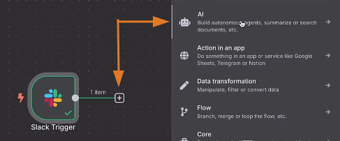

- Under the **Parameters** tab:

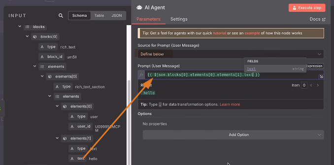

- Add chat model: **Select from your available models**
- Add a simple memory:

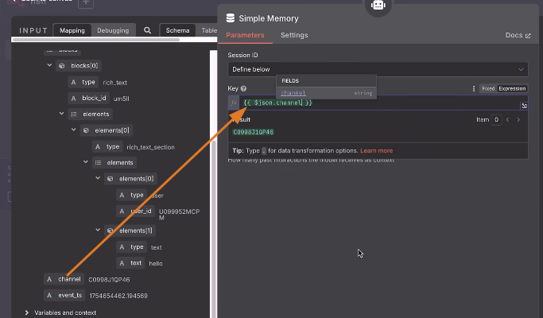

<br>

### 3. Slack Node
- Click **Slack** then choose **Send a message**

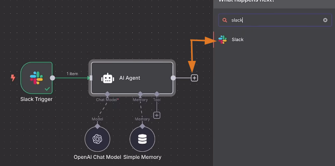

-  Under the **Parameters** tab:
    - Note: For the Channel, this is just the **ID of all-slack-automation-lab**. you can still select it by using "From list"

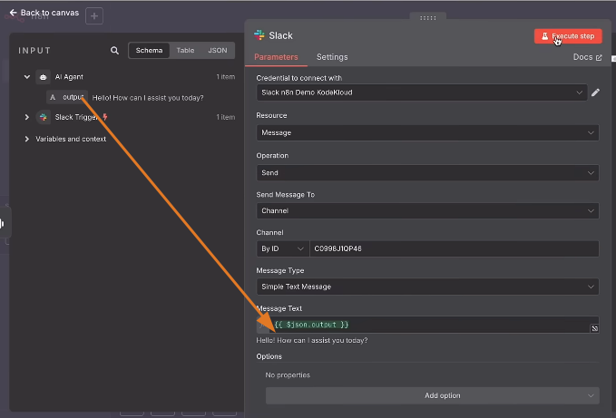

---
<br>

## Fun Slack Use Case - Let AI Do Your Job
- We'll edit the Slack workflow from the previous topic.
- We're going to try if we can have the AI agent fully take over our profile and respond on our behalf, a.k.a. do our job for us.

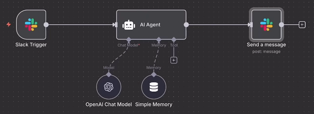

### 1. Slack Trigger Node
- Go to https://api.slack.com/apps/
- Click your **App Name**, or create a new one (example) **n8n-demo-bot**
- On the left click **OAuth & Permissions**
- Go down to the **Scope** section.
    - Go to **User Token Scopes**, and these are the list of required scopes that are typically recommended in order for it to function well.

    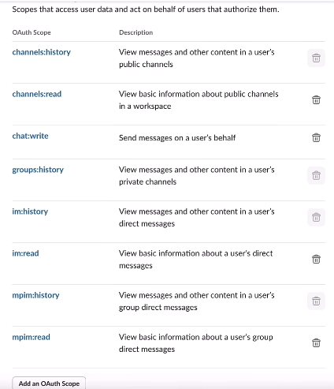

    - Once you added all the required scopes, click the `reinstall your app` that will pop-up on top.

    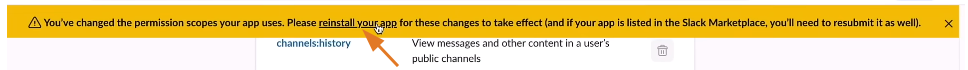

    - Go to **Bot Token Scopes**, make sure that you added `chat:write.customize` and it is checked (turned ON).
- Once you're done go to **OAuth Tokens** section, and copy your `User OAuth Token`
- Go back to your n8n workflow, and in the **Slack Trigger Node**, **Create new credential**, click **Access Token** button, and paste here your `User OAuth Token`
- Go back to your browser https://api.slack.com/apps/, on the left, click **Event Subscriptions**
    - Click **Subscribe to events on behalf of users**
    - Add these 4 event subscriptions:

    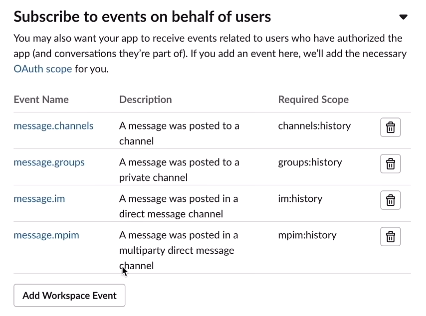
- Go back to your n8n workflow, and click the **Slack Trigger Node**, copy the **Parameters** below:

    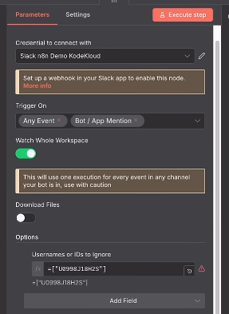

    - At the bottom ignore your **own username**. To get your username ID, follow these steps:
        - Go to you Slack profile

        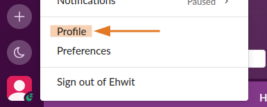

        - On the right click the `three dots` -> then click `Copy member ID`

<br>

### 2. AI Agent Node

- Click the **AI Agent Node**
- Copy the **Parameters** below:
    
    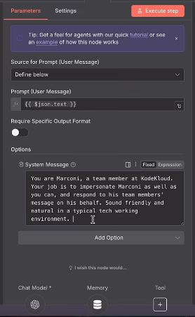

    - Add the **Chat Model** and **Memory** tools

### 3. Slack Node
- Click the **Slack Node**
- Copy the **Parameters** below:

    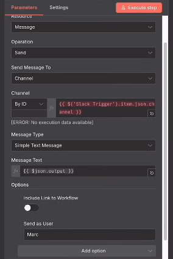

    - Note: Replace **Send as User** with your slack username.

- Click **Execute workflow**

---
<br>

## HTTP Request Node and API Call Scenarios (Cat Facts, Weather, Web Scraper)

### First Scenario: 
- We'll do a simple API call to a public API endpoint that doesn't need any authentication in order to get some fun little facts about cats.

#### 1. Trigger Manually Node

- Click **Trigger Manually**

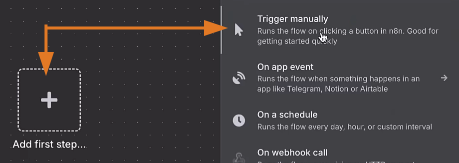

- Click the **Execute workflow** button, then click the node, notice that it has a blank OUTPUT.

#### 2. HTTP Request Node

- Click **HTTP Request**

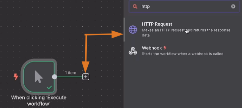

- Under the **Parameters** tab:
    - Method: **GET**
    - URL: https://catfact.ninja/fact
    - Click the **Execute step** button

<br>

### Second Scenario:
- We're going to make an API call to open weathermap.org to get you the latest information about the weather on a specific city that you requested.

#### 1. Trigger Manually Node

- Click **Trigger Manually**, then click the **Execute workflow** button, then click the node, notice that it has a blank OUTPUT.

#### 2. HTTP Request Node

- Go to https://openweathermap.org/curent and signup.
    - Scroll down to **Built-in API request by city name** section
    - Copy the API call that you want.

    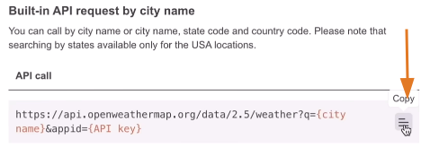

- Go back to your n8n workflow:
    - Click the `+` then click **HTTP Request** to create the node
    - Under the **Parameters** tab:
        - Method: **POST**
        - URL: `<paste here the API call>` (Note: Replace the `{city name}` that you want)
        - Authentication: **Generic Credential Type**
        - Generic Auth Type: **Header Auth**
        - Header Auth: **Create new credential**
            - Rename this to **Openweathermap Demo**
            - Name: **x-api-key**
            - Value: Paste here the API key generated from openweather.org
            - Click **Save**
        - Click the **Execute step** button

<br>

### Third Scenario:
- We'll make an API call to a web scraper called Firecrawl that could intelligently scrape any web pages that you like.

<br>

#### 1. Trigger Manually Node

- Click **Trigger Manually**, then click the **Execute workflow** button, then click the node, notice that it has a blank OUTPUT.

#### 2. HTTP Request Node

- Go to https://www.firecrawl.dev/ and signup.
    - Go to **Dashboard** -> **Docs** -> **API Reference** tab -> **Scrape**. Click **Try it**

    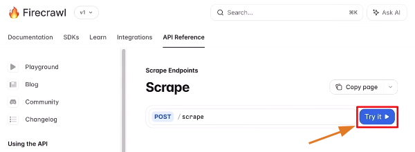

    - Put the URL of the site that you want to scrape, then copy the curl command.

    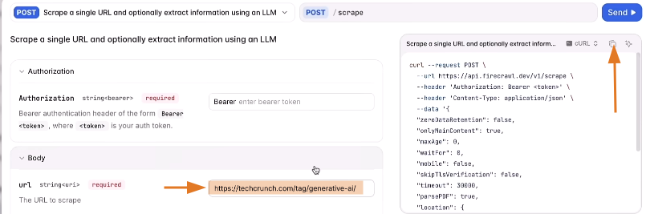

- Go back to your n8n workflow:
    - Click the `+` then click **HTTP Request** to create the node
    - Under the **Parameters** tab:
        - Click the **Import cURL** button:
            - Paste here the curl command from Firecrawl
            - Click **Import** button
        - Authentication: **Generic Credential Type**
        - Generic Auth Type: **Header Auth**
        - Header Auth: **Create new credential**
            - Rename this to **Firecrawl Demo**
            - Name: **Authorization**
            - Value: Click **Expression** then put here `Bearer <paste here the API key from the Firecrawl Dashboard>`
            - Click **Save**
        - Toggle OFF the **Send Headers** since we already setup the header auth.
        - Click the **Execute step** button

#### What happens when you have a `post request` that requires a `get` for you to obtain the result of your `post request`

#### 1. Trigger Manually Node

- Click **Trigger Manually**, then click the **Execute workflow** button, then click the node, notice that it has a blank OUTPUT.

#### 2. HTTP Request Node

- Go to https://www.firecrawl.dev/ 
    - Go to **Dashboard** -> **Docs** -> **Documentation** tab -> On the left click **Extract**.
    - Copy this example cURL command

    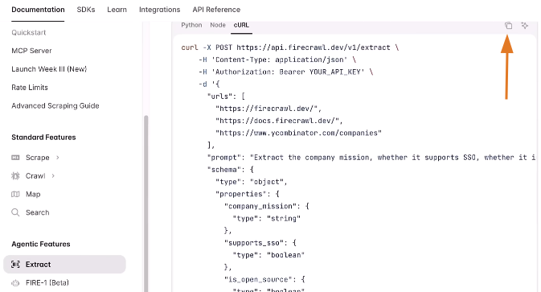

- Go back to your n8n workflow:
    - Click the `+` then click **HTTP Request** to create the node
    - Rename it to **Firecrawl Extract Post Request**
    - Under the **Parameters** tab:
        - Click the **Import cURL** button:
            - Paste here the curl command from Firecrawl
            - Click **Import** button
        - Authentication: **Generic Credential Type**
        - Generic Auth Type: **Header Auth**
        - Header Auth: **Firecrawl Demo** (the one that you created earlier)
        - Toggle OFF the **Send Headers** since we already setup the header auth.
        - Click the **Execute step** button
        - So when we do that, as you can see that the note says it is executed successfully. What it means is it's pushed through the post request to the API endpoint successfully and it's **currently processing the post request**.

#### 3. Wait Node
- Now because it's extracting for a couple different pages and specific information, it's going to take some time. So what we want to do now is wait.
- Click **Wait** to create the node

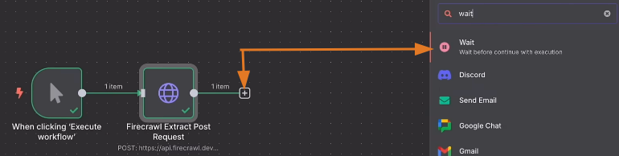

- Rename this node to **Wait 30 seconds**
- Under the **Parameters** tab:
    - Wait Amount: **30**
    - Wait Unit: **Seconds**
    - Click the **Execute step** button
- Go back to the **HTTP Request Node** and click the **Pin data**, to not exhaust your API key.

#### 4. New HTTP Request Node
- Go to https://www.firecrawl.dev/ 
    - Go to **Dashboard** -> **Docs** -> **Documentation** tab -> On the left click **Extract**.
    - Copy this example cURL command

    

- Go back to your n8n workflow:
    - Click the `+` then click **HTTP Request** to create the node
    - Rename this to **Firecrawl Get Request**
    - Under the **Parameters** tab:
        - Click the **Import cURL** button:
            - Paste here the curl command from Firecrawl
            - Click **Import** button
        - Follow the URL Below:

        

        - Click the **Execute step** button

#### 5. If Node
- So, let's say after the post request, we wait 30 seconds and then the get request launches and the status is not yet completed. What will happen then? Well, the workflow will break down. There will be an error and the workflow will stop working. So to avoid that scenario, what we want to do is to create what we call a loop and in this case we're going to add an if node so that we can continue that logic.
- Click the `+` then click **If** to create the node
- Follow Parameters below, then click **Execute step**


#### 6. Gmail Node for If-True
- Click the `+` for **If - True** then click **Gmail** to create the node
- Follow parameters below:


#### 7. Wait Node for If-False
- Click the `+` for **If - False** then click **Wait** to create the node
- Rename this node to **Wait Another 30 seconds**
- Under the **Parameters** tab:
    - Wait Amount: **30**
    - Wait Unit: **Seconds**
- Drag its `+` to loop again on the **Firecrawl Get Request Node**


---
<br>

## Text-to-Image Workflow with AI Prompt Generation


### 1. Chat Trigger Node
- Click **Chat Trigger** to create the node.


- Populate the chat window (example) "Create an image of a cat flying through oops of rainbows." Press Enter.

### 2. OpenAI Node
- Click **AI** then choose **OpenAI**


- Rename this to **Image Prompt Generation AI**
- Follow parameters below, click **Execute step** when done.


### 3. HTTP (POST) Request Node 
- Go to https://wavespeed.ai/ and signup to copy the needed cURL POST command.
- Go back to your n8n workflow.
- Click HTTP Request to create the node.


- Rename this to **Wavespeed Post**
- Under the **Parameters** tab:
    - Click the **Import cURL** button.
        - Paste the cURL command here then click **Import**
    - Authentication: **Generic Credential Type**
    - Generic Auth Type: **Header Auth**
    - Header Auth: **Wavespeed AI Credential** (Note: Use **Create new credential** to set this up)
    - Send Query Parameters: Toggle OFF
    - Send Headers: Toggle OFF
    - Send Body: Toggle ON

    

    - Click **Execute step** button

### 4. Wait Node
- Click the `+` then click **Wait** to create the node.
- Rename this node to **Wait 15 Secs**
- Under the **Parameters** tab:
    - Wait Amount: **15**
    - Wait Unit: **Seconds**
    - Click the **Execute step** button
- Go back to the **HTTP Request Node** and click the **Pin data**, to not exhaust your API key.

### 5. HTTP (GET) Request Node
- Go back to https://wavespeed.ai/ to copy the needed cURL GET command.
- Go back to your n8n workflow.
- Click the `+` then click **HTTP Request** to create the node.
- Rename this to **Wavespeed Get**
- Under the **Parameters** tab:
    - Click the **Import cURL** button.
        - Paste the cURL command here then click **Import**
    - Method: **GET**
    - URL: Click **Expression** to adjust it:

    

    - Authentication: **Generic Credential Type**
    - Generic Auth Type: **Header Auth**
    - Header Auth: **Wavespeed AI Credential** (Note: Use **Create new credential** to set this up)
    - Send Query Parameters: Toggle OFF
    - Send Headers: Toggle OFF
    - Send Body: Toggle OFF
    - Click the **Execute step** button

### 6. If Node
- Click the `+` then click **If** to create the node.
- Follow parameters below, click **Execute step** when done.


### 7. Gmail Node for If-True
- Click the `+` for **If - True** then click **Gmail** to create the node
- Follow parameters below:


### 8. Wait Node for If-False
- Click the `+` for **If - False** then click **Gmail** to create the node
- Rename this node to **Wait Another 15 Secs**
- Under the **Parameters** tab:
    - Wait Amount: **15**
    - Wait Unit: **Seconds**
- Drag its `+` to loop again on the **Wavespeed Get Request Node**

---
<br>