# n8n Tutorial – Zero to Hero Course
- [Youtube Link: n8n Tutorial – Zero to Hero Course](https://www.youtube.com/watch?v=UIf-SlmMays)

---

## Table of Contents
* [Foundations of n8n: Nodes, Architecture, and Data Types](#foundations-of-n8n-nodes-architecture-and-data-types)
* [Building Your First AI Agent Workflow (Chatbot/Email Agent Demo)](#building-your-first-ai-agent-workflow-chatbotemail-agent-demo)

---
<br>

## Foundations of n8n: Nodes, Architecture, and Data Types

### Introduction to n8n and Nodes
- **n8n** is a free and open workflow automation tool that lets you connect different apps and services with ease.
- **Nodes** are the individual, visual building blocks that connect together to form an automation workflow.
    - **Trigger node** starts an automation workflow when a specific event happens.
    - **Action node** performs a task or processes data inside or at the end of that workflow.

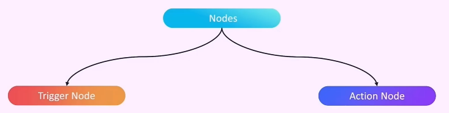

### Explore AI Agent architecture and API flow

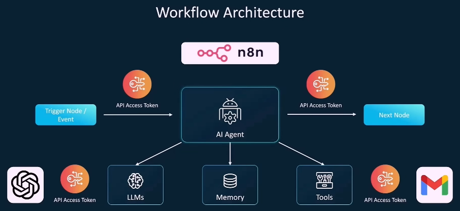

### Automate a full email-to-Slack use case

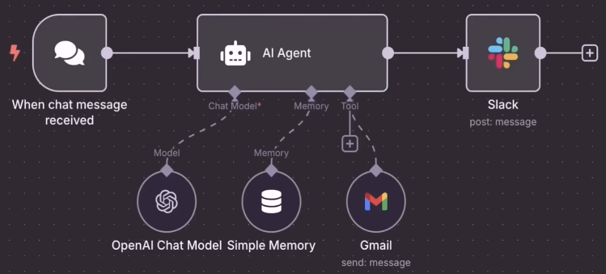

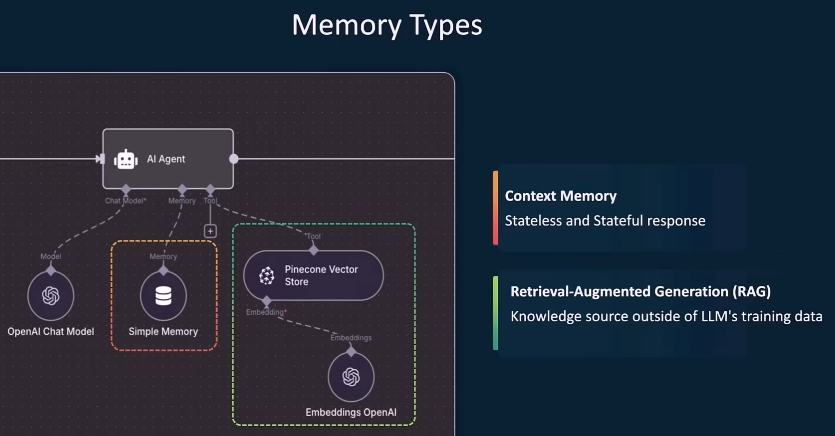

### Work with input formats and expressions
- **Every node has an input and an output data**, and the output data of this node will be the input payload of the next node. And that's how the logic strings the entire workflow.
- **Input and Output Formats** - Schema, Table, and JSON (Note: JSON is the most common.)

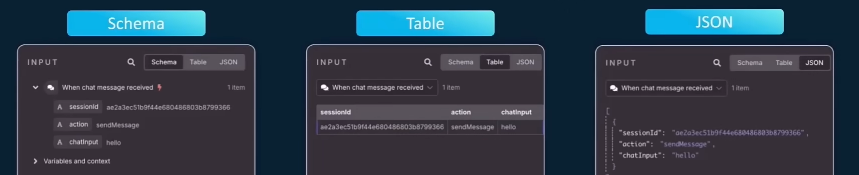

- **Fixed vs Expression:** 
    - **Fixed** - treats your input as literal text or static configuration data.
    - **Expression** - allow your workflow to adapt to real-time inputs instead of being hardcoded in.

### Understand how n8n handles data types
- **String:** `Hello world"`
- **Numbers:** `42, 3.14, -100`
- **Boolean:** `True or False`
- **Arrays:** `[1,2,300], ["James","Tony","Samantha"]`
- **Object:**
```
{
"user":{
    "name":"John",
    "email":"john@gmail.com"
    }
}
```

### Community Nodes
- **Extensions and custom integrations** built by the n8n user community to provide functionality not available in n8n's built-in nodes.

---
<br>

## Building Your First AI Agent Workflow (Chatbot/Email Agent Demo)

1. Open nodes panel or press `N`. It will generate a list of options or possible **trigger nodes** that you can start your workflow with.
2. The usual option to choose here is **Trigger Manually**, but for this current task, select **On chat message**.
3. You can type **"hello"** on the chatbox to interact with it. Note: One way to differentiate between a normal node and a trigger node is that **trigger nodes have a lightning icon**. Open this newly created node by clicking it (click the image below)

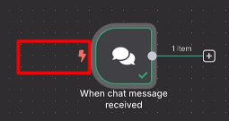

4. Since this is a trigger node, you'll only have an **OUTPUT** as shown below. You can also see the types of data here (Schema, Table, JSON). Click **JSON** as this is the coommnly used.

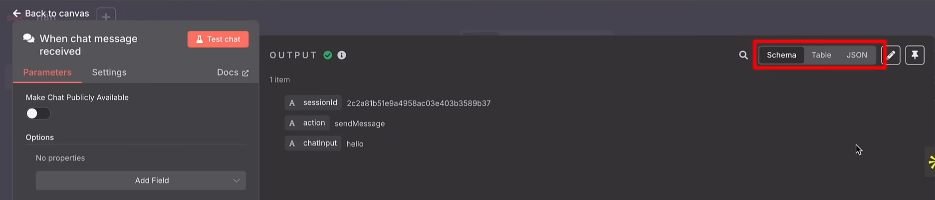

5. Click the `+` to create the next node, then select the **AI -> AI Chatbot**

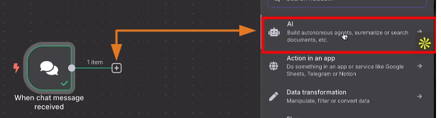

Notice from the image below that the previous **OUTPUT** node now becomes the **INPUT** node. Click the **Chat model** to select an LLM for the brain of this AI chatbot node.

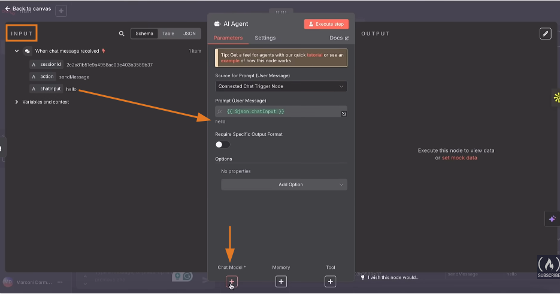

 Then click the `+ Create new credential` to put your API key. Depending on the LLM that you selected, choose a **model**.

6. Now click `+` for **Memory -> Simple Memory**. Note: This is basically the persistent memory so that the AI Agent can remember your conversation.

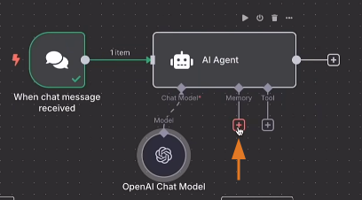

Once the **Simple Memory** is added, the **AI Agent node** becomes **yellow**. This means that you need to re-populate the chats. This should turn the node to **green**.

7. Now click the last `+` for **Tools -> Gmail Tool**.
    - Click the `+ Create new credential` to input your gmail account. Since the **To, Subject, Message** are not fixed and will be decided depending on what you chat, click the ✨.
    - Change the **Email Type** to **Text**.
    - Click the **Options** on the bottom and select **Append n8n Attribution** then **Toggle OFF**. Note: This option will remove the part of the email that it came from an AI automation.

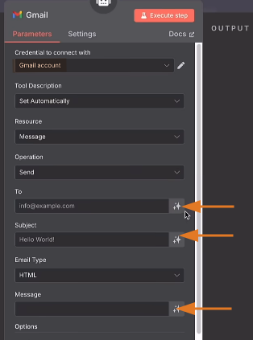

8. Now that the you configured the Tools element, the **AI chatbot** node becomes **yellow** again. Click the node. 
    - Source for Prompt (User Message): **Define below**
    - Drag and drop the `chatinput` variable on Prompt
    - Click the **Expression** because the information will change depending our input in the chat.
    - Change the **User Message** to **System Message**

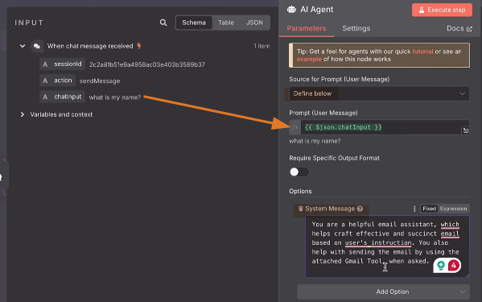

9. Now test the chat by giving its needed info (Your name, to whom you want to send your email, and the email body message). If you want to re-run the flow that you already created, you can click the **Play (Execute Step)** button.

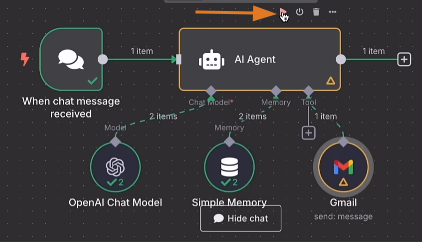

10. Open up the **chat node** and go to the top right hand corner you can see that there's an option to **pin the data**. Now this is super useful because now you don't have to key in or populate this particular node with new data all the time. And this is extremely valuable when you're running a workflow that uses API tokens or might cost you for every run of the workflow. **So that every single demo run or every single trial run is using the data that's already been populated**.

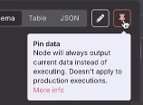

11. Toggle ON the **Activate** so that your workflow will be pushed to production.

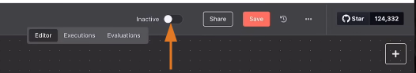

12. To make this workflow available to the public, in the **chat node**, toggle ON **Make Chat Publicly Available**, and this will give you a **url that you can share**.

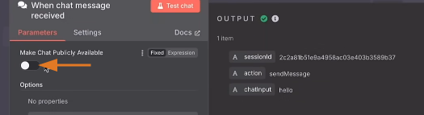