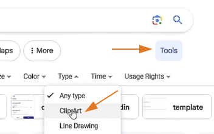
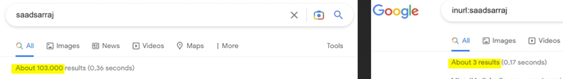
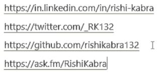
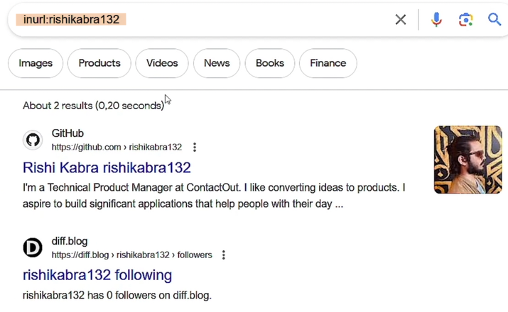
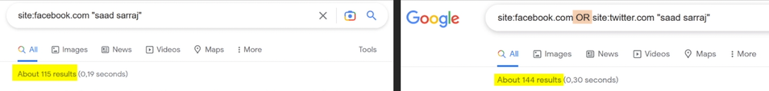
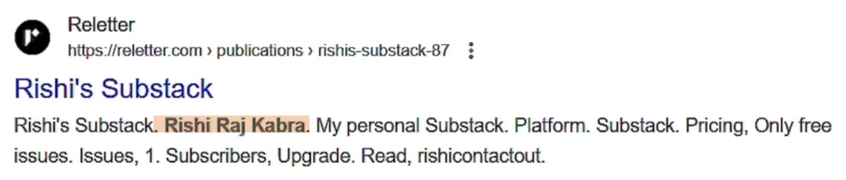
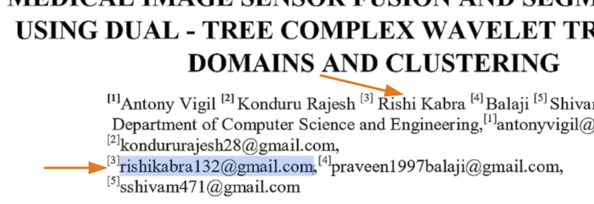
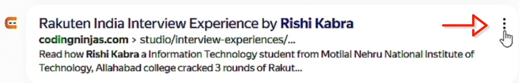

# Google Search Operators

## Discovering Sensitive Information About People

### Double Quotes `""`
- This operator displays results that **exactly match** your search query within double-quotes only.
- Note: This is also applicable to Bing.

- **Example:** Target information:
    - Name: Rishi Kabra
    - Works at: ContactOut

- Methodology:
1. Search google for: `"rishi kabra"`
2. To narrow it down, include his work: `"rishi kabra""contactout"`

3. You can take down notes using **Notion** (cloud service), or **KeepNote** (local). You can also take screenshots using **greenshot** or **lightshot**.
4. Copy the URLs of his accounts (linkedin, X, etc) and put it in your notes, you can clean long URLs using: https://urlclean.com/
5. If you're sure what his face looks like, you can search it too. Click the **Images**.

6. Go to `Tools -> ClipArt`

7. On the URL, change the word `clipart` to `face`.

8. Now from the search results, you confirmed that he is from "kolkata", you can then search again: `"rishi kabra""kolkata"` to further see if he have other accounts.

9. You might also see other result, like OLX, that he might be selling something.

10. Unfortunately, if the item is already sold, you might not see the post anymore.

11. What we can do is to check if there's a cached version of this page. Copy the URL from the search result.

12. Clean the link using: https://urlclean.com/

13. At the beginning, add the word `cache:`, paste the URL in a new tab then press Enter.

 

## Discovering Social Media Profiles Accounts

### `inurl:`
- Tells search engines **to only look for a specific keyword in the URL**.

- Methodology:
1. After getting the accounts from earlier, search each of his usernames using `inurl:`

2. For example, search his github username: `inurl:rishikabra132`

3. With this, we discovered his another account.

### `OR` operator
- Searches for a given search term OR an equivalent term.
- `OR` should be in capital letters.
- In this example, we are searching `saad sarraj` in **facebook site** OR the **twitter site**

- Example:
    - If we apply this to our target `rishi kabra`, we can search him within facebook or twitter by: `"rishi kabra" site:facebook.com OR site:twitter.com`

### `intitle:`
- Displays search results that contain a search term within the title of the page.
- Use a dot `.` for space.
- Example:
    - To apply this to our target, search: `intitle:rishi.kabra`

### Asterisk `*` operator
- Is a wildcard operator that **acts as a placeholder for one or more words**.
- Useful for **finding middle names** or **filling in missing information** in searches.
- Example:
    - To apply this to our target, search: `"rishi * kabra"`
    - From the search result, we now know that his middle name is **Raj**. (considering that we should confirm first if he owns this account by referring with other known details)

    

### Hyphen `-` operator
- **Excludes a search term** from appearing in the search results.
- Methodology:
1. Search again for: `"rishi kabra"`
2. Notice that from the results, there's another person named `rishi kabra`, and he works at `MOTLEY GREEN`
3. We can then exclude this other person by: `"rishi kabra"-"MOTLEY GREEN"`
4. We can also exclude results from a certain website, in this example, we want to remove the results from the linkedin website: `"rishi kabra"-"MOTLEY GREEN"-site:linkedin.com`

### `site:`
- **Searches within a particular site**.
- Can be used to display search terms on that website.
- Example:
    - To apply this to our target, we want to know if the name "rishi kabra" is in facebook, search: `"rishi kabra" site:facebook.com`

 

## Discovering PDF Documents Associated with Targets

### `filetype:`
- Tells search engines to only **search for a specific file type**.
- Example / Methodology:
1. If we want to know if there are PDF files related to our target "rishi kabra", search: `"rishi kabra" filetype:pdf`
2. By opening each result, we opened a PDF file that "rishi kabra" is one of its authors. And we can also see his **gmail account**, we can confirm this with his username **rishikabra132** which he also used with his github account.

3. By opening other PDF results, we also discovered another info that he studied in **SRM University**.

4. **Note:** We can also check the metadata on this PDF files to get more info.

 

## Find Hidden Search Results
- Sometimes, Google removes some results if you are in a certain country. In the example below, Europe.

### 2 Ways to bypass this
1. Use a **VPN**.
2. Use a browser extension **SquareX**.

 

## Find Cameras & More With GHDB

### Google Hacking Database (GHDB)
- is an index of search queries that **allow you to find sensitive/specific information** on the internet.
- **Examples:** Vulnerabilities, Public cameras, Public IOT devices, Public Passwords, and many more..
- **Access it here:** https://www.exploit-db.com/google-hacking-database
- Methodology:
1. Go to https://www.exploit-db.com/google-hacking-database
2. Quick Search: `camera`
3. Copy a google dork. Example: `inurl:"view.shtml" "camera"`
4. Paste it in Google Search.
5. Check the results for live camera footage of certain places.
6. Another example: You can also copy this google dork `intitle:"Index of" "DCIM/camera"` to see some saved photos and videos from android devices.
7. Copy the URL of one of the images.
8. Go to https://exif.tools/
9. Paste the URL to see the metadata of that image.

 

## Enhancing Google Searches with AI
- **Access it here:** https://www.dorkgpt.com/
- Example:

 
 
 

# Bing Search Operators

## Discovering Additional Information & Online Accounts Using Bing
- Using different search engines might yield varying search results.
- Bing has some exclusive search operators that Google SE doesn't have.
- **Access it here:** https://www.bing.com/
- Example / Methodology:
1. Try searching here: `"rishi kabra"`
2. Sometimes, bing will provide results that google didn't, like in this example, one of the results show that rishi kabra had an instagram account (https://www.instagram.com/rishikabra132), it's just not working anymore.
3. Try also searching: `"rishi kabra" "kolkata"`
4. Sometimes Bing provides a cached copy of a page, showed by 3 dots. Click on the `3 dots` then click `Cached`

### `loc:`
- Find web pages from a specific country or region.
- Example: If we want to narrow the search for Rishi Kabra in India, search: `"rishi kabra" loc:in`

### `language:`
- Return search results in a preferred language.
- Example: If we want to show the search results for Rishi Kabra in english only, search: `"rishi kabra" language:en`

 

## Beyond Google Finding Hidden Information

### `linkfromdomain:`
- Finds all links found on the target website.
- Example: `linkfromdomain:zsecurity.org`

### `ip:`
- Returns indexed websites that are hosted on this IP address.
- Example: `ip: 141.20.5.188`

### `contains:`
- Searches for pages that have links to a file type you specify.
- Example: `site:zsecurity.org contains:pdf`

 
 
 

# Alternative Search Engines

## Yandex
- Yandex **has some exclusive search operators** that Google or Bing don't have.
- Using different search engines might yield varying search results.
- Yandex is the **best for face matching and location identification**.
- **Access it here:** https://yandex.com/
- Example: Search for `"rishi kabra"`
    - Same with Bing, Yandex sometimes cached a page shown by 3 dots. Click the `3 dots`, then click `Saved Copy`

    

### `date:`
- Used to find search results in a specific date.
- How to use: 
    - `date:2023` - year
    - `date:202301` - year/month
    - `date:20230101` - year/month/day
    - `date:2023..2022` - from year to year
    - `date:>2022` - set if greater than or less than of that year (you can also include month and day if needed)
- Example: `"rishi kabra" date:2020`

### `rhost:`
- Can be used to **find a website's subdomains**.
- Format: `rhost:top_level_domain.second_level.*`
- Example: `rhost:org.cybersudo.*`

- Note: Yandex will show subdomains even if they are not available anymore.

 

## DuckDuckGo
- Pretty much the same dorking techniques.
- Using different search engines might yield varying search results.
- **Access it here:** https://duckduckgo.com/
- Example: `"rishi kabra" "kolkata"`

 

## Baidu
- Best in **finding chinese person**.
- **Access it here:** https://www.baidu.com/
- Example: search `"rishi kabra"`

 

## Intel Techniques
- Used for automating searches from different tools.
- **Access it here:** https://inteltechniques.com/tools/index.html
- Example: (Note: Click 'Populate All' to use all the search engines)

- Note: Use this as a last option as it will overwhelm you with results.