# Database Breaches & Leaks - Finding Passwords, Emails, Locations + More!

## Understanding the Difference Between Breached & Leaked Database

#### Data Breach
- is an **intentional** unauthorized access to sensitive information.
    - Exploited security vulnerabilities

#### Data Leak
- is an **unintentional** exposure of sensitive data.
    - Human error
    - Overlooked vulnerabilities

 

## Finding Relevant Breach & Leak Databases

### Required Information to Search the Database

#### At least one of the following:
- Email
- Phone Number

#### Additional helpful information to refine your research:
- First and Last Name
- Physical Address
- Country, City
- Age
- Gender

 

### Have I been pwned? (HIBP)
- Allows you to check if your info are leaked online.
- Utilizing HIBP in OSINT:
    - Confirming email validity
    - Revealing individual interests
    - Shows what types of data were leaked
- **Access it here:** https://haveibeenpwned.com/
- Example: Check Rishi Kabra's email.
1. Go to https://haveibeenpwned.com/
2. Search for `rishikabra132@gmail.com`

Sample result (Compromised Data):

3. Notice that the his email is pwned in 9 data breaches. This also confirmed that this **email is valid, revealed his interests, and showed what types of data were leaked**.

 

## Finding Emails, Passwords & More

### DeHashed
- is a search engine to find data breaches and data leaks.
- requires a paid subscription to be used.
- **Access it here:** https://dehashed.com/
- **Example:**
1. Search the name: `"zaid sabih"`

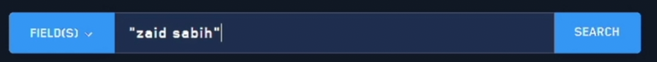

2. Check the results until you find your target. (You can confirm it based on the info that you have about your target). In this example, you confirmed that this result is for Zaid Sabih, because you're sure that this is his email.

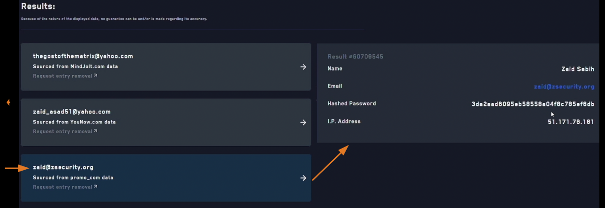

**Note:** Also check the other results as they might also belong or related to your target.

3. Go to https://whatismyipaddress.com/ip-lookup to check the IP address `51.171.78.181`

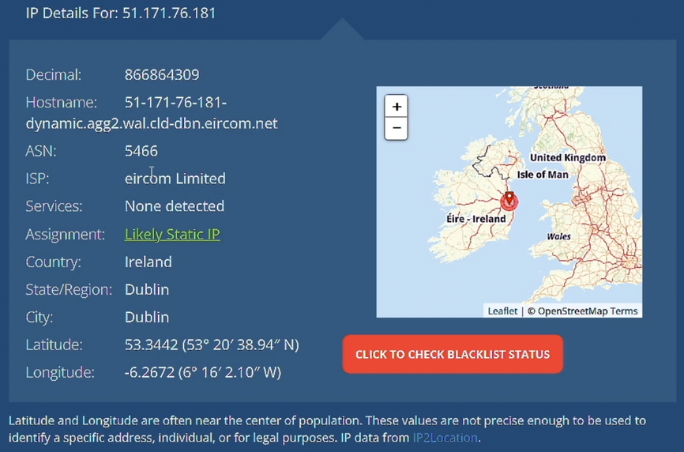

4. Google search `zsecurity dublin` to verify this info.

 

## Finding Addresses, Phone Number & 

### IntelligenceX
- is a search engine and data archive.
- is partially free to use.
- **Access it here:** https://intelx.io/
- Example:
1. Search Rishi Kabra's email.

2. Notice that the results are reducted. To view them, it requires a paid plan/subscription.

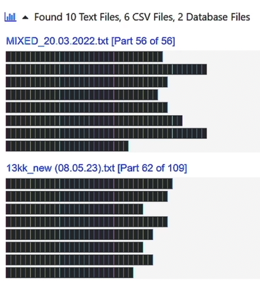

3. To view the results for free users, click `Advanced`, and only select the options that has no "PRO".

Then click `Search`.

- Another example:
1. Search the email address that you got earlier (with Zaid Sabih).

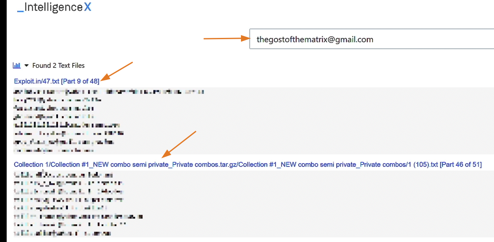

2. Click the blue text, and search again the email address, to view its password.

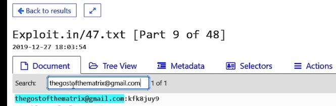

 
 
 

# Downloading Leak / Breach Databases

## Search in Leaked/Breached Databases
- There are **two ways** to access data from a leaked or breached database:
    - **Subscription Service**
        - DeHashed, IntelX, Snusbase, etc.
    - **Local Download**
        - Software: Agent Ransack and Torrent client
        - Hardware: Disk space

## Setting Up an Isolated Virtual Environment

1. Open VirtualBox and create a new **Windows 11 VM**.

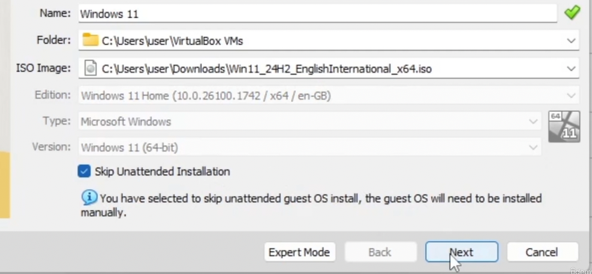

2. Hardware: 4gb ram; 3cpu; Enable EFI (checked)
3. Select **Create a Virtual Hard Disk Now** radio button, and provide at least **80gb** storage.
4. Start the VM that you just created.
5. Continue with the installation process.

6. Select **I don't have a product key**.
7. Select **Windows 11 Pro**.
8. Click all the **Next** then **Install**
9. Before you continue, you can disable the internet to avoid downloading and installing updates. Go to your `VM Settings -> Network -> Attached to: Not attached -> OK`
10. Now continue with the installation: Selecting your region, keyboard layout, Skip, then Select `I don't have internet`
11. Enter your username, then password is not required.
12. Select `No` for your location. Click `Accept`
13. Install VirtualBox guest tools: `Devices -> Insert Guest Additions CD Image..`, then open it in the File Explorer.
14. Then run this tool: 

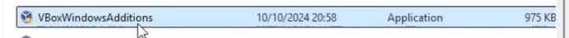

15. Select "Reboot now" after installation.
16. Enable copy-paste in the VM:
    - `Devices -> Drag and Drop -> Bidirectional`
    - `Devices -> Share Clipboard -> Bidirectional`
    - `Devices -> Shared Folders -> Shared Folders Settings..`

 

## Installing Needed Software to Manage Leaked Databases

### 1. utorrent
- A torrent client to download the database.
- Get it here: https://www.utorrent.com/

### 2. Agent Ransack
- A tool that will allow you to search for data within the leaked database that you downloaded.
- Get it here: https://www.mythicsoft.com/agentransack/download/

### 3. Hardware; Disk Space
- You will need a large disk space to download the databases.

 

## Downloading & Accessing Leaked Facebook Data (2019)
- **Compromised Data:** User IDs, Phone numbers, and full names.

1. Google search: `facebook data leak github`
2. Then click on the first link:

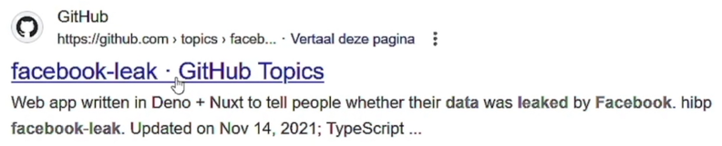

3. In **utorrent**, add the torrent to download the file. 

4. Unzip the files that you need, in this example, the **India.zip**

5. Open the extracted folder `India`. `Right-click ->  Show more options -> Agent Ransack..`

6. Input the facebook ID of Rishi Kabra, and click the `Start` button. (Note: Getting the facebook ID will be discussed on future tutorial)

 

## Downloading & Accessing Leaked Twitter Data (2023)
- **Compromised Data:** Email addresses, names, social media profiles, and usernames.

1. Google search: `"twitter 200m" "magnet:?"`
2. Download the database using **utorrent**, then extract the file.
3. Go to the extracted folder, `right-click ->  Show more options -> Agent Ransack..`
4. In this example, search for Zaid's twitter username.

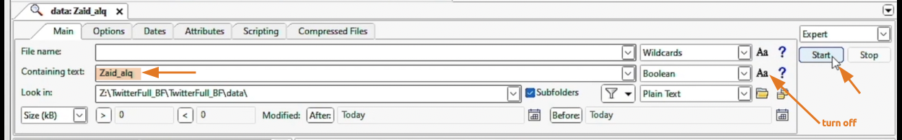

 

## Downloading & Accessing Leaked LinkedIn Data (2012)
- **Compromised Data:** Member IDs and Email addresses.

1. Go to the provided link.
2. Click on the 7z to download the 1.7gb file.

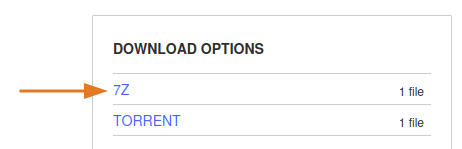

3. After downloading and extracting the folder, run **Agent Ransack**.
4. To search for a person, you need their **member ID**.
    - To get a **member ID**, go to their linkedin profile page.
    - Right-click -> View Page Source
    - ctrl + F, then type `member:`
6. In **Agent Ransack**, paste the member's ID.

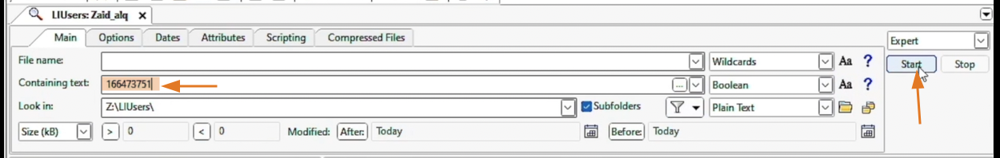

 

## Downloading & Accessing Leaked Snapchat Data (2014)
- **Compromised Data:** Usernames and partial phone numbers.

1. Go to the provided link.
2. Click on the 7z to download the 32mb file.
3. After downloading and extracting the folder, run **Agent Ransack**.
4. You can get the username from the URL.

5. In **Agent Ransack**, paste the username.

6. Copy the result and paste it in a text editor.

7. Find if she has a facebook account. Copy her facebook's URL. Example: `https://www.facebook.com/claire.semenza`

8. In incognito tab, go to facebook.com, then click the `Forgot account?`, then paste the URL, then click **Search**

9. Click on **Try another way**. Now we can see her number ends with `13`

10. Go back to text editor, replace the `XX` with `13`
11. Copy the blurred number then go back to facebook, then search for that number (Note: Don't forget the country code). Then click **Search** to reveal her full number.

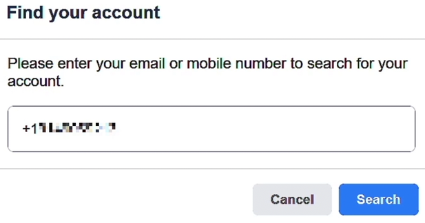

 

## Finding Leaked Databases on The Internet

### Use Google Search
- Include the name of the website that has been hacked, together with keywords.
- Example: `
"000webhost.com.7z" "leak" "download" "magnet:?"`

### sizeof.cat
- **Access it here:** https://sizeof.cat/post/data-leaks/