# Facebook OSINT

## Extracting Valuable Information From a Facebook Profile

### Using Filter When Finding a Person
- We can use the **filter to narrow down the search results**.
- Example: Instead of just searching for "Rishi Kabra", we could add the place "Kolkata", since we already confirmed this place from our previous research.

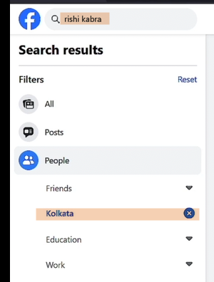

### Username in URL
- Once you found your target, check the URL.
- Facebook will create your username, based on the **first display name** that you provided.
- Example: Rishi Kabra's URL is "https://www.facebook.com/RishiRajKabra". Which means his username is still `RishiRajKabra`, even though he already removed his middle name in his profile.

### Facebook Info pages
- These are tabs **Intro, About, Friends, Photos, Videos, Check-ins, More, etc**
- Take note all the available info shown from these tabs.
- Example: Rishi Kabra's Intro page. 

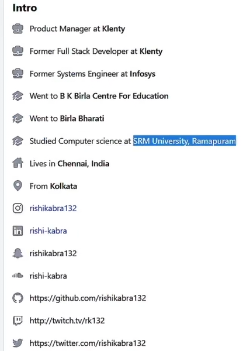

- Check all the photos, and the details included. Example below is his post, with the detail "Birthday dinner with the fam" and the date he posted it. So there's a high possibility that his birthday is "December 1".

- And we can confirm this from his other accounts, like linkedin.

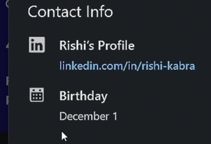

- We are now sure that his birthday is December 1, we only don't know the 'year'. But by further checking his other posts, we can confirm that his birth year is 1995.

 

## Extracting User ID, Facebook Friends & More

### User ID
- You can go to this website: https://findidfb.com/ then paste the target's URL. Or --

- Go to your target's facebook profile, `right-click -> View Page Source`
- `ctrl + F` then search for `userID`

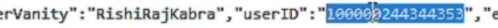

- You can then use it on the URL. Example: `https://www.facebook.com/100000244344353`

- We can also use the **userID** to find out the **Account Creation Date**.

### Download your Target's Friends List
- If you use a browser extension, facebook might detect and block it. To manually download your target's friends list, go to your target's **Friends** tab, go all the way down (or keep on pressing Spacebar) until all the Friends are displayed. (**Note:** Sometimes the important friends are only by his current location)

- Then select them by using your mouse, then `right-click -> Copy`, then paste it on Excel (just select one cell then paste it).

- If you just want to see the names without the descriptions:
    - Click of the first field (Ex. Simran Venkat)
    - Go on the `Data tab -> Filter`
    - Click the `dropdown button -> Filter by Color -> click the color`

    

 

## Find Partial Email / Phone Number
- Click the `Forgot password?` 

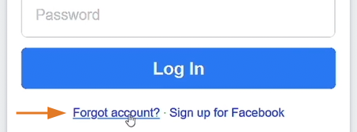

- Enter the **email or mobile number or username**. Example: Rishi Kabra
- Click the **This Is My Account**

- You can now se the options similar below:

- To confirm the email address that we got earlier (from previous topic lecture), we can go back `Find your account - Enter your email or mobile number`

- Now we are now sure with his email address, and we got the last 2 digits of his number.

 

## Finding Public Comments / Tags of a Facebook Account
- **Utilizing search engine operators** can be useful in locating publicly indexed comments and tags.

- Format: `"Name" site:facebook.com inurl:posts`

- Example: `"rishi kabra" site:facebook.com inurl:posts`

 

## Facebook OSINT Summary Checklist
- Use **filters** to locate the target profile.
- Save the **profile picture**.
- Check the **username**.
- Find the **user ID**.
- Identify the account **creation date**.
- **Review** all posts.
- Save the public friend list.
- Try the **forgot password** feature on FB.
- Search for public info using **search operators**.

 
 
 

# Instagram OSINT

## Extracting the User ID of an Instagram Account
- Use `Search` to find your target. **Note**: Use all the name or usernames from your notes.
- Once you found your target, **note the URL and the profile picture**.
- To get the `User ID`:
    - Go to your target's instagram page.
    - `right-click -> View Page Source`
    - `ctrl + F` then search for `profile_id`

    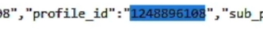

    - Or you can use this website: https://fameswap.com/tool-instagram-user-id
- So if your target changed their username or profile name, you can still find them using their **user ID**, you can use this website: https://commentpicker.com/instagram-username.php

 

## Extracting Timestamps from Posts and Comments
- Timestamp will show you the **exact date and time when a post was posted**.
- Format: `yyyy-MM-dd'T'HH:mm:ss`
- Follow this to get the timestamp:
    - Click the instagram post.
    - `right-click -> Inspect`
    - Then select the date of the post or a comment.

    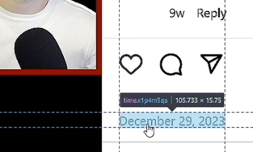

    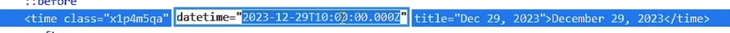

    - To convert it on your local time, you can use this website: https://www.timestamp-converter.com/, then paste it on the `ISO 8601` section.

    

 

## Uncovering Comments of Private Instagram Accounts
- **Utilize serach engine operators** to discover indexed information on Instagram profiles.
- Examples:
    - `site:instagram.com "cyber_sudo"`
    - `site:instagram.com "@cyber_sudo"`
    - `site:twitter.com "username" "instagram.com/p"`
    - or search the target's complete URL, `https://www.instagram.com/rishirajkabra/`
    - Note: If post not available anymore, you **can check bing or yandex for the cached copy**.

 

## Extracting Hidden Information from Instagram Metadata
#### Steps:
- Add browser extension: **User-Agent Switcher and Manager**
- Get the **User ID** of the target's instagram account.
- Log in to your socket instagram account.
- Click the **User-Agent Switcher** extension, then select **Instagram** and **Android**, then select a radio button.

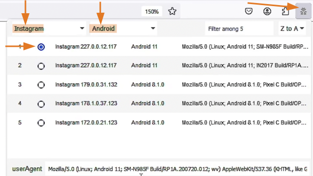

- Then access the API using this endpoint. `https://i.instagram.com/api/v1/users/1248896108/info/` (**Note:** Replace it with the target's user ID.) Copy-paste the API endpoint on a new tab.

- Click on **Save** to save the JSON file.

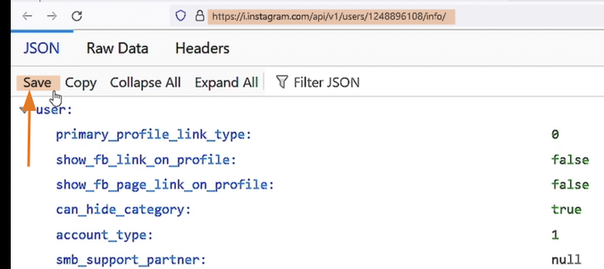

 

## Scraping Instagram Followers

### Manual Method:
- Click on your target's `followers`

- Load all the followers by scrolling down. Then select all of them by dragging your mouse then 'right-click -> Copy'.
- Go to Excel, then click `A` to select the entire column.
- Then press `ctrl + V` to paste.
- Notice that even the followers' profile pics are saved, to remove them click `F5 -> Special... -> select 'Objects'` then click `OK`. Then press `Delete` on your keyboard.
- Filter the column to see the **usernames** only. Click the `Data tab -> Filter -> click drop-down button on the top cell -> Sort by Color -> Automatic`

### Automatic Method:
- Install web browser extension: **IG Follower Export Tool - IG Tools**
- Be sure that you are logged in, then go to your target's instagram page.
- Click the extension's icon, then click **Export Instagram Data**
- Under **Options** input the target's IG user

- After the parsing finishes, select if you want to **Save to CSV, or Save to Excel**

 

## Downloading All Instagram Photos

### Manual Method:
- Go to your target's instagram page.
- `Right-click -> Inspect`
- Inspect the image, copy the image URL, then open it in a new tab, then save the image.

### Automatic Method:
- Install web browser extension: **Download All Images**
- Be sure that you are logged in, then go to your target's instagram page, scroll down until all the images are loaded.
- Click the extension's icon, then select **JPEG** then click **Save**

 

## Automatically Download Instagram Profiles

### Instaloader
- is a free, open-source tool written in Python that lets you download pictures, videos, and metadata from Instagram.
- to install using pipx: `pipx install instaloader`

#### Download a Public Instagram Account
- To download all photos and videos from a public instagram account, use this format: `instaloader <username>`
- Example: `instaloader cyber_sudo`

#### Download a Private Instagram Account
- Make sure that this private account **accepted your follow request**.
- Format: `instaloader -l <your_username> <target_username>`
- Once you enter this command, it will request your password.
- If you got a 401 error: `rm /root/.config/instaloader/session-<your_username>`

 

## Undetectable Instagram Info Extraction

### Toutatis
- is an open-source command-line intelligence tool **used to extract public and partially masked private information** from Instagram accounts.
- it is **unstable due to Instagram's shifting security measures**
- to install using pipx: `pipx install git+https://github.com/megadose/toutatis.git`

#### Key Features:
- Extract the user's partial email and phone number without notification
- Retrieve the user's ID
- Download the user's HD profile picture

#### Usage:
- Format: `toutatis -u <target_username> -s <your_session_id>`
- **Note:** To get your session ID, log in to your instagram account page, `right-click -> Inspect`, then go to `Storage` tab.

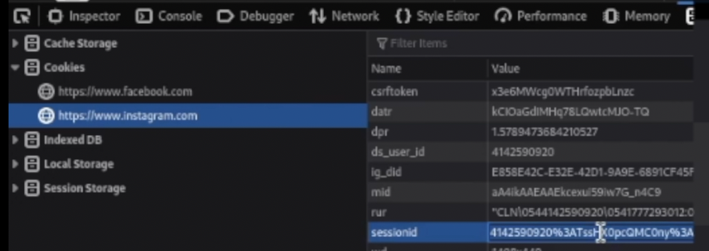

 
 
 

# Twitter OSINT

## Extracting X / Twitter User IDs

### Analyze the target profile

### Search for an Account
- You can confirm your target's account with the help of your gathered research (from previous topics).

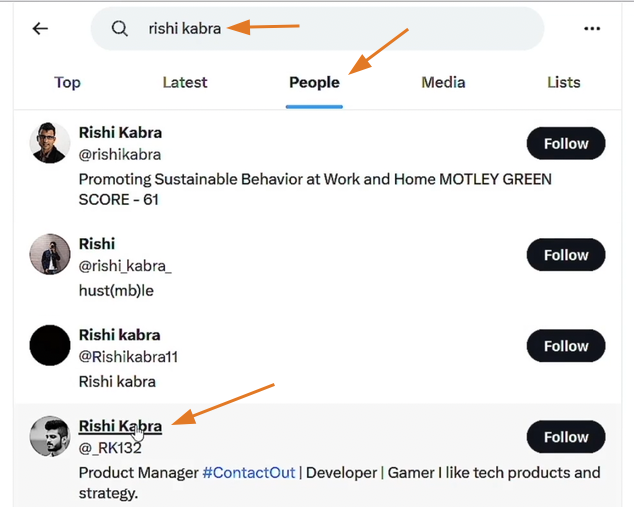

### Find the User ID
- Go to your target's twitter page.
- `Right-click -> Inspect`
- Search for `/profile_banners/`

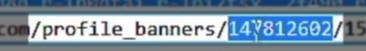

- Or search for `identifier`

- Or use this website: https://commentpicker.com/twitter-id.php

### Track the Target using User ID
- Use this URL: `https://twitter.com/intent/user?user_id=147812602`
- Or use this URL: `https://twitter.com/i/user/147812602`

 

## Recovering Deleted Tweets and Timestamps
### To get the timestamp of a post or comment:
- `Right-click -> Inspect` the date.

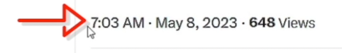

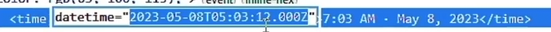

- To convert it on your local time, you can use this website: https://www.timestamp-converter.com/, then paste it on the `ISO 8601` section.

### Indexed Tweets
- Utilize search engine operators to discover indexed tweets.
- Examples:
    - `site:x.com "cyber_sudo"`
    - `site:x.com "@cyber_sudo"`
    - `site:x.com/cyber_sudo/status`

 

## Leveraging Search Operators to Find Specific Tweets
- `from:` - will display all tweets from @X
    - Example: To see all tweets from username: `_zsecurity_`, search for: `from:_zsecurity_`
    - Example: To see all tweets from username: `_zsecurity_` with keyword `email`, search for: `from:_zsecurity_ email`

- `from:` + `to:` - if we would like to see any connection or any tweets from a certain account to another
    - Example: `from:cyber_sudo to:_zsecurity_`

- `since:`yyyy-mm-dd
- `until:`yyyy-mm-dd
    - Example: To see all tweets from the username: `cyber_sudo` from `2024-01-01` to `2024-01-15`, search for: `from:cyber_sudo since:2024-01-01 until:2024-01-15`

 

## Discovering Tweets Posted from a Specific Location
- `geocode:` - restrict your search by a given location
    - Format: latitude,longitude,radius
    - To get the latitude and longitude of a certain location, go to **google maps**, then right-click the location that you need. Click the coordinates to copy it to your clipboard.

    

    - Example: If you want to see all the tweets from this location within a radius of 5km and related to keyword "osint", go to twitter search bar: `geocode:41.15827,-8.62937,5km "osint"`

 

## Other Search Operators
- `@` - used to find if an account has mentioned another x account
    - Example: `from:_zsecurity_ @cyber_sudo`
- `filter:` media, replies, retweets
    - Example: `from:_zsecurity_ filter:media` to see all the media from the username: `_zsecurity_`
    - Example: `from:_zsecurity_ -filter:replies` to see all the tweets EXCEPT for replies
- `OR`
    - Example: `from:_zsecurity_ "osint" OR "cybersecurity"` to see all the tweets from the username: `_zsecurity_` with the keywords "osint" OR "cybersecurity"