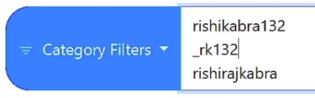

# Username OSINT - Tracking Online Identities

## Tracking a Username Using Advanced Search Techniques

### Gather Online Usernames
- After gathering all the social accounts of your target, **save all the unique usernames the target used** in a text file for future searches.
- Example: In our target Rishi Kabra, he used different unique usernames for his facebook, instagram, etc. such as -- **rishi-kabra, _RK132, rishikabra132, rk132, RishiRajKabra**

### Search Operators
- Use **search operators** to check if a username is indexed by search operators.
- Format: `inurl:username1 OR inurl:username2 OR inurl:username3`
- Example, search this in Google: `inurl:rishi-kabra OR inurl:_RK132 OR inurl:rishikabra132 OR inurl:rk132 OR inurl:RishiRajKabra`

 

## Finding Hidden Profiles with Reverse Username Lookup

### ID Crawl
- Can find social media profiles and potential email addresses using a username, email, name, or phone number.
- **Access it here:** https://www.idcrawl.com/username-search
- Then search each of your gathered unique usernames that the target uses.

 

## Finding Linked Accounts Across the Web

### Find Additional Online Accounts
- Tools like **WhatsMyName** and **Blackbird** help you find additional accounts on hundreds of websites.

#### WhatsMyName
- **Access it here:** https://whatsmyname.app/
- Choose **All** to search for a username.

- You can search for all the usernames that you previoulsy gathered, but you might get overwhelmed with false results.

- You can download the results - CSV or PDF.

 

## Finding Passwords & Other Breached/Leaked Data Connected to a Username
- Aside from **HaveIBeenPwned**, you can use other websites:

### DeHashed
- **Access it here:** https://dehashed.com/search
- Note: This is paid and free use is limited.

### leakpeek
- **Access it here:** https://leakpeek.com/

### Breach Directory
- **Access it here:** https://breachdirectory.org/

 

## Discovering Additional Online Accounts Automatically

### Sherlock
- Is a tool **to search for a given username**** on hundreds of websites.
- Note: Some results are false positive.
- Installation using pipx: `pipx install sherlock-project`
- Installation using apt: `sudo apt install sherlock`
- Format for single target: `sherlock target_username`
- Format for multiple targets: `sherlock user1 user2 user3`
- Example: `sherlock rishikabra132 _rk132`

 

## Summary / Methodology
- Collect the person's usernames.
- Search for usernames on search engines.
- Use online tools to find additional accounts with the same username.
- Search in leaked databases.
- Use `sherlock`.