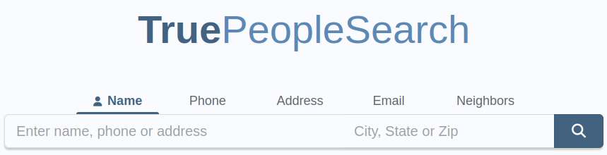
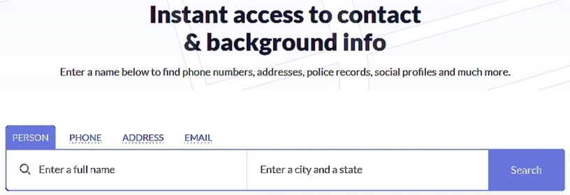
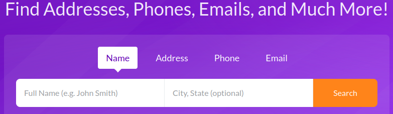

# People OSINT - Uncovering Personal Information Online

## Finding the Geographic Origins of a Name
- Helps you narrow down your search by giving some **geographical clues**.

### Websites

#### Family Search
- **Access it here:** https://www.familysearch.org/

#### Namsor
- **Access it here:** https://namsor.app/
- This is more reliable than 'Family Search'

### After Getting the Possible Country
- After getting the possible country of the target, you can then use a search engine like Google. Example search: `"rishi kabra" "india"`
- Check the next topic for more info.

 

## Find Personal Details Using Advanced Search Techniques

- Use search operators to **check if a person's information is indexed** by search engines.
- Format: `"first and last name" "city" OR "country" OR "university" OR "company"`
- Example: `"rishi kabra" "kolkata" OR "contactout" OR "SRM"`

 

## Discovering Social Media Accounts Linked to a Person

### Websites
- These are websites that will help you find information about **individuals that are NOT from United States**.

#### Social Searcher
- **Access it here:** https://www.social-searcher.com 

#### ID Crawl
- **Access it here:** https://www.idcrawl.com

 

## Discovering Phone Numbers, Addresses, DOB, and More

### Websites
- These are websites that will help you find information about **individuals that are mainly from United States**.

#### True People Search
- **Access it here:** https://www.truepeoplesearch.com/
- Note: Your **IP should be in United States** to use this website. Use VPN to change your IP.
- As you can see, you can search for **Name, Phone, Address, Email, Neighbors**, depending on what info you have.

#### Nuwber
- **Access it here:** https://nuwber.com/
- Note: Your **IP should also be in United States** to use this website. Use VPN to change your IP.

#### Fast People Search
- **Access it here:** https://www.fastpeoplesearch.com/
- Note: Your **IP should also be in United States** to use this website. Use VPN to change your IP.

#### Fast Background Check
- **Access it here:** https://www.fastbackgroundcheck.com/
- Note: Your **IP should also be in United States** to use this website. Use VPN to change your IP.

#### ThatsThem
- **Access it here:** https://thatsthem.com/
- Note: You **don't need a VPN** to use this website.

#### Radaris
- **Access it here:** https://radaris.com/
- Note: You **don't need a VPN** to use this website.

 

## Uncover Political Party Affiliations
- Note: This topic will focus on people living in the United States only.

### Voter Records
- **Each record has:** full name, party affiliation, home address, date of birth, and relatives.

### Websites
- Note: Your **IP should be in United States** to use this websites.
- https://voterrecords.com/
- https://voteref.com/
- https://www.blackbookonline.info/

 

## Finding Partners and Maiden Names in Registries
- Note: This topic will focus on people living in the United States only.

### Wedding / Baby Registries
- A registry is a list of items that you want to receive as gifts.
- Each registry includes: partner name, maiden name, details about the event, desired items.

### Websites
- https://www.amazon.com/registries?ref_=nav_cs_registry&ref_=nav_cs_registry (Note: You need an amazon account to access this)
- https://www.myregistry.com/
- https://www.theknot.com/registry/couplesearch
- https://www.target.com/registry-kiosk

 

## Summary / Methodology
- Use search engines to find the person by their name and city.
- Learn where the name comes from.
- Search in people search engine websites.
- See if they're in voter records.
- Search in wedding/baby records.
