# Email OSINT - Finding Email Addresses

## Uncovering Emails From Social Online Accounts
- Check if the target has shared their email on their online/social media accounts.
- **Example 1:** Rishi Kabra's Github Account
    - Go to his public repositories.

    

    - Notice that he posted something about himself, but he didn't mention his email. Go to **History**.
    
    

    - Check and view each of his commit details.

    

    - It is possible that one of this commit details has his email.

    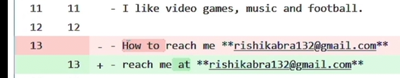

- **Example 2:** Rishi Kabra's Twitch Account
    - Go to his **About** page.
    - Notice that he has a youtube channel link here:

    

    - Notice that in his **Youtube Channel's About**, he included his email address.

    

 

## Finding Emails Using Advanced Search Techniques
- Use **search operators** to find the person's email address **on search engines**.
- **Example 1:** Use his **name** to search in Google. (Note: You can add more email domains if needed)
    - `"rishi kabra" "@hotmail.com" OR "@gmail.com" OR "@yahoo.com"`
- **Example 2:** Use his **username** to search.
    - `"rishikabra132" "@hotmail.com" OR "@gmail.com" OR "@yahoo.com"`

 

## Uncovering Emails Linked to Usernames
- Use **collected usernames** from social media profiles of the target to form an email address.
- **Example:**
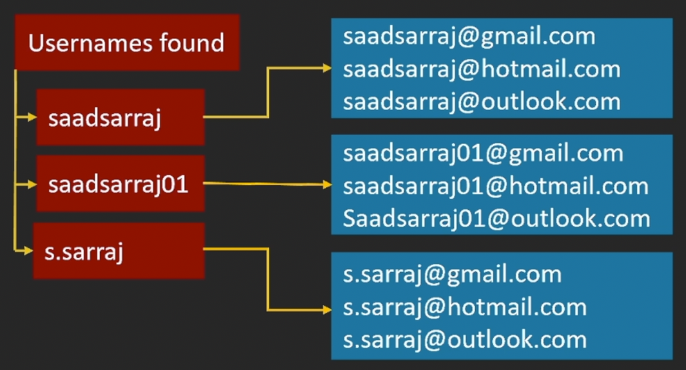

- To verify the emails that you created if they exist, go to this website: https://www.experte.com/

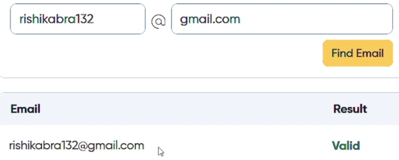

- List all the valid emails. Next step is to **check which of these valid emails belong to your target**.
    - To do this go to `facebook.com` and click the `Forgot password?`
    - Input your target's name. Example: "rishi kabra"
    - After finding his account, click `This is My Account`
    - Here we can have an idea of his email address:

    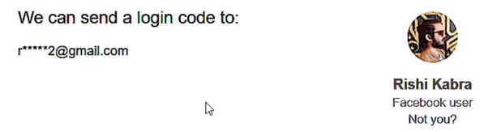

    - Another way to verify is go to gmail and compose an email, **paste the email and see if it will show details  about it or a profile pic**.

 

## Creating and Verifying Possible Email Addresses
- **Email Permutators** - Generate a list of possible email combinations.
- **Access it here:** http://metricsparrow.com/toolkit/email-permutator/

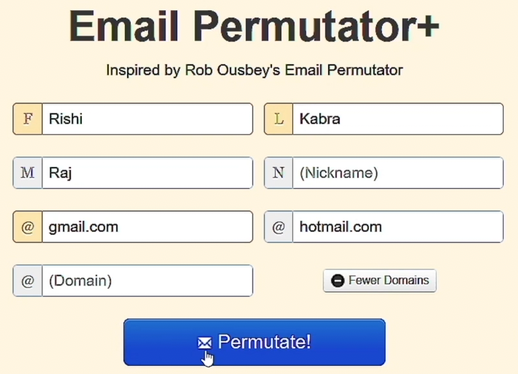

- Copy the result and put it in your notepad. 
- You can also paste them in **Gmail Compose** to check which of these are valid and will show a profile pic.

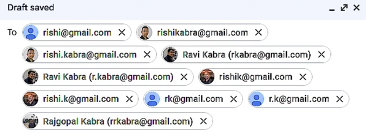

- You can also use this website: https://www.experte.com/email-finder to find an email. Just type the target's name and an email domain.

 

## Uncovering Emails with Browser Tools
- If a person has a linkedin account and you are trying to find their email address then you can rely on some browser extensions.

### Browser Extensions

#### GetProspect (Chrome extension only)
1. Log in to your LinkedIn account.
2. Go to your target's LinkedIn profile page (example: Rishi Kabra)
3. Click the **GetProspect Icon**

4. **Refresh** the page.
5. The **GetProspect** will automatically find the target's email address if it's available.

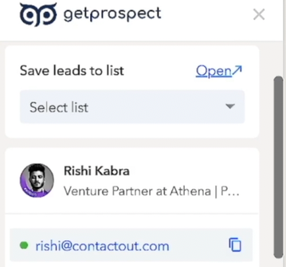

#### Email Finder by ContactOut
1. Log in to your LinkedIn account.
2. Go to your target's LinkedIn profile page (example: Rishi Kabra)
3. Click the icon of the browser extension.

4. It will automatically show the available email address/es of the target. And sometimes it can also show the phone number.

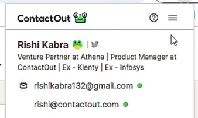

#### SignalHire
1. Log in to your LinkedIn account.
2. Go to your target's LinkedIn profile page (example: Rishi Kabra)
3. Click the large icon of SignalHire on the right side.
4. It will automatically show all the email address or phone number.

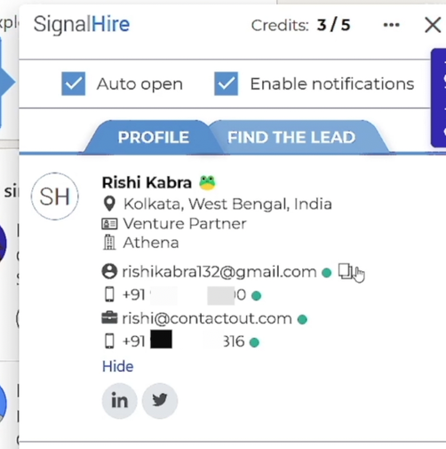

 

## Finding Business Email Addresses

### Hunter.io
- Identifies email pattern manually or automatically.
- Example pattern:
    - `f.lastname@example.com`
    - `s.sarraj@example.com`
- **Access it here:** https://hunter.io/
- To use:
    - Create a free account.
    - Go to **Search** tab.
    - Then search for the target's company. Example: ContactOut

    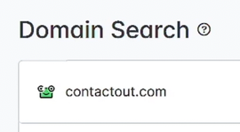

    - On the right-side part you can see the pattern.

    

    - Hunter.io also has an email verifier. 

    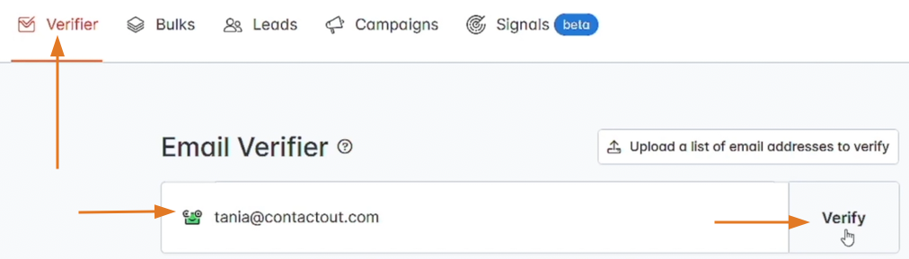

### Phonebook.cz
- Use this website if you like to gather many business email addresses of people who work at the same company.
- **Access it here:** https://phonebook.cz/
- You must create an account to use this.
- Example: 

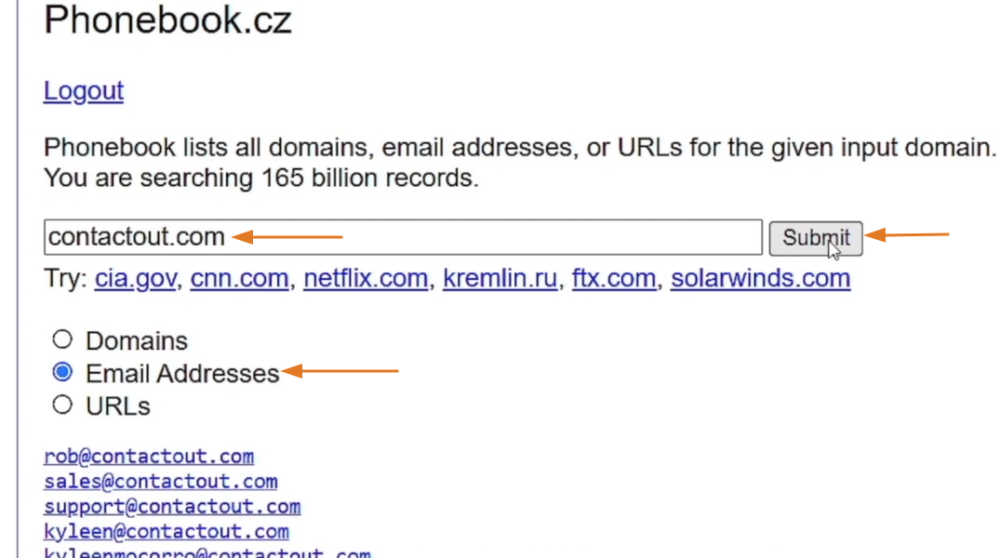

 

## Discovering Emails Within Data Breaches / Leaks
- Search for the person's info in leaked/breached databases.
- Search by:
    - Name
    - Phone number
- Check **Facebook, LinkedIn, Twitter** data leaks if the person has these accounts.

 

## Extracting Emails from GitHub Accounts

### Two Methods to Find an Email in Github

#### Check the file history edits
1. Go to your target's public repositories.
2. Check for files about them.
3. Click the **Commits** to check its history.

#### Check the email associated to a commit using GitHub API
1. Go to this URL example: `https://api.github.com/repos/rishikabra132/rishikabra132/commits` (Note: Replace the github username with your target.)

2. Or use a web app like: https://github-email-finder.netlify.app/

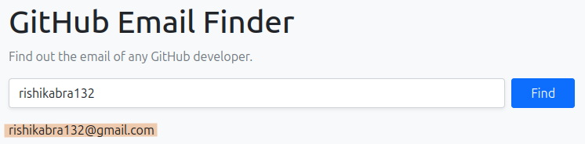

Note: This websites might not work if the person didn't commit anything.

 
 
 

# Email OSINT - Discovering Info Linked to an Email Address

## Tracking the Identity Behind an Email Address
- Use **search operators** to check if an email address is indexed by search engines.
- Example search in Google: `"rishikabra132@gmail.com"` or just search the username: `"rishikabra132"`

 

## Leveraging Password Resets to Validate Email Addresses
- Helps you find parts of an email address, potentially **aiding in the process of guessing or verifying it**.
- Example:
    - `example@gmail.com`
    - `e****@g***.com`

### Facebook password reset
- In `facebook.com`, click the `Forgot password?`
- See previous topics on how to use it.

### Twitter / X password reset
- https://twitter.com/account/begin_password_reset

### Instagram password reset
- https://www.instagram.com/accounts/password/reset/
- **Note:** Be careful at using this as instagram will send an email to notify the user that you used the password reset.

 

## Investigating an Email Address for Red Flags

### emailrep.io
- Is a service that provides **reputation scores and information about email addresses**.
- **Access it here:** https://emailrep.io/
- You need to sign up for a free API key to use this website.

#### Reputation factors:
- Presence on social media sites
- Public records
- Email deliverability
- Data breaches and credential leaks

 

## Uncovering Websites & Accounts Linked to an Email Address
- If you know someone's email, **you can check if they've signed up on other websites you didn't know about**.

### Epieos
- **Access it here:** https://epieos.com/auth/signin
- You need to sign in to use this (free plan)

### Castrickclues
- You need to sign up an account in https://usersearch.ai/m/auth/login 
- Their "ONEScan" feature allows you to cross-reference an email or phone number across multiple engines simultaneously, including Castrick Clues, Epieos, and OSINT Industries.

### Osint Industries
- **Access it here:** https://app.osint.industries/
- Need to sign up for a free account (30 credits / month)
- You'll have a free access if you're a journalist or working with police.

### Gravatar Email Checker
- **Access it here:** https://gravatar.com/site/check/

 

## Gmail OSINT - Discovering Phone number, reviews, addresses and more
- If the person uses Gmail, you can:
    - Identify their partial phone number
    - Find their GAIA ID

### Identify their partial phone number

1. Go to https://www.google.com/ and click the `Sign in` button.
2. Input your target's gmail account then click **Next**.
3. Click **Forgot password?**
4. This will show you the last 2 digits of the phone number associated with this account.
5. Click **Try another way** for more info if available.

### Find their GAIA ID manually

1. Go to https://mail.google.com/chat/u/0/#chat/home
2. Go to **Search** and paste your target's gmail address.
3. `Right-click (anywhere) -> Inspect`
4. Go to **Network** tab.
5. **Refresh** the page.
6. In the **Network** tab, search for `GetAssistiveFeatures`
7. Click the result, then click the **Response** tab, then click `1` then `0`. This will show the GAIA ID.

8. Go to this URL and replace the `ID` with your `target's ID`.

9. This will show your target's google reviews.

### GHunt Online
- Is a tool that allows you to find information about any Gmail account.
- **Access it here:** https://gmail-osint.activetk.jp/
- You can easily find your target's GAIA ID, profile pic, google reviews, etc. using this tool.

 

## Identify Data Leaks Linked to an Email Address
- **Access it here:** https://haveibeenpwned.com/
- Identify data breaches/leaks associated with the email.
- Download relevant data leaks/breaches.
- Search for additional information.

 

## Discovering LinkedIn Profiles Linked to an Email
### SignalHire
- is a browser extension that allows you to search for a LinkedIn account by an **email address** or a **phone number**.
- Just click its large icon (right side) and input the email address or the phone number.

 

## Leveraging Usernames and Emails to Discover Additional Accounts

### Blackbird
- **Get it here:** https://github.com/p1ngul1n0/blackbird

#### Key Features
- Reverse username search across +700 sites.
- Reverse email search across +10 sites.
- Support AI for better metadata extraction.
- Might be better than **Sherlock**
- Example usage (Note: You need to create a virtual environment first and install the ai module to use AI)
    - `python3 blackbird.py -u rishikabra132 -ai`
    - `python3 blackbird.py -e rishikabra132@gmail.com -ai`
