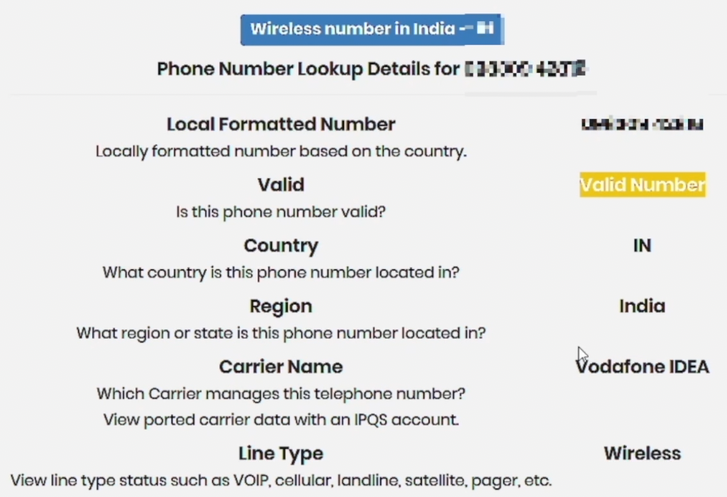
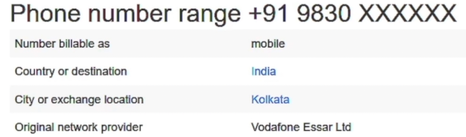
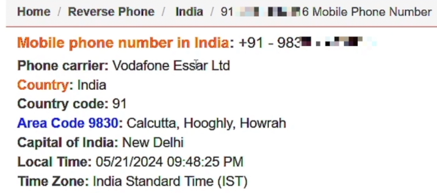
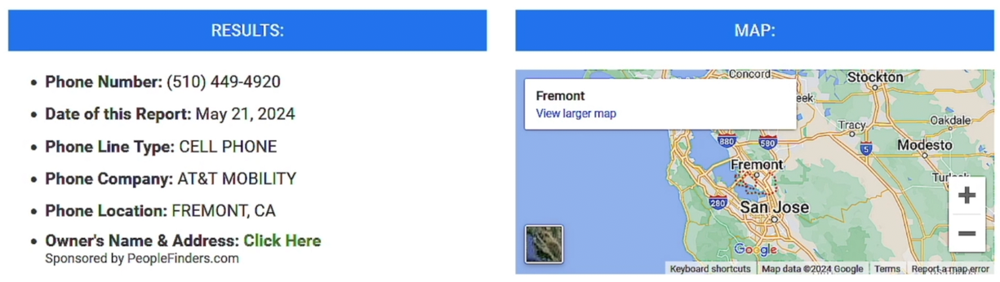
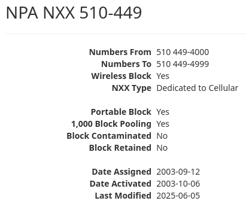
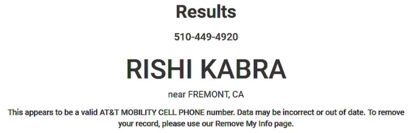

# Phone Number OSINT - Discovering Phone Numbers

## Tracking a Phone Number Across Online Platforms
- Finding a phone number is more difficult than finding an email, but **having an email address makes it easier to find a phone number**.

#### 1st method
- The obvious first step is to check if the person has shared their phone number on **their online/social media accounts**.

#### 2nd method
- Use **search operators** to find the person's phone number on **search engines**.
- **Format:** `"first and last name" "city" "phone number" OR "number" OR "country code"`
- **Example:** `"rishi kabra" "kolkata" "number" OR "phone number" OR "+91" OR "91" OR "0091"`. If you didn't find anything useful you could remove the "city".

 

## Uncovering Phone Numbers Linked to Linkedin Accounts

### Phone Lookup Extensions
- These are the browser extensions that might provide the target's phone number. Please see previous topics on how to use them.
    - ContactOut
    - SignalHire
    - GetProspect

 

## Discovering Sensitive Details Linked to a Phone Number
- Note that these websites info are limited to US residents only. And you need to use vpn to access them.
    - https://www.truepeoplesearch.com/
    - https://nuwber.com/
    - https://www.fastpeoplesearch.com/
    - https://www.fastbackgroundcheck.com/
    - https://thatsthem.com/
    - https://radaris.com/

 

## Finding Phone Numbers in Leaked Databases
- Search by: **Name or Email Address or Password** on these websites:
    - https://haveibeenpwned.com/
    - https://dehashed.com/
- Search in downloaded database leaks / breach:
    - Example: **Snapchat database** hides the last 2 digits, while the **Facebook database** shows these last 2 digits.

 
 
 

# Phone Number OSINT – Finding Details Behind a Number

## Uncovering Detailed Phone Number Information

### Phone Number Lookup
- Is the process of finding general information about a phone number.
    - Number type
    - Service provider
    - Spam score
    - Location

### Websites

#### IP Quality Score
- https://www.ipqualityscore.com/free-phone-number-lookup
- Example result:

#### Comfi
- https://www.comfi.com/abook/reverse
- Example result:

#### International Numbering Plans
- https://www.numberingplans.com/index.php?page=analysis&sub=phonenr
- Example result:

#### Search Yellow Directory
- https://www.searchyellowdirectory.com/
- Example result:

#### Phone Validator
- This is for US phone numbers only.
- To get more info you need to create a free account (you can use a temp mail only)
- https://www.phonevalidator.com/
- Example result:

#### North American NPA NXX
- Provides a detailed info about phone numbers from US or Canada only.
- https://www.npanxxsource.com/nalennd.php
- Example result (just a screenshot of the top, as it has many other details provided)

 

## Revealing Sensitive Information Using Advances Search Techniques
- Use **search operators** to check if a phone number is indexed by **search engines**.

- **International Format:** `"+CCXXXXXXXXX" OR "00CCXXXXXXXXX" OR "CCXXXXXXXXX" OR "XXXXXXXXX"`

- **US Format:** `"xxxxxxxxxx" OR "xxx-xxx-xxxx" OR "xxx.xxx.xxxx" OR "xxx xxx xxxx"`

 

## Uncovering the Identity  Behind a Phone Number

### Caller IDs Identifiers
- Caller ID identifiers help you find the caller's ID so you can block spam calls.

### Websites

#### True Caller
- https://www.truecaller.com/
- This has a huge database of international numbers.
- Requires a sign in from your Google or Microsoft account
- Example result from Rishi Kabra's phone number:

#### Sync Me
- https://sync.me/
- Signing in is required.
- Example result:

#### NumLookup
- https://www.numlookup.com/
- No need to sign up, but limited results.

#### Spy Dialer
- https://www.spydialer.com/
- For US phone numbers only.
- Example result:

 

## Uncovering Accounts Registered with a Phone Number
- We already used these websites when uncovering accounts with an email address, but now we'll use them for phone numbers.
- Note that we need to sign up to use these websites.

### Websites
- https://epieos.com/
- https://usersearch.ai/
- https://app.osint.industries/

### Browser Extension
- SignalHire

 

## Discovering Leaked Information Linked to a Phone Number

### Websites

#### DeHashed
- https://dehashed.com/

#### Facebook Data Breach Checker
- https://haveibeenzuckered.com/

 

## Deep Phone Number Scanning & Footprinting

### PhoneInfoga
- Is a tool to gather information about phone numbers.

#### Features
- Check if phone number is valid.
- Gather basic information.
- Check for reputation reports.

#### Installation
- `bash <(curl -sSL https://raw.githubusercontent.com/sundowndev/phoneinfoga/master/support/scripts/install)`
- verify if installed: `./phoneinfoga version`
- `sudo mv ./phoneinfoga /usr/local/bin/phoneinfoga`

#### Basic Usage
1. To use the GUI: `phoneinfoga serve` (take note of the port number)
2. Go to your web browser: `127.0.0.1:5000`