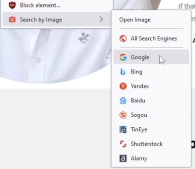
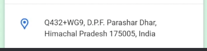

# Image OSINT - Reverse Image Search

## Gathering Profile Images for OSINT Investigations
- Download **unique profile pictures** from gathered online accounts.
- Let's assume that a client only gave you these pictures, and we will use these pictures **to find accounts**.

 

## Tracking Images Using a Web Browser Extension

### Search by Image extension
- by **Armin Sebastian**
- A powerful reverse image search tool, with support for various search engines, such as Google, Bing, Yandex, Baidu and TinEye.
- **Usage:**
1. `Right-click` an image.
2. Select **Search by Image** and select the search engine/s.

 

## Google Reverse Image Search
- **Google image search** allows you to search for exact images across the web.
- **Features:**
    - Displays websites where the image appears.
    - **Single object** detection.

- **Usage:** Go to https://www.google.com/ then click the `Search by image`. You can drag or upload an image or provide the image link.

 

## Bing Reverse Image Search
- **Features:**
    - Finds visually similar images.
    - **Strong object detection**.
    - **Ideal for detecting products and items** in images.
- **Usage:** Go to https://www.bing.com/ and click the `Search using an image` button. You can drag or upload an image or provide the image link.

 

## Yandex Reverse Image Search
- **Features:**
    - Good for **detecting similar faces**.
    - Effective at **identiying some locations**.
    - Strong **text recognition**.
- **Usage:** Go to https://yandex.com/ and click the `Image search` button. You can drag or upload an image or provide the image link.

 

## Specialized Search Image Engines

### TinEye
- **Features:**
    - Good at identifying logos or public pictures.
    - Not good at detecting places or faces.
- **Usage:** Go to https://tineye.com/ then you can drag or upload an image or provide the image link.

### NumLookup
- **Features:**
    - Can also do **Reverse Phone** and **People Search**.
- **Usage:** Go to https://www.numlookup.com/reverse-image-search then you can drag or upload an image.

 
 
 

# Image OSINT - Facial Recognition

## Facial Recognition
- **Facial recognition tools** allow you to search the internet **to find identical or similar faces** that have appeared online.
- Use **Google, Bing or Yandex** image search before using the following tools.

### Search for Faces
- https://search4faces.com/search.html
- Best for searching people in Russia.

### Pim Eyes
- https://pimeyes.com/en
- Discover where your images appear online and to track reuse.
- Note: This website requires payment to view for more info. To bypass this (might not work in the future), right-click and `Inspect` the image, copy the link of the image and go to https://gchq.github.io/CyberChef/ to decode some info on its URL.

### Face Check ID
- https://facecheck.id/
- Search internet by face (Social Media, Scammers, Sex Offenders, Videos, Mugshots, News & Blogs)
- Note: This website also requires payment for more info, repeat the process above and go to https://gchq.github.io/CyberChef/

 
 
 

# Image OSINT - Geo Location Tracking

## Using AI to Identify an Image Location

### GeoSpy
- https://geospy.net/en/geospy
- Is an AI-powered geolocation service to **uncover a picture location**.
- Examines **Landmarks, Vegetation, or Building styles**

### Alternative websites
- https://oceanir.ai/geospy-alternative
- https://geoseeer.com/blog/geoseer-vs-geospy-raven-ai-geolocation

 

## Discovering Image location Using Search Engines

### Sample Methodology
1. Go to https://www.google.com/ and click `Search by image`.
2. Upload the image, crop or select a portion of what you want in an image.

3. Click the closest image result, preferably with provided description. In this example we select the **Prashar Temple** image.
4. Go to https://www.google.com/maps and search for **Prashar Temple**.
5. Note the location. We could use this address to search for other multiple maps (yandex, etc)

 

## Extracting Location, Device Info and More From Images

### Metadata
- Is information stored within an image, video, or document file that gives extra details about the file.
- Information like:
    - Creation and modification date
    - Author, username
    - GPS coordinates of the location
    - Device information
- Note: Some social media strips the metadata once you uploaded it to their platform.
    - Example: If you downloaded a picture from Facebook, it is possible that this photo has no more metadata.

### Websites

#### MetaData2Go
- https://www.metadata2go.com/
- In this website you can view or edit Metadata of an image you uploaded. You can also extract or compare its data. 

#### EXIFTool
- https://exif.tools/
- is an online EXIF viewer and metadata checker for image metadata, file metadata, GPS data, hashes, magic bytes, XMP, IPTC, ICC, and adjacent formats.

### Browser Extension

#### Exif Viewer
- by Alan Raskin
- Displays the Exif and IPTC data in local and remote JPEG images.