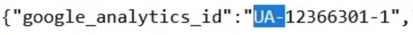

# Website OSINT – Analyzing Website Data for Intelligence

## Discovering Website Owners & Hidden Contact Details

### WHOIS record
- https://who.is/
- Is a public database entry that **shows who owns a domain name**.

Each record contains:
- Domain owner's name and contact details
- Registration and expiration dates
- Domain registrar information

### Osint.sh
- https://osint.sh/domain/ - Allows you to find domain names by a keyword
- https://osint.sh/reversewhois/ - Allow you to find domain names owned by an email address
- Note: This website currently broken.

 

## Identifying Technologies used in a Website
- Identifying a website technology helps you understand its **infrastructure and security posture**.
- **Information** you can find:
    - CMS (Content Management System)
    - LMS (Learning Management System)
    - Plugins
    - More..

### Websites
- https://osint.sh/stack/ (Note: broken)
- https://builtwith.com/

### Browser Extension
- Wappalyzer

 

## Discovering Subdomains

### Essential Subdomain Google Dorks
- `site:*.target.com -www`: Displays indexed subdomains while removing the main www page.
- `site:*.target.com -www -mail -app`: Stacks exclusions to narrow results down to uncommon or internal service panels.
- `site:target.com intitle:"index of" "../"`: Locates open directory listings nested under the main domain or its subdomains.
- `site:subdomain.target.com`: Isolates deep results inside a specific discovered branch.
- `site:*.target.com -www -mail -support`: The most effective Google dork for finding hidden or unlinked subdomains.

### Essential Subdomain Yandex Dork
- `rhost:com.target.*`

### Complementary Discovery Methods
- **Certificate Logs:** Query platforms like `crt.sh` using `%.target.com` to reveal all historically issued SSL certificates and hidden branches.
- **Automated Tools:** Run specialized passive reconnaissance software like **SubFinder** to aggregate records quickly. **Note:** Use something like **httprobe** or **httpx** to get only the live subdomains.

 

## Extracting Information From DNS Records
- **DNS Records** are instructions that live in DNS servers and provide information about a domain.

### Websites
- https://dnsdumpster.com/
- https://viewdns.info/

 

## Uncovering Websites Under the Same Ownership

### Reverse Google Analytics

- **Google Analytics ID** is a unique identifier that allows Google to collect data when inserted on a website.
- It helps us **find additional websites that the person controls**.

### Finding the Google Analytics ID
1. Go to your target's website.
2. `Right-click -> View Page Source`
3. `ctrl + F` then search for `ua-`

4. To search for this ID, go to this website: https://dnslytics.com/reverse-analytics/ or https://hackertarget.com/reverse-analytics-search/

 

## Tracking a Website's Changes and Updates

### Wayback Machine
- https://archive.org/
- Includes over 800 billion web pages saved over time.

#### OSINT usages:
- View websites as they appeared in the past.
- Retrieve deleted information.
- Track changes on web pages over time.

 

## Investigating Website’s Files for Hidden Information

### Metagoofil: The Automated Web Harvester
- targets a specific domain name, uses search engine scraping (Google Dorking automation) to find public document files hosted on that site, and downloads them locally to a folder.

#### Practical Application
- Instead of a researcher clicking and downloading dozens of PDFs manually, Metagoofil sweeps the site and grabs common target extensions like `.pdf, .docx, .xlsx, or .pptx`. It extracts immediate structural data to map an organization's internal layout.

### ExifTool: The Forensic Micro-Analyzer
- Once Metagoofil secures the files locally, ExifTool is used to analyze individual or mass files. ExifTool does not scrape the web; it reads the metadata layers—such as EXIF, XMP, and IPTC blocks—of more than 200 file formats.

#### Practical Application
- Investigators use ExifTool to find hidden timelines and operational footprints that basic document readers hide. While web platforms often strip metadata from public profile photos, standalone files hosted in a website's resource directory or media attachments usually remain fully loaded with tracking details.

 
 
 

# Website OSINT with OSINT TraceLabs VM

## Discovering Subdomains
- **subfinder** is a tool to find subdomains of any given domain.
- **httprobe** checks if a list of domains are live or not.
- Installation: `apt install subfinder httprobe`
- Example usage: `subfinder -d cybersudo.org -silent -o subdomain.txt | httprobe | grep -v 'http:'`

 

## Investigate WordPress Websites
### WPScan
- Is a security scanner used **to identify attack vectors of websites built with WordPress**.
- It collects information on:
    - Plugins
    - Themes
    - Usernames
    - More...
- Installation: `apt install wpscan`
- Example usage: `wpscan --url cybersudo.org -e u --random-user-agent`

 

## Automating OSINT Investigations

### Spiderfoot
- Is a tool used to gather information from various sources on the internet.
- Collects information on:
    - Domains, IPs, Hostnames, Network Subnets
    - Email Addresses, Phone Numbers
    - Names, Usernames
    - Bitcoin Addresses
    - And More...
- Installation: `apt update spiderfoot`
- Example usage: 
    - `spiderfoot -l 127.0.0.1:9999`
    - Go to your web browser: `127.0.0.1:9999` to open the spiderfoot GUI
