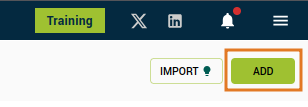
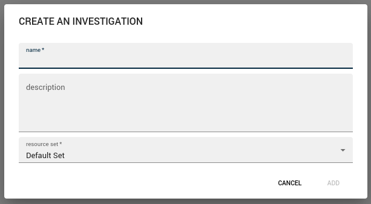
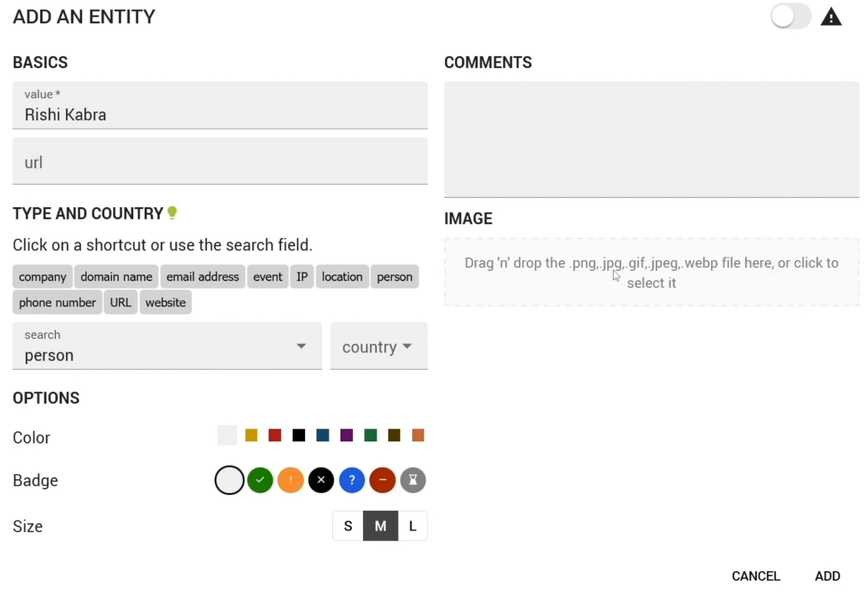
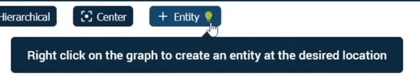
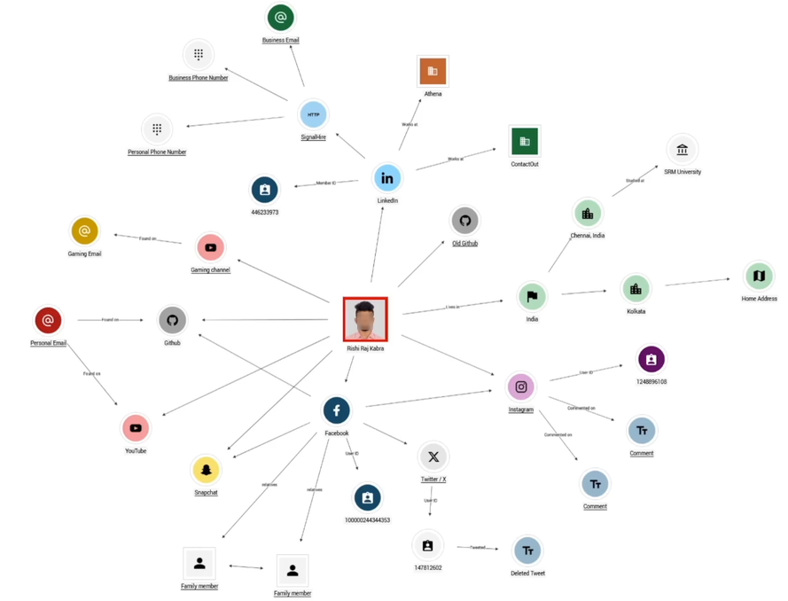
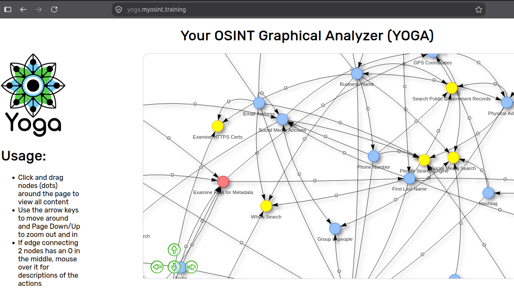

# OSINT Reporting

## Creating an OSINT Relationship Map

### Osintracker
- https://www.osintracker.com/
- Can be used if you would like to create a graph of the information that you have gathered about a person or a company.
- This will help you to present the information that you have gathered more professionally.
- This will give you an overview of the information that you have gathered.

#### How to Use Osintracker
1. Go to https://app.osintracker.com/investigations
2. Click the **Add** button to create an investigation.

3. Provide an **investigation name**, then click **Add**.
4. Click your newly created **investigation**, then click **Add the First Entity**. After your input click **Add**. Example:

5. Click **Entity** to add more info like his **Facebook**. 

6. Once you created an entity, click the **Relationship** to provide the relationship between this 2 entities. 

7. Drag an arrow from his entity to the facebook entity. Then provide the necessary information.

8. Keep on doing this until you have a full graph of all the information that you gathered.

9. Once you're done, use the Export to save your investigation.

10. To open this again in the future, click the **Import** button at start.

 

## Structuring Open-Source Investigations

### OSINT Flowcharts
- Is a step-by-step visualization of an OSINT process.
- This helps you to:
    - Know what to do with a piece of information.
    - Ensure no steps are missed.
- You can get sample flowcharts in: https://inteltechniques.com/osintbook/ and click the `Flow Charts: workflow.zip` to download. Example:

- You can also use this website: https://yoga.myosint.training/

 

## Writing a Professional OSINT Report

### What an OSINT Report Should Include:
- Scope
- Summary
- Key Findings
- Verification Steps
- Supporting Evidence
- Recommendations