# Learn OSINT from Scratch

---

## Table of Contents
* [01 - Search Engines](#01---search-engines)
* [02 - Database Breaches and Leaks](#02---database-breaches-and-leaks)
* [03 - Sock Puppets](#03---sock-puppets)
* [04 - Socmint](#04---socmint)
* [05 - Username](#05---username)
* [06 - People](#06---people)
* [07 - Emails](#07---emails)
* [08 - Phone Numbers](#08---phone-numbers)
* [09 - Images](#09---images)
* [10 - Maps](#10---maps)
* [11 - Websites](#11---websites)
* [12 - Reporting](#12---reporting)

---
 

## 01 - Search Engines

### Google Search Operators

#### Discovering Sensitive Information About People

##### Double Quotes `""`
- This operator displays results that **exactly match** your search query within double-quotes only.
- Note: This is also applicable to Bing.

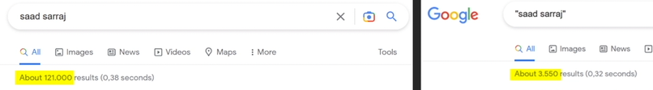

- **Example:** Target information:
    - Name: Rishi Kabra
    - Works at: ContactOut

- Methodology:
1. Search google for: `"rishi kabra"`
2. To narrow it down, include his work: `"rishi kabra""contactout"`

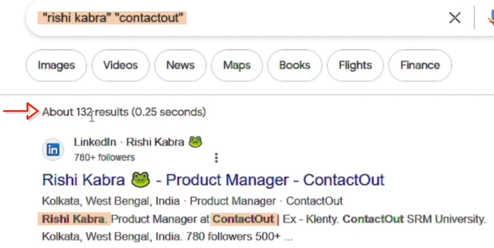

3. You can take down notes using **Notion** (cloud service), or **KeepNote** (local). You can also take screenshots using **greenshot** or **lightshot**.
4. Copy the URLs of his accounts (linkedin, X, etc) and put it in your notes, you can clean long URLs using: https://urlclean.com/
5. If you're sure what his face looks like, you can search it too. Click the **Images**.

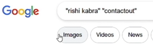

6. Go to `Tools -> ClipArt`

7. On the URL, change the word `clipart` to `face`.

8. Now from the search results, you confirmed that he is from "kolkata", you can then search again: `"rishi kabra""kolkata"` to further see if he have other accounts.

9. You might also see other result, like OLX, that he might be selling something.

10. Unfortunately, if the item is already sold, you might not see the post anymore.

11. What we can do is to check if there's a cached version of this page. Copy the URL from the search result.

12. Clean the link using: https://urlclean.com/

13. At the beginning, add the word `cache:`, paste the URL in a new tab then press Enter.

 

#### Discovering Social Media Profiles Accounts

##### `inurl:`
- Tells search engines **to only look for a specific keyword in the URL**.

- Methodology:
1. After getting the accounts from earlier, search each of his usernames using `inurl:`

2. For example, search his github username: `inurl:rishikabra132`

3. With this, we discovered his another account.

##### `OR` operator
- Searches for a given search term OR an equivalent term.
- `OR` should be in capital letters.
- In this example, we are searching `saad sarraj` in **facebook site** OR the **twitter site**

- Example:
    - If we apply this to our target `rishi kabra`, we can search him within facebook or twitter by: `"rishi kabra" site:facebook.com OR site:twitter.com`

##### `intitle:`
- Displays search results that contain a search term within the title of the page.
- Use a dot `.` for space.
- Example:
    - To apply this to our target, search: `intitle:rishi.kabra`

##### Asterisk `*` operator
- Is a wildcard operator that **acts as a placeholder for one or more words**.
- Useful for **finding middle names** or **filling in missing information** in searches.
- Example:
    - To apply this to our target, search: `"rishi * kabra"`
    - From the search result, we now know that his middle name is **Raj**. (considering that we should confirm first if he owns this account by referring with other known details)

    

##### Hyphen `-` operator
- **Excludes a search term** from appearing in the search results.
- Methodology:
1. Search again for: `"rishi kabra"`
2. Notice that from the results, there's another person named `rishi kabra`, and he works at `MOTLEY GREEN`
3. We can then exclude this other person by: `"rishi kabra"-"MOTLEY GREEN"`
4. We can also exclude results from a certain website, in this example, we want to remove the results from the linkedin website: `"rishi kabra"-"MOTLEY GREEN"-site:linkedin.com`

##### `site:`
- **Searches within a particular site**.
- Can be used to display search terms on that website.
- Example:
    - To apply this to our target, we want to know if the name "rishi kabra" is in facebook, search: `"rishi kabra" site:facebook.com`

 

#### Discovering PDF Documents Associated with Targets

##### `filetype:`
- Tells search engines to only **search for a specific file type**.
- Example / Methodology:
1. If we want to know if there are PDF files related to our target "rishi kabra", search: `"rishi kabra" filetype:pdf`
2. By opening each result, we opened a PDF file that "rishi kabra" is one of its authors. And we can also see his **gmail account**, we can confirm this with his username **rishikabra132** which he also used with his github account.

3. By opening other PDF results, we also discovered another info that he studied in **SRM University**.

4. **Note:** We can also check the metadata on this PDF files to get more info.

 

#### Find Hidden Search Results
- Sometimes, Google removes some results if you are in a certain country. In the example below, Europe.

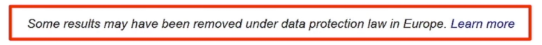

##### 2 Ways to bypass this
1. Use a **VPN**.
2. Use a browser extension **SquareX**.

 

#### Find Cameras & More With GHDB

##### Google Hacking Database (GHDB)
- is an index of search queries that **allow you to find sensitive/specific information** on the internet.
- **Examples:** Vulnerabilities, Public cameras, Public IOT devices, Public Passwords, and many more..
- **Access it here:** https://www.exploit-db.com/google-hacking-database
- Methodology:
1. Go to https://www.exploit-db.com/google-hacking-database
2. Quick Search: `camera`
3. Copy a google dork. Example: `inurl:"view.shtml" "camera"`
4. Paste it in Google Search.
5. Check the results for live camera footage of certain places.
6. Another example: You can also copy this google dork `intitle:"Index of" "DCIM/camera"` to see some saved photos and videos from android devices.
7. Copy the URL of one of the images.
8. Go to https://exif.tools/
9. Paste the URL to see the metadata of that image.

 

##### Enhancing Google Searches with AI
- **Access it here:** https://www.dorkgpt.com/
- Example:

 
 
 

### Bing Search Operators

#### Discovering Additional Information & Online Accounts Using Bing
- Using different search engines might yield varying search results.
- Bing has some exclusive search operators that Google SE doesn't have.
- **Access it here:** https://www.bing.com/
- Example / Methodology:
1. Try searching here: `"rishi kabra"`
2. Sometimes, bing will provide results that google didn't, like in this example, one of the results show that rishi kabra had an instagram account (https://www.instagram.com/rishikabra132), it's just not working anymore.
3. Try also searching: `"rishi kabra" "kolkata"`
4. Sometimes Bing provides a cached copy of a page, showed by 3 dots. Click on the `3 dots` then click `Cached`

##### `loc:`
- Find web pages from a specific country or region.
- Example: If we want to narrow the search for Rishi Kabra in India, search: `"rishi kabra" loc:in`

##### `language:`
- Return search results in a preferred language.
- Example: If we want to show the search results for Rishi Kabra in english only, search: `"rishi kabra" language:en`

 

#### Beyond Google Finding Hidden Information

##### `linkfromdomain:`
- Finds all links found on the target website.
- Example: `linkfromdomain:zsecurity.org`

##### `ip:`
- Returns indexed websites that are hosted on this IP address.
- Example: `ip: 141.20.5.188`

##### `contains:`
- Searches for pages that have links to a file type you specify.
- Example: `site:zsecurity.org contains:pdf`

 
 
 

### Alternative Search Engines

#### Yandex
- Yandex **has some exclusive search operators** that Google or Bing don't have.
- Using different search engines might yield varying search results.
- Yandex is the **best for face matching and location identification**.
- **Access it here:** https://yandex.com/
- Example: Search for `"rishi kabra"`
    - Same with Bing, Yandex sometimes cached a page shown by 3 dots. Click the `3 dots`, then click `Saved Copy`

    

##### `date:`
- Used to find search results in a specific date.
- How to use: 
    - `date:2023` - year
    - `date:202301` - year/month
    - `date:20230101` - year/month/day
    - `date:2023..2022` - from year to year
    - `date:>2022` - set if greater than or less than of that year (you can also include month and day if needed)
- Example: `"rishi kabra" date:2020`

##### `rhost:`
- Can be used to **find a website's subdomains**.
- Format: `rhost:top_level_domain.second_level.*`
- Example: `rhost:org.cybersudo.*`

- Note: Yandex will show subdomains even if they are not available anymore.

 

#### DuckDuckGo
- Pretty much the same dorking techniques.
- Using different search engines might yield varying search results.
- **Access it here:** https://duckduckgo.com/
- Example: `"rishi kabra" "kolkata"`

 

#### Baidu
- Best in **finding chinese person**.
- **Access it here:** https://www.baidu.com/
- Example: search `"rishi kabra"`

 

#### Intel Techniques
- Used for automating searches from different tools.
- **Access it here:** https://inteltechniques.com/tools/index.html
- Example: (Note: Click 'Populate All' to use all the search engines)

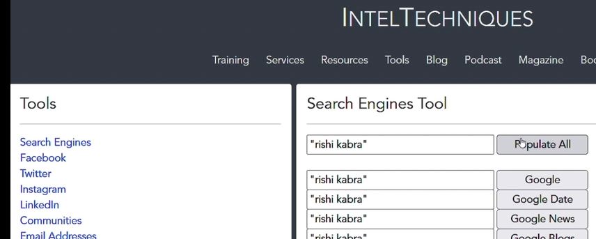

- Note: Use this as a last option as it will overwhelm you with results.

---
 

## 02 - Database Breaches and Leaks

### Database Breaches & Leaks - Finding Passwords, Emails, Locations + More!

#### Understanding the Difference Between Breached & Leaked Database

##### Data Breach
- is an **intentional** unauthorized access to sensitive information.
    - Exploited security vulnerabilities

##### Data Leak
- is an **unintentional** exposure of sensitive data.
    - Human error
    - Overlooked vulnerabilities

 

#### Finding Relevant Breach & Leak Databases

##### Required Information to Search the Database

###### At least one of the following:
- Email
- Phone Number

###### Additional helpful information to refine your research:
- First and Last Name
- Physical Address
- Country, City
- Age
- Gender

 

##### Have I been pwned? (HIBP)
- Allows you to check if your info are leaked online.
- Utilizing HIBP in OSINT:
    - Confirming email validity
    - Revealing individual interests
    - Shows what types of data were leaked
- **Access it here:** https://haveibeenpwned.com/
- Example: Check Rishi Kabra's email.
1. Go to https://haveibeenpwned.com/
2. Search for `rishikabra132@gmail.com`

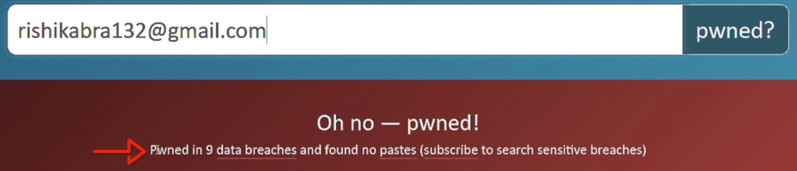

Sample result (Compromised Data):

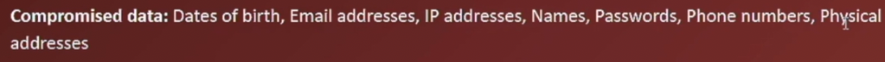

3. Notice that the his email is pwned in 9 data breaches. This also confirmed that this **email is valid, revealed his interests, and showed what types of data were leaked**.

 

#### Finding Emails, Passwords & More

##### DeHashed
- is a search engine to find data breaches and data leaks.
- requires a paid subscription to be used.
- **Access it here:** https://dehashed.com/
- **Example:**
1. Search the name: `"zaid sabih"`

2. Check the results until you find your target. (You can confirm it based on the info that you have about your target). In this example, you confirmed that this result is for Zaid Sabih, because you're sure that this is his email.

**Note:** Also check the other results as they might also belong or related to your target.

3. Go to https://whatismyipaddress.com/ip-lookup to check the IP address `51.171.78.181`

4. Google search `zsecurity dublin` to verify this info.

 

#### Finding Addresses, Phone Number & 

##### IntelligenceX
- is a search engine and data archive.
- is partially free to use.
- **Access it here:** https://intelx.io/
- Example:
1. Search Rishi Kabra's email.

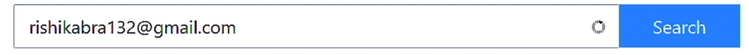

2. Notice that the results are reducted. To view them, it requires a paid plan/subscription.

3. To view the results for free users, click `Advanced`, and only select the options that has no "PRO".

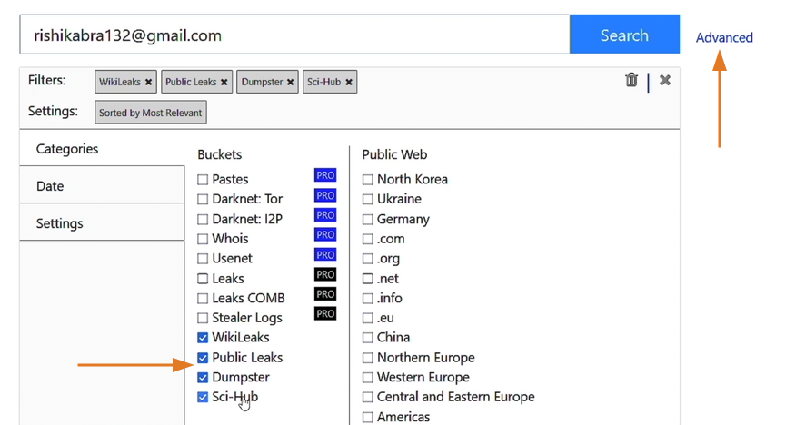

Then click `Search`.

- Another example:
1. Search the email address that you got earlier (with Zaid Sabih).

2. Click the blue text, and search again the email address, to view its password.

 
 
 

### Downloading Leak / Breach Databases

#### Search in Leaked/Breached Databases
- There are **two ways** to access data from a leaked or breached database:
    - **Subscription Service**
        - DeHashed, IntelX, Snusbase, etc.
    - **Local Download**
        - Software: Agent Ransack and Torrent client
        - Hardware: Disk space

#### Setting Up an Isolated Virtual Environment

1. Open VirtualBox and create a new **Windows 11 VM**.

2. Hardware: 4gb ram; 3cpu; Enable EFI (checked)
3. Select **Create a Virtual Hard Disk Now** radio button, and provide at least **80gb** storage.
4. Start the VM that you just created.
5. Continue with the installation process.

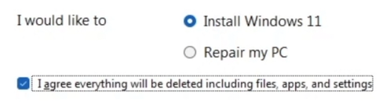

6. Select **I don't have a product key**.
7. Select **Windows 11 Pro**.
8. Click all the **Next** then **Install**
9. Before you continue, you can disable the internet to avoid downloading and installing updates. Go to your `VM Settings -> Network -> Attached to: Not attached -> OK`
10. Now continue with the installation: Selecting your region, keyboard layout, Skip, then Select `I don't have internet`
11. Enter your username, then password is not required.
12. Select `No` for your location. Click `Accept`
13. Install VirtualBox guest tools: `Devices -> Insert Guest Additions CD Image..`, then open it in the File Explorer.
14. Then run this tool: 

15. Select "Reboot now" after installation.
16. Enable copy-paste in the VM:
    - `Devices -> Drag and Drop -> Bidirectional`
    - `Devices -> Share Clipboard -> Bidirectional`
    - `Devices -> Shared Folders -> Shared Folders Settings..`

 

#### Installing Needed Software to Manage Leaked Databases

##### 1. utorrent
- A torrent client to download the database.
- Get it here: https://www.utorrent.com/

##### 2. Agent Ransack
- A tool that will allow you to search for data within the leaked database that you downloaded.
- Get it here: https://www.mythicsoft.com/agentransack/download/

##### 3. Hardware; Disk Space
- You will need a large disk space to download the databases.

 

#### Downloading & Accessing Leaked Facebook Data (2019)
- **Compromised Data:** User IDs, Phone numbers, and full names.

1. Google search: `facebook data leak github`
2. Then click on the first link:

3. In **utorrent**, add the torrent to download the file. 

4. Unzip the files that you need, in this example, the **India.zip**

5. Open the extracted folder `India`. `Right-click ->  Show more options -> Agent Ransack..`

6. Input the facebook ID of Rishi Kabra, and click the `Start` button. (Note: Getting the facebook ID will be discussed on future tutorial)

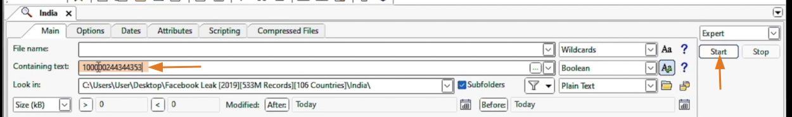

 

#### Downloading & Accessing Leaked Twitter Data (2023)
- **Compromised Data:** Email addresses, names, social media profiles, and usernames.

1. Google search: `"twitter 200m" "magnet:?"`
2. Download the database using **utorrent**, then extract the file.
3. Go to the extracted folder, `right-click ->  Show more options -> Agent Ransack..`
4. In this example, search for Zaid's twitter username.

 

#### Downloading & Accessing Leaked LinkedIn Data (2012)
- **Compromised Data:** Member IDs and Email addresses.

1. Go to the provided link.
2. Click on the 7z to download the 1.7gb file.

3. After downloading and extracting the folder, run **Agent Ransack**.
4. To search for a person, you need their **member ID**.
    - To get a **member ID**, go to their linkedin profile page.
    - Right-click -> View Page Source
    - ctrl + F, then type `member:`
6. In **Agent Ransack**, paste the member's ID.

 

#### Downloading & Accessing Leaked Snapchat Data (2014)
- **Compromised Data:** Usernames and partial phone numbers.

1. Go to the provided link.
2. Click on the 7z to download the 32mb file.
3. After downloading and extracting the folder, run **Agent Ransack**.
4. You can get the username from the URL.

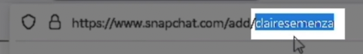

5. In **Agent Ransack**, paste the username.

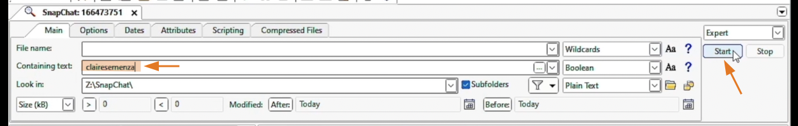

6. Copy the result and paste it in a text editor.

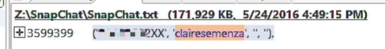

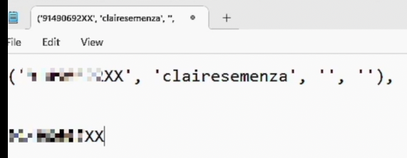

7. Find if she has a facebook account. Copy her facebook's URL. Example: `https://www.facebook.com/claire.semenza`

8. In incognito tab, go to facebook.com, then click the `Forgot account?`, then paste the URL, then click **Search**

9. Click on **Try another way**. Now we can see her number ends with `13`

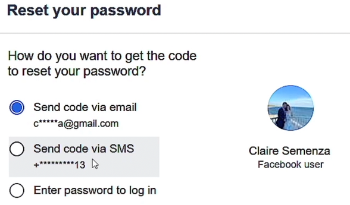

10. Go back to text editor, replace the `XX` with `13`
11. Copy the blurred number then go back to facebook, then search for that number (Note: Don't forget the country code). Then click **Search** to reveal her full number.

 

#### Finding Leaked Databases on The Internet

##### Use Google Search
- Include the name of the website that has been hacked, together with keywords.
- Example: `
"000webhost.com.7z" "leak" "download" "magnet:?"`

##### sizeof.cat
- **Access it here:** https://sizeof.cat/post/data-leaks/

---
 

## 03 - Sock Puppets

### Building a Sock Puppet Identity for OSINT

#### Why to use sock puppet account in VM?
- Hide your real OS footprints from websites
- Protects your main system from malware
- Quickly **wipe your VM after an investigation is done**

 

#### Setup your VM

##### Tracelabs VM 
- is a specialized, pre-configured virtual machine built for open-source intelligence (OSINT) investigations, focusing on tools **for social media analysis, reconnaissance, and gathering digital forensic evidence**.

 

#### Creating an Untraceable Covert Account
- It is a **covert account** that is not related to your identity.
- This will prevent you from revealing your identity when performing SOCMINT.
- It is ideal to **mirror target identity characteristics**. Example: If you are investigating an indian target, it is better if you use a sock puppet account that has an indian name.

###### 1. Create a fake bio data

- https://www.fakenamegenerator.com/ - To create a fake identity and select the nationality.

###### 2. Create a fake profile pic

- https://thispersondoesnotexist.com/ 
- https://thispersonnotexist.org/

###### 3. Create a Fastmail Email

- https://www.fastmail.com/
- Only `Try for Free` (30 days)
- It is advisable to choose a top level domain based on the country/nationality of your target. Example: Choose `.us` for `johndoe@fastmail.us` if your target is from Unites States.

###### 4. Create a burner number
- Buy a prepaid card that doesn't need an ID.

###### 5. Use a Library/Cafe Wi-Fi
- It is better to create social media accounts in (example) coffee shop because (example) facebook can detect if you are using a VPN and will ask for more info.

###### 6. Create a Facebook/Instagram/x accounts

###### 7. Keep the account active

###### 8. Log in at least twice a week

###### 9. Add 2FA (2 Factor Authentication)

---
 

## 04 - Socmint

### Facebook OSINT

#### Extracting Valuable Information From a Facebook Profile

##### Using Filter When Finding a Person
- We can use the **filter to narrow down the search results**.
- Example: Instead of just searching for "Rishi Kabra", we could add the place "Kolkata", since we already confirmed this place from our previous research.

##### Username in URL
- Once you found your target, check the URL.
- Facebook will create your username, based on the **first display name** that you provided.
- Example: Rishi Kabra's URL is "https://www.facebook.com/RishiRajKabra". Which means his username is still `RishiRajKabra`, even though he already removed his middle name in his profile.

##### Facebook Info pages
- These are tabs **Intro, About, Friends, Photos, Videos, Check-ins, More, etc**
- Take note all the available info shown from these tabs.
- Example: Rishi Kabra's Intro page. 

- Check all the photos, and the details included. Example below is his post, with the detail "Birthday dinner with the fam" and the date he posted it. So there's a high possibility that his birthday is "December 1".

- And we can confirm this from his other accounts, like linkedin.

- We are now sure that his birthday is December 1, we only don't know the 'year'. But by further checking his other posts, we can confirm that his birth year is 1995.

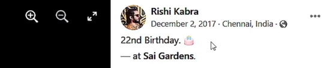

 

#### Extracting User ID, Facebook Friends & More

##### User ID
- You can go to this website: https://findidfb.com/ then paste the target's URL. Or --

- Go to your target's facebook profile, `right-click -> View Page Source`
- `ctrl + F` then search for `userID`

- You can then use it on the URL. Example: `https://www.facebook.com/100000244344353`

- We can also use the **userID** to find out the **Account Creation Date**.

##### Download your Target's Friends List
- If you use a browser extension, facebook might detect and block it. To manually download your target's friends list, go to your target's **Friends** tab, go all the way down (or keep on pressing Spacebar) until all the Friends are displayed. (**Note:** Sometimes the important friends are only by his current location)

- Then select them by using your mouse, then `right-click -> Copy`, then paste it on Excel (just select one cell then paste it).

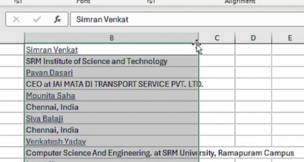

- If you just want to see the names without the descriptions:
    - Click of the first field (Ex. Simran Venkat)
    - Go on the `Data tab -> Filter`
    - Click the `dropdown button -> Filter by Color -> click the color`

    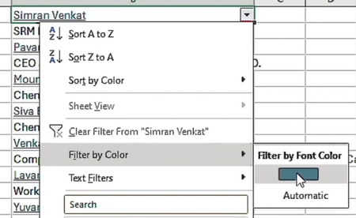

 

#### Find Partial Email / Phone Number
- Click the `Forgot password?` 

- Enter the **email or mobile number or username**. Example: Rishi Kabra
- Click the **This Is My Account**

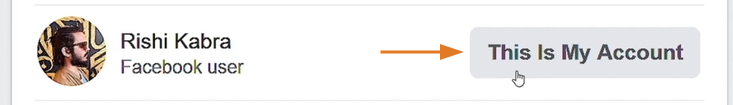

- You can now se the options similar below:

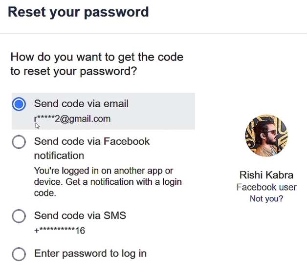

- To confirm the email address that we got earlier (from previous topic lecture), we can go back `Find your account - Enter your email or mobile number`

- Now we are now sure with his email address, and we got the last 2 digits of his number.

 

#### Finding Public Comments / Tags of a Facebook Account
- **Utilizing search engine operators** can be useful in locating publicly indexed comments and tags.

- Format: `"Name" site:facebook.com inurl:posts`

- Example: `"rishi kabra" site:facebook.com inurl:posts`

 

#### Facebook OSINT Summary Checklist
- Use **filters** to locate the target profile.
- Save the **profile picture**.
- Check the **username**.
- Find the **user ID**.
- Identify the account **creation date**.
- **Review** all posts.
- Save the public friend list.
- Try the **forgot password** feature on FB.
- Search for public info using **search operators**.

 
 
 

### Instagram OSINT

#### Extracting the User ID of an Instagram Account
- Use `Search` to find your target. **Note**: Use all the name or usernames from your notes.
- Once you found your target, **note the URL and the profile picture**.
- To get the `User ID`:
    - Go to your target's instagram page.
    - `right-click -> View Page Source`
    - `ctrl + F` then search for `profile_id`

    

    - Or you can use this website: https://fameswap.com/tool-instagram-user-id
- So if your target changed their username or profile name, you can still find them using their **user ID**, you can use this website: https://commentpicker.com/instagram-username.php

 

#### Extracting Timestamps from Posts and Comments
- Timestamp will show you the **exact date and time when a post was posted**.
- Format: `yyyy-MM-dd'T'HH:mm:ss`
- Follow this to get the timestamp:
    - Click the instagram post.
    - `right-click -> Inspect`
    - Then select the date of the post or a comment.

    

    

    - To convert it on your local time, you can use this website: https://www.timestamp-converter.com/, then paste it on the `ISO 8601` section.

    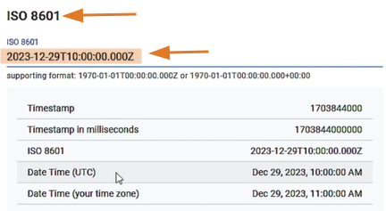

 

#### Uncovering Comments of Private Instagram Accounts
- **Utilize serach engine operators** to discover indexed information on Instagram profiles.
- Examples:
    - `site:instagram.com "cyber_sudo"`
    - `site:instagram.com "@cyber_sudo"`
    - `site:twitter.com "username" "instagram.com/p"`
    - or search the target's complete URL, `https://www.instagram.com/rishirajkabra/`
    - Note: If post not available anymore, you **can check bing or yandex for the cached copy**.

 

#### Extracting Hidden Information from Instagram Metadata
###### Steps:
- Add browser extension: **User-Agent Switcher and Manager**
- Get the **User ID** of the target's instagram account.
- Log in to your socket instagram account.
- Click the **User-Agent Switcher** extension, then select **Instagram** and **Android**, then select a radio button.

- Then access the API using this endpoint. `https://i.instagram.com/api/v1/users/1248896108/info/` (**Note:** Replace it with the target's user ID.) Copy-paste the API endpoint on a new tab.

- Click on **Save** to save the JSON file.

 

#### Scraping Instagram Followers

##### Manual Method:
- Click on your target's `followers`

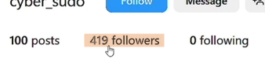

- Load all the followers by scrolling down. Then select all of them by dragging your mouse then 'right-click -> Copy'.
- Go to Excel, then click `A` to select the entire column.
- Then press `ctrl + V` to paste.
- Notice that even the followers' profile pics are saved, to remove them click `F5 -> Special... -> select 'Objects'` then click `OK`. Then press `Delete` on your keyboard.
- Filter the column to see the **usernames** only. Click the `Data tab -> Filter -> click drop-down button on the top cell -> Sort by Color -> Automatic`

##### Automatic Method:
- Install web browser extension: **IG Follower Export Tool - IG Tools**
- Be sure that you are logged in, then go to your target's instagram page.
- Click the extension's icon, then click **Export Instagram Data**
- Under **Options** input the target's IG user

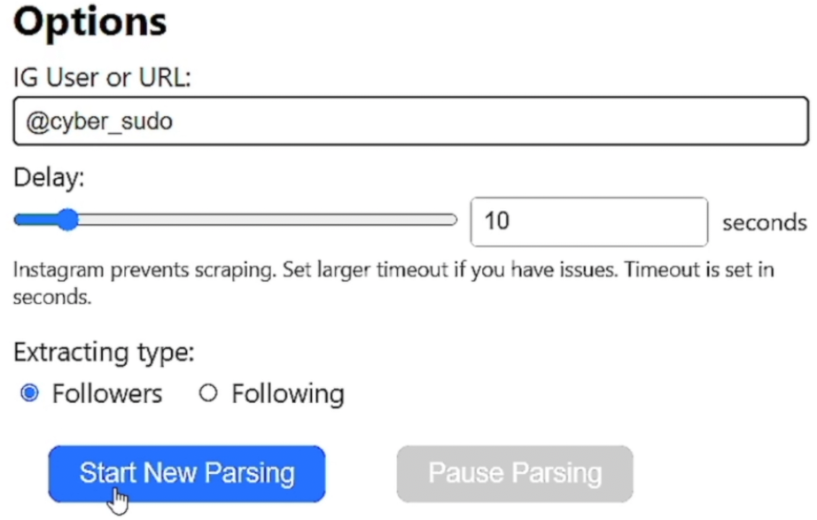

- After the parsing finishes, select if you want to **Save to CSV, or Save to Excel**

 

#### Downloading All Instagram Photos

##### Manual Method:
- Go to your target's instagram page.
- `Right-click -> Inspect`
- Inspect the image, copy the image URL, then open it in a new tab, then save the image.

##### Automatic Method:
- Install web browser extension: **Download All Images**
- Be sure that you are logged in, then go to your target's instagram page, scroll down until all the images are loaded.
- Click the extension's icon, then select **JPEG** then click **Save**

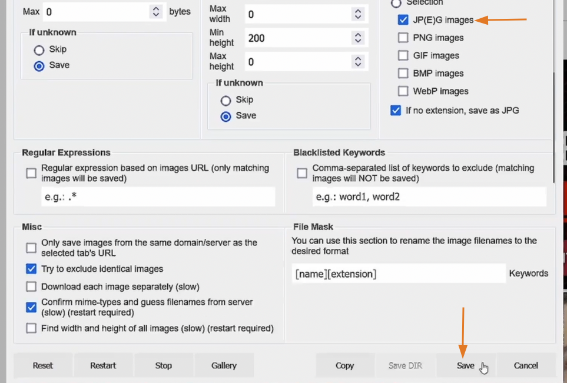

 

#### Automatically Download Instagram Profiles

##### Instaloader
- is a free, open-source tool written in Python that lets you download pictures, videos, and metadata from Instagram.
- to install using pipx: `pipx install instaloader`

###### Download a Public Instagram Account
- To download all photos and videos from a public instagram account, use this format: `instaloader <username>`
- Example: `instaloader cyber_sudo`

###### Download a Private Instagram Account
- Make sure that this private account **accepted your follow request**.
- Format: `instaloader -l <your_username> <target_username>`
- Once you enter this command, it will request your password.
- If you got a 401 error: `rm /root/.config/instaloader/session-<your_username>`

 

#### Undetectable Instagram Info Extraction

##### Toutatis
- is an open-source command-line intelligence tool **used to extract public and partially masked private information** from Instagram accounts.
- it is **unstable due to Instagram's shifting security measures**
- to install using pipx: `pipx install git+https://github.com/megadose/toutatis.git`

###### Key Features:
- Extract the user's partial email and phone number without notification
- Retrieve the user's ID
- Download the user's HD profile picture

###### Usage:
- Format: `toutatis -u <target_username> -s <your_session_id>`
- **Note:** To get your session ID, log in to your instagram account page, `right-click -> Inspect`, then go to `Storage` tab.

 
 
 

### Twitter OSINT

#### Extracting X / Twitter User IDs

##### Analyze the target profile

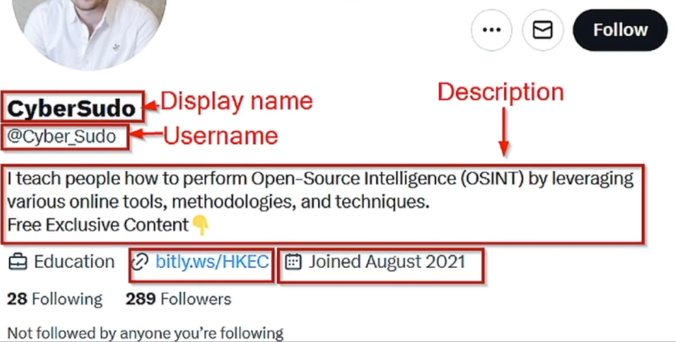

##### Search for an Account
- You can confirm your target's account with the help of your gathered research (from previous topics).

##### Find the User ID
- Go to your target's twitter page.
- `Right-click -> Inspect`
- Search for `/profile_banners/`

- Or search for `identifier`

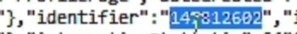

- Or use this website: https://commentpicker.com/twitter-id.php

##### Track the Target using User ID
- Use this URL: `https://twitter.com/intent/user?user_id=147812602`
- Or use this URL: `https://twitter.com/i/user/147812602`

 

#### Recovering Deleted Tweets and Timestamps
##### To get the timestamp of a post or comment:
- `Right-click -> Inspect` the date.

- To convert it on your local time, you can use this website: https://www.timestamp-converter.com/, then paste it on the `ISO 8601` section.

##### Indexed Tweets
- Utilize search engine operators to discover indexed tweets.
- Examples:
    - `site:x.com "cyber_sudo"`
    - `site:x.com "@cyber_sudo"`
    - `site:x.com/cyber_sudo/status`

 

#### Leveraging Search Operators to Find Specific Tweets
- `from:` - will display all tweets from @X
    - Example: To see all tweets from username: `_zsecurity_`, search for: `from:_zsecurity_`
    - Example: To see all tweets from username: `_zsecurity_` with keyword `email`, search for: `from:_zsecurity_ email`

- `from:` + `to:` - if we would like to see any connection or any tweets from a certain account to another
    - Example: `from:cyber_sudo to:_zsecurity_`

- `since:`yyyy-mm-dd
- `until:`yyyy-mm-dd
    - Example: To see all tweets from the username: `cyber_sudo` from `2024-01-01` to `2024-01-15`, search for: `from:cyber_sudo since:2024-01-01 until:2024-01-15`

 

#### Discovering Tweets Posted from a Specific Location
- `geocode:` - restrict your search by a given location
    - Format: latitude,longitude,radius
    - To get the latitude and longitude of a certain location, go to **google maps**, then right-click the location that you need. Click the coordinates to copy it to your clipboard.

    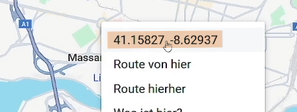

    - Example: If you want to see all the tweets from this location within a radius of 5km and related to keyword "osint", go to twitter search bar: `geocode:41.15827,-8.62937,5km "osint"`

 

#### Other Search Operators
- `@` - used to find if an account has mentioned another x account
    - Example: `from:_zsecurity_ @cyber_sudo`
- `filter:` media, replies, retweets
    - Example: `from:_zsecurity_ filter:media` to see all the media from the username: `_zsecurity_`
    - Example: `from:_zsecurity_ -filter:replies` to see all the tweets EXCEPT for replies
- `OR`
    - Example: `from:_zsecurity_ "osint" OR "cybersecurity"` to see all the tweets from the username: `_zsecurity_` with the keywords "osint" OR "cybersecurity"

 
 
 

### LinkedIn OSINT

#### Discovering and Analysing LinkedIn Profiles

##### Search Filters
- You can narrow down your search by using the **filters**. Click on **All filters** to see all of them.

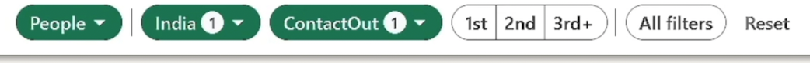

##### Download Information
- LinkedIn makes it very easy for us to download someone's profile.
- Click on **More** then **Save to PDF**

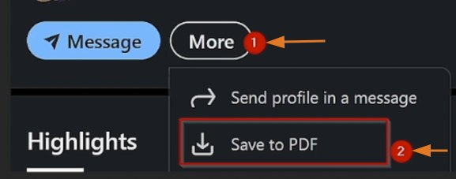

 

#### Finding Hidden Names & Extracting Post Timestamps

##### Timestamps

###### How to Get Post Timestamp
1. Get the Post ID.

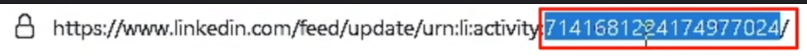

2. Convert it to binary using this website: https://www.rapidtables.com/convert/number/decimal-to-binary.html

3. Convert the **first 42** binary digits to decimal. https://www.rapidtables.com/convert/number/binary-to-decimal.html

4. Get the result then convert it using this website: https://www.unixtimestamp.com/

###### How to Get Comment Timestamp
1. Click the 3 dots then **Copy link to comment**

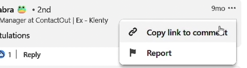

2. Copy the highlighted number.

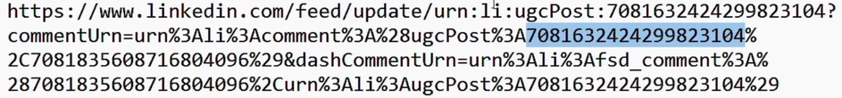

3. Repeat **steps 2 to 4**.

###### Shortcut Process of Getting the Timestamps
1. Copy the URL of the post.
2. Go to this website: https://dfir.blog/unfurl/ then paste the URL.

 

##### Find Redacted Names
- LinkedIn censors or hides the names of some company employees.
- Example:
1. Search for `zsecurity`, then from the results, click its company page.
2. Click `People`, notice that some members are hidden.  Nothing will happen even if you click on it.

3. Try finding it in a search engine (like Google) using this format: `site:linkedin.com "job description"`
    - Example: `site:linkedin.com "Ethical Hacker at zSecurity"`

 

#### Finding LinkedIn Profile Member IDs
1. Go to the target's linkedin profile page.
2. `Right-click -> View Page Source`
3. `ctrl + F` then search for `member:`

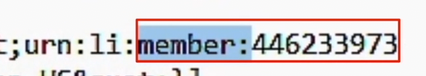

**Note:** Be careful as your own member ID will also show in here. Make sure that you have copied your target's member ID and not yours.

 
 
 

### Other Social Media OSINT

#### Snapchat OSINT - Downloading Stories & Extracting Metadata

##### How to Download Stories

###### Manual Process
1. Go to your target's snapchat page.
2. `Right-click -> Inspect`
3. Go to **Network** tab, then select **Media**

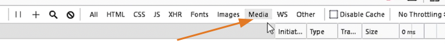

4. Click and play all the videos to populate the URLs.
5. Click the URL to show the video, the `right-click -> Save Video As...`

###### Shortcut Process
1. Go to this website: https://z.storyclone.com/
2. Paste the URL profile of your target.
3. To convert the time from UTC to your target's local time, you can use this website: https://savvytime.com/converter

##### How to Get your Target's Snapcode
Use this URL: `https://app.snapchat.com/web/deeplink/snapcode?username=USERNAME&type=SVG` but replace the `USERNAME` by your target's snapchat username.

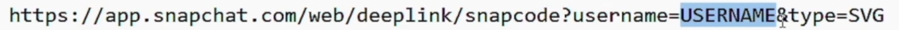

 

#### TikTok OSINT - Downloading Videos, Extracting Timestamps, Metadata & More

##### Analyze the target profile
- Copy the important details.
- Save the target's profile picture.

##### Timestamps

###### Post Timestamp
1. Get the Post ID in the URL (highlighted below).

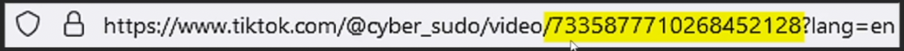

2. Convert it to binary using this website: https://www.rapidtables.com/convert/number/decimal-to-binary.html

3. Convert the **first 32** binary digits to decimal. https://www.rapidtables.com/convert/number/binary-to-decimal.html

4. Get the result then convert it using this website: https://www.unixtimestamp.com/

###### Comment Timestamp
1. `Right-click -> Inspect` on the comment.

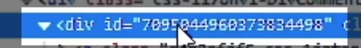

2. Repeat **steps 2 to 4**.

###### Shortcut Method to Get the Post or Comment Timestamp
- Go to this website: https://dfir.blog/unfurl/ then paste the ID number or the URL.

##### Download Videos Manually
1. Go to your target's tiktok page.
2. `Right-click -> Inspect`
3. Go to **Network** tab, then select **Media**
4. Click the videos to populate the URLs.
5. Click the URL to show the video, the `right-click -> Save Video As...`

##### Extract Metadata
1. Go to your target's tiktok page.
2. `Right-click -> Inspect` anywhere.
3. Copy all the metadata from this **UNIVERSAL_DATA_FOR_REHYDRATION** section.

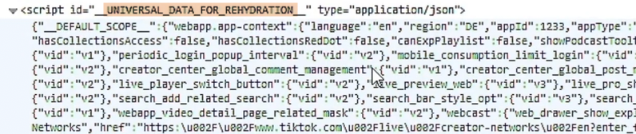

4. Paste it in a notepad, and save it as a JSON file (.json file extension)
5. Open the json file with your browser. Then click **Expand All**
6. From this metadata you can see the **region** where the account is created, a **high resolution of the profile pic**, etc.

---
 

## 05 - Username

### Username OSINT - Tracking Online Identities

#### Tracking a Username Using Advanced Search Techniques

##### Gather Online Usernames
- After gathering all the social accounts of your target, **save all the unique usernames the target used** in a text file for future searches.
- Example: In our target Rishi Kabra, he used different unique usernames for his facebook, instagram, etc. such as -- **rishi-kabra, _RK132, rishikabra132, rk132, RishiRajKabra**

##### Search Operators
- Use **search operators** to check if a username is indexed by search operators.
- Format: `inurl:username1 OR inurl:username2 OR inurl:username3`
- Example, search this in Google: `inurl:rishi-kabra OR inurl:_RK132 OR inurl:rishikabra132 OR inurl:rk132 OR inurl:RishiRajKabra`

 

#### Finding Hidden Profiles with Reverse Username Lookup

##### ID Crawl
- Can find social media profiles and potential email addresses using a username, email, name, or phone number.
- **Access it here:** https://www.idcrawl.com/username-search
- Then search each of your gathered unique usernames that the target uses.

 

#### Finding Linked Accounts Across the Web

##### Find Additional Online Accounts
- Tools like **WhatsMyName** and **Blackbird** help you find additional accounts on hundreds of websites.

###### WhatsMyName
- **Access it here:** https://whatsmyname.app/
- Choose **All** to search for a username.

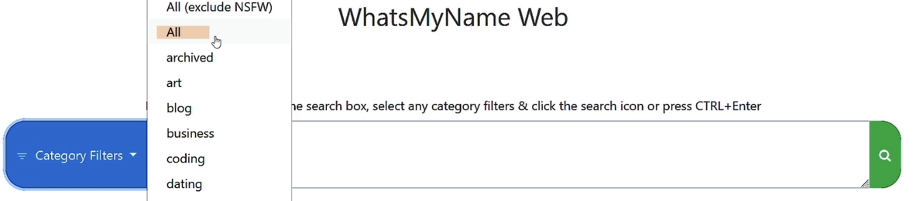

- You can search for all the usernames that you previoulsy gathered, but you might get overwhelmed with false results.

- You can download the results - CSV or PDF.

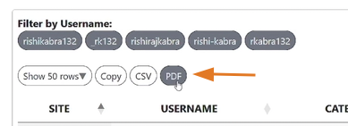

 

#### Finding Passwords & Other Breached/Leaked Data Connected to a Username
- Aside from **HaveIBeenPwned**, you can use other websites:

##### DeHashed
- **Access it here:** https://dehashed.com/search
- Note: This is paid and free use is limited.

##### leakpeek
- **Access it here:** https://leakpeek.com/

##### Breach Directory
- **Access it here:** https://breachdirectory.org/

 

#### Discovering Additional Online Accounts Automatically

##### Sherlock
- Is a tool **to search for a given username**** on hundreds of websites.
- Note: Some results are false positive.
- Installation using pipx: `pipx install sherlock-project`
- Installation using apt: `sudo apt install sherlock`
- Format for single target: `sherlock target_username`
- Format for multiple targets: `sherlock user1 user2 user3`
- Example: `sherlock rishikabra132 _rk132`

 

#### Summary / Methodology
- Collect the person's usernames.
- Search for usernames on search engines.
- Use online tools to find additional accounts with the same username.
- Search in leaked databases.
- Use `sherlock`.

---
 

## 06 - People

### People OSINT - Uncovering Personal Information Online

#### Finding the Geographic Origins of a Name
- Helps you narrow down your search by giving some **geographical clues**.

##### Websites

###### Family Search
- **Access it here:** https://www.familysearch.org/

###### Namsor
- **Access it here:** https://namsor.app/
- This is more reliable than 'Family Search'

##### After Getting the Possible Country
- After getting the possible country of the target, you can then use a search engine like Google. Example search: `"rishi kabra" "india"`
- Check the next topic for more info.

 

#### Find Personal Details Using Advanced Search Techniques

- Use search operators to **check if a person's information is indexed** by search engines.
- Format: `"first and last name" "city" OR "country" OR "university" OR "company"`
- Example: `"rishi kabra" "kolkata" OR "contactout" OR "SRM"`

 

#### Discovering Social Media Accounts Linked to a Person

##### Websites
- These are websites that will help you find information about **individuals that are NOT from United States**.

###### Social Searcher
- **Access it here:** https://www.social-searcher.com 

###### ID Crawl
- **Access it here:** https://www.idcrawl.com

 

#### Discovering Phone Numbers, Addresses, DOB, and More

##### Websites
- These are websites that will help you find information about **individuals that are mainly from United States**.

###### True People Search
- **Access it here:** https://www.truepeoplesearch.com/
- Note: Your **IP should be in United States** to use this website. Use VPN to change your IP.
- As you can see, you can search for **Name, Phone, Address, Email, Neighbors**, depending on what info you have.

###### Nuwber
- **Access it here:** https://nuwber.com/
- Note: Your **IP should also be in United States** to use this website. Use VPN to change your IP.

###### Fast People Search
- **Access it here:** https://www.fastpeoplesearch.com/
- Note: Your **IP should also be in United States** to use this website. Use VPN to change your IP.

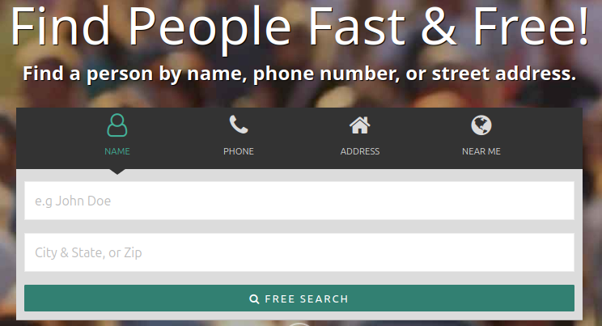

###### Fast Background Check
- **Access it here:** https://www.fastbackgroundcheck.com/
- Note: Your **IP should also be in United States** to use this website. Use VPN to change your IP.

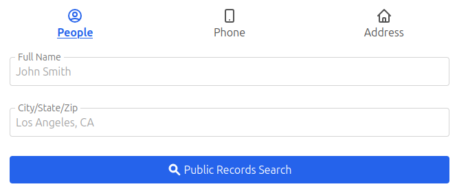

###### ThatsThem
- **Access it here:** https://thatsthem.com/
- Note: You **don't need a VPN** to use this website.

###### Radaris
- **Access it here:** https://radaris.com/
- Note: You **don't need a VPN** to use this website.

 

#### Uncover Political Party Affiliations
- Note: This topic will focus on people living in the United States only.

##### Voter Records
- **Each record has:** full name, party affiliation, home address, date of birth, and relatives.

##### Websites
- Note: Your **IP should be in United States** to use this websites.
- https://voterrecords.com/
- https://voteref.com/
- https://www.blackbookonline.info/

 

#### Finding Partners and Maiden Names in Registries
- Note: This topic will focus on people living in the United States only.

##### Wedding / Baby Registries
- A registry is a list of items that you want to receive as gifts.
- Each registry includes: partner name, maiden name, details about the event, desired items.

##### Websites
- https://www.amazon.com/registries?ref_=nav_cs_registry&ref_=nav_cs_registry (Note: You need an amazon account to access this)
- https://www.myregistry.com/
- https://www.theknot.com/registry/couplesearch
- https://www.target.com/registry-kiosk

 

#### Summary / Methodology
- Use search engines to find the person by their name and city.
- Learn where the name comes from.
- Search in people search engine websites.
- See if they're in voter records.
- Search in wedding/baby records.

---
 

## 07 - Emails

### Email OSINT - Finding Email Addresses

#### Uncovering Emails From Social Online Accounts
- Check if the target has shared their email on their online/social media accounts.
- **Example 1:** Rishi Kabra's Github Account
    - Go to his public repositories.

    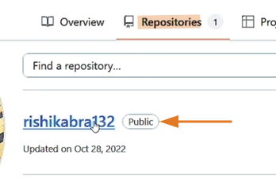

    - Notice that he posted something about himself, but he didn't mention his email. Go to **History**.
    
    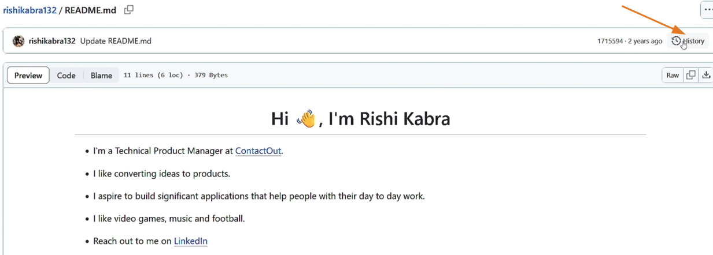

    - Check and view each of his commit details.

    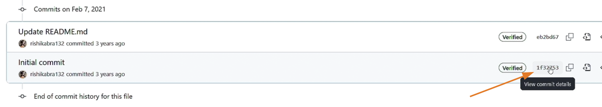

    - It is possible that one of this commit details has his email.

    

- **Example 2:** Rishi Kabra's Twitch Account
    - Go to his **About** page.
    - Notice that he has a youtube channel link here:

    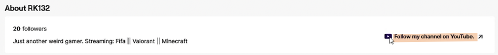

    - Notice that in his **Youtube Channel's About**, he included his email address.

    

 

#### Finding Emails Using Advanced Search Techniques
- Use **search operators** to find the person's email address **on search engines**.
- **Example 1:** Use his **name** to search in Google. (Note: You can add more email domains if needed)
    - `"rishi kabra" "@hotmail.com" OR "@gmail.com" OR "@yahoo.com"`
- **Example 2:** Use his **username** to search.
    - `"rishikabra132" "@hotmail.com" OR "@gmail.com" OR "@yahoo.com"`

 

#### Uncovering Emails Linked to Usernames
- Use **collected usernames** from social media profiles of the target to form an email address.
- **Example:**

- To verify the emails that you created if they exist, go to this website: https://www.experte.com/

- List all the valid emails. Next step is to **check which of these valid emails belong to your target**.
    - To do this go to `facebook.com` and click the `Forgot password?`
    - Input your target's name. Example: "rishi kabra"
    - After finding his account, click `This is My Account`
    - Here we can have an idea of his email address:

    

    - Another way to verify is go to gmail and compose an email, **paste the email and see if it will show details  about it or a profile pic**.

 

#### Creating and Verifying Possible Email Addresses
- **Email Permutators** - Generate a list of possible email combinations.
- **Access it here:** http://metricsparrow.com/toolkit/email-permutator/

- Copy the result and put it in your notepad. 
- You can also paste them in **Gmail Compose** to check which of these are valid and will show a profile pic.

- You can also use this website: https://www.experte.com/email-finder to find an email. Just type the target's name and an email domain.

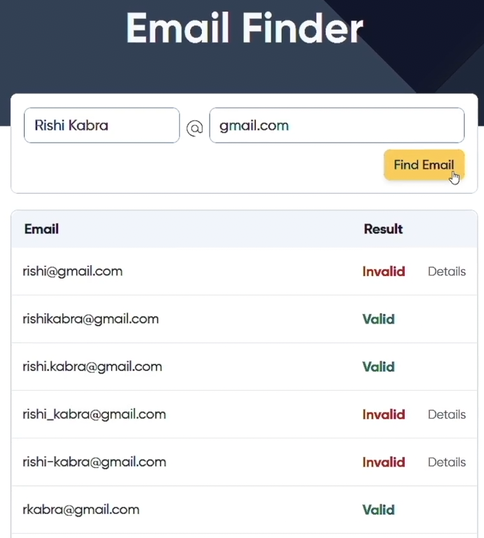

 

#### Uncovering Emails with Browser Tools
- If a person has a linkedin account and you are trying to find their email address then you can rely on some browser extensions.

##### Browser Extensions

###### GetProspect (Chrome extension only)
1. Log in to your LinkedIn account.
2. Go to your target's LinkedIn profile page (example: Rishi Kabra)
3. Click the **GetProspect Icon**

4. **Refresh** the page.
5. The **GetProspect** will automatically find the target's email address if it's available.

###### Email Finder by ContactOut
1. Log in to your LinkedIn account.
2. Go to your target's LinkedIn profile page (example: Rishi Kabra)
3. Click the icon of the browser extension.

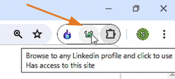

4. It will automatically show the available email address/es of the target. And sometimes it can also show the phone number.

###### SignalHire
1. Log in to your LinkedIn account.
2. Go to your target's LinkedIn profile page (example: Rishi Kabra)
3. Click the large icon of SignalHire on the right side.
4. It will automatically show all the email address or phone number.

 

#### Finding Business Email Addresses

##### Hunter.io
- Identifies email pattern manually or automatically.
- Example pattern:
    - `f.lastname@example.com`
    - `s.sarraj@example.com`
- **Access it here:** https://hunter.io/
- To use:
    - Create a free account.
    - Go to **Search** tab.
    - Then search for the target's company. Example: ContactOut

    

    - On the right-side part you can see the pattern.

    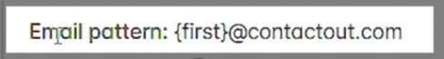

    - Hunter.io also has an email verifier. 

    

##### Phonebook.cz
- Use this website if you like to gather many business email addresses of people who work at the same company.
- **Access it here:** https://phonebook.cz/
- You must create an account to use this.
- Example: 

 

#### Discovering Emails Within Data Breaches / Leaks
- Search for the person's info in leaked/breached databases.
- Search by:
    - Name
    - Phone number
- Check **Facebook, LinkedIn, Twitter** data leaks if the person has these accounts.

 

#### Extracting Emails from GitHub Accounts

##### Two Methods to Find an Email in Github

###### Check the file history edits
1. Go to your target's public repositories.
2. Check for files about them.
3. Click the **Commits** to check its history.

###### Check the email associated to a commit using GitHub API
1. Go to this URL example: `https://api.github.com/repos/rishikabra132/rishikabra132/commits` (Note: Replace the github username with your target.)

2. Or use a web app like: https://github-email-finder.netlify.app/

Note: This websites might not work if the person didn't commit anything.

 
 
 

### Email OSINT - Discovering Info Linked to an Email Address

#### Tracking the Identity Behind an Email Address
- Use **search operators** to check if an email address is indexed by search engines.
- Example search in Google: `"rishikabra132@gmail.com"` or just search the username: `"rishikabra132"`

 

#### Leveraging Password Resets to Validate Email Addresses
- Helps you find parts of an email address, potentially **aiding in the process of guessing or verifying it**.
- Example:
    - `example@gmail.com`
    - `e****@g***.com`

##### Facebook password reset
- In `facebook.com`, click the `Forgot password?`
- See previous topics on how to use it.

##### Twitter / X password reset
- https://twitter.com/account/begin_password_reset

##### Instagram password reset
- https://www.instagram.com/accounts/password/reset/
- **Note:** Be careful at using this as instagram will send an email to notify the user that you used the password reset.

 

#### Investigating an Email Address for Red Flags

##### emailrep.io
- Is a service that provides **reputation scores and information about email addresses**.
- **Access it here:** https://emailrep.io/
- You need to sign up for a free API key to use this website.

###### Reputation factors:
- Presence on social media sites
- Public records
- Email deliverability
- Data breaches and credential leaks

 

#### Uncovering Websites & Accounts Linked to an Email Address
- If you know someone's email, **you can check if they've signed up on other websites you didn't know about**.

##### Epieos
- **Access it here:** https://epieos.com/auth/signin
- You need to sign in to use this (free plan)

##### Castrickclues
- You need to sign up an account in https://usersearch.ai/m/auth/login 
- Their "ONEScan" feature allows you to cross-reference an email or phone number across multiple engines simultaneously, including Castrick Clues, Epieos, and OSINT Industries.

##### Osint Industries
- **Access it here:** https://app.osint.industries/
- Need to sign up for a free account (30 credits / month)
- You'll have a free access if you're a journalist or working with police.

##### Gravatar Email Checker
- **Access it here:** https://gravatar.com/site/check/

 

#### Gmail OSINT - Discovering Phone number, reviews, addresses and more
- If the person uses Gmail, you can:
    - Identify their partial phone number
    - Find their GAIA ID

##### Identify their partial phone number

1. Go to https://www.google.com/ and click the `Sign in` button.
2. Input your target's gmail account then click **Next**.
3. Click **Forgot password?**
4. This will show you the last 2 digits of the phone number associated with this account.
5. Click **Try another way** for more info if available.

##### Find their GAIA ID manually

1. Go to https://mail.google.com/chat/u/0/#chat/home
2. Go to **Search** and paste your target's gmail address.
3. `Right-click (anywhere) -> Inspect`
4. Go to **Network** tab.
5. **Refresh** the page.
6. In the **Network** tab, search for `GetAssistiveFeatures`
7. Click the result, then click the **Response** tab, then click `1` then `0`. This will show the GAIA ID.

8. Go to this URL and replace the `ID` with your `target's ID`.

9. This will show your target's google reviews.

##### GHunt Online
- Is a tool that allows you to find information about any Gmail account.
- **Access it here:** https://gmail-osint.activetk.jp/
- You can easily find your target's GAIA ID, profile pic, google reviews, etc. using this tool.

 

#### Identify Data Leaks Linked to an Email Address
- **Access it here:** https://haveibeenpwned.com/
- Identify data breaches/leaks associated with the email.
- Download relevant data leaks/breaches.
- Search for additional information.

 

#### Discovering LinkedIn Profiles Linked to an Email
##### SignalHire
- is a browser extension that allows you to search for a LinkedIn account by an **email address** or a **phone number**.
- Just click its large icon (right side) and input the email address or the phone number.

 

#### Leveraging Usernames and Emails to Discover Additional Accounts

##### Blackbird
- **Get it here:** https://github.com/p1ngul1n0/blackbird

###### Key Features
- Reverse username search across +700 sites.
- Reverse email search across +10 sites.
- Support AI for better metadata extraction.
- Might be better than **Sherlock**
- Example usage (Note: You need to create a virtual environment first and install the ai module to use AI)
    - `python3 blackbird.py -u rishikabra132 -ai`
    - `python3 blackbird.py -e rishikabra132@gmail.com -ai`

---
 

## 08 - Phone Numbers

### Phone Number OSINT - Discovering Phone Numbers

#### Tracking a Phone Number Across Online Platforms
- Finding a phone number is more difficult than finding an email, but **having an email address makes it easier to find a phone number**.

###### 1st method
- The obvious first step is to check if the person has shared their phone number on **their online/social media accounts**.

###### 2nd method
- Use **search operators** to find the person's phone number on **search engines**.
- **Format:** `"first and last name" "city" "phone number" OR "number" OR "country code"`
- **Example:** `"rishi kabra" "kolkata" "number" OR "phone number" OR "+91" OR "91" OR "0091"`. If you didn't find anything useful you could remove the "city".

 

#### Uncovering Phone Numbers Linked to Linkedin Accounts

##### Phone Lookup Extensions
- These are the browser extensions that might provide the target's phone number. Please see previous topics on how to use them.
    - ContactOut
    - SignalHire
    - GetProspect

 

#### Discovering Sensitive Details Linked to a Phone Number
- Note that these websites info are limited to US residents only. And you need to use vpn to access them.
    - https://www.truepeoplesearch.com/
    - https://nuwber.com/
    - https://www.fastpeoplesearch.com/
    - https://www.fastbackgroundcheck.com/
    - https://thatsthem.com/
    - https://radaris.com/

 

#### Finding Phone Numbers in Leaked Databases
- Search by: **Name or Email Address or Password** on these websites:
    - https://haveibeenpwned.com/
    - https://dehashed.com/
- Search in downloaded database leaks / breach:
    - Example: **Snapchat database** hides the last 2 digits, while the **Facebook database** shows these last 2 digits.

 
 
 

### Phone Number OSINT – Finding Details Behind a Number

#### Uncovering Detailed Phone Number Information

##### Phone Number Lookup
- Is the process of finding general information about a phone number.
    - Number type
    - Service provider
    - Spam score
    - Location

##### Websites

###### IP Quality Score
- https://www.ipqualityscore.com/free-phone-number-lookup
- Example result:

###### Comfi
- https://www.comfi.com/abook/reverse
- Example result:

###### International Numbering Plans
- https://www.numberingplans.com/index.php?page=analysis&sub=phonenr
- Example result:

###### Search Yellow Directory
- https://www.searchyellowdirectory.com/
- Example result:

###### Phone Validator
- This is for US phone numbers only.
- To get more info you need to create a free account (you can use a temp mail only)
- https://www.phonevalidator.com/
- Example result:

###### North American NPA NXX
- Provides a detailed info about phone numbers from US or Canada only.
- https://www.npanxxsource.com/nalennd.php
- Example result (just a screenshot of the top, as it has many other details provided)

 

#### Revealing Sensitive Information Using Advances Search Techniques
- Use **search operators** to check if a phone number is indexed by **search engines**.

- **International Format:** `"+CCXXXXXXXXX" OR "00CCXXXXXXXXX" OR "CCXXXXXXXXX" OR "XXXXXXXXX"`

- **US Format:** `"xxxxxxxxxx" OR "xxx-xxx-xxxx" OR "xxx.xxx.xxxx" OR "xxx xxx xxxx"`

 

#### Uncovering the Identity  Behind a Phone Number

##### Caller IDs Identifiers
- Caller ID identifiers help you find the caller's ID so you can block spam calls.

##### Websites

###### True Caller
- https://www.truecaller.com/
- This has a huge database of international numbers.
- Requires a sign in from your Google or Microsoft account
- Example result from Rishi Kabra's phone number:

###### Sync Me
- https://sync.me/
- Signing in is required.
- Example result:

###### NumLookup
- https://www.numlookup.com/
- No need to sign up, but limited results.

###### Spy Dialer
- https://www.spydialer.com/
- For US phone numbers only.
- Example result:

 

#### Uncovering Accounts Registered with a Phone Number
- We already used these websites when uncovering accounts with an email address, but now we'll use them for phone numbers.
- Note that we need to sign up to use these websites.

##### Websites
- https://epieos.com/
- https://usersearch.ai/
- https://app.osint.industries/

##### Browser Extension
- SignalHire

 

#### Discovering Leaked Information Linked to a Phone Number

##### Websites

###### DeHashed
- https://dehashed.com/

###### Facebook Data Breach Checker
- https://haveibeenzuckered.com/

 

#### Deep Phone Number Scanning & Footprinting

##### PhoneInfoga
- Is a tool to gather information about phone numbers.

###### Features
- Check if phone number is valid.
- Gather basic information.
- Check for reputation reports.

###### Installation
- `bash <(curl -sSL https://raw.githubusercontent.com/sundowndev/phoneinfoga/master/support/scripts/install)`
- verify if installed: `./phoneinfoga version`
- `sudo mv ./phoneinfoga /usr/local/bin/phoneinfoga`

###### Basic Usage
1. To use the GUI: `phoneinfoga serve` (take note of the port number)
2. Go to your web browser: `127.0.0.1:5000`

---
 

## 09 - Images

### Image OSINT - Reverse Image Search

#### Gathering Profile Images for OSINT Investigations
- Download **unique profile pictures** from gathered online accounts.
- Let's assume that a client only gave you these pictures, and we will use these pictures **to find accounts**.

 

#### Tracking Images Using a Web Browser Extension

##### Search by Image extension
- by **Armin Sebastian**
- A powerful reverse image search tool, with support for various search engines, such as Google, Bing, Yandex, Baidu and TinEye.
- **Usage:**
1. `Right-click` an image.
2. Select **Search by Image** and select the search engine/s.

 

#### Google Reverse Image Search
- **Google image search** allows you to search for exact images across the web.
- **Features:**
    - Displays websites where the image appears.
    - **Single object** detection.

- **Usage:** Go to https://www.google.com/ then click the `Search by image`. You can drag or upload an image or provide the image link.

 

#### Bing Reverse Image Search
- **Features:**
    - Finds visually similar images.
    - **Strong object detection**.
    - **Ideal for detecting products and items** in images.
- **Usage:** Go to https://www.bing.com/ and click the `Search using an image` button. You can drag or upload an image or provide the image link.

 

#### Yandex Reverse Image Search
- **Features:**
    - Good for **detecting similar faces**.
    - Effective at **identiying some locations**.
    - Strong **text recognition**.
- **Usage:** Go to https://yandex.com/ and click the `Image search` button. You can drag or upload an image or provide the image link.

 

#### Specialized Search Image Engines

##### TinEye
- **Features:**
    - Good at identifying logos or public pictures.
    - Not good at detecting places or faces.
- **Usage:** Go to https://tineye.com/ then you can drag or upload an image or provide the image link.

##### NumLookup
- **Features:**
    - Can also do **Reverse Phone** and **People Search**.
- **Usage:** Go to https://www.numlookup.com/reverse-image-search then you can drag or upload an image.

 
 
 

### Image OSINT - Facial Recognition

#### Facial Recognition
- **Facial recognition tools** allow you to search the internet **to find identical or similar faces** that have appeared online.
- Use **Google, Bing or Yandex** image search before using the following tools.

##### Search for Faces
- https://search4faces.com/search.html
- Best for searching people in Russia.

##### Pim Eyes
- https://pimeyes.com/en
- Discover where your images appear online and to track reuse.
- Note: This website requires payment to view for more info. To bypass this (might not work in the future), right-click and `Inspect` the image, copy the link of the image and go to https://gchq.github.io/CyberChef/ to decode some info on its URL.

##### Face Check ID
- https://facecheck.id/
- Search internet by face (Social Media, Scammers, Sex Offenders, Videos, Mugshots, News & Blogs)
- Note: This website also requires payment for more info, repeat the process above and go to https://gchq.github.io/CyberChef/

 
 
 

### Image OSINT - Geo Location Tracking

#### Using AI to Identify an Image Location

##### GeoSpy
- https://geospy.net/en/geospy
- Is an AI-powered geolocation service to **uncover a picture location**.
- Examines **Landmarks, Vegetation, or Building styles**

##### Alternative websites
- https://oceanir.ai/geospy-alternative
- https://geoseeer.com/blog/geoseer-vs-geospy-raven-ai-geolocation

 

#### Discovering Image location Using Search Engines

##### Sample Methodology
1. Go to https://www.google.com/ and click `Search by image`.
2. Upload the image, crop or select a portion of what you want in an image.

3. Click the closest image result, preferably with provided description. In this example we select the **Prashar Temple** image.
4. Go to https://www.google.com/maps and search for **Prashar Temple**.
5. Note the location. We could use this address to search for other multiple maps (yandex, etc)

 

#### Extracting Location, Device Info and More From Images

##### Metadata
- Is information stored within an image, video, or document file that gives extra details about the file.
- Information like:
    - Creation and modification date
    - Author, username
    - GPS coordinates of the location
    - Device information
- Note: Some social media strips the metadata once you uploaded it to their platform.
    - Example: If you downloaded a picture from Facebook, it is possible that this photo has no more metadata.

##### Websites

###### MetaData2Go
- https://www.metadata2go.com/
- In this website you can view or edit Metadata of an image you uploaded. You can also extract or compare its data. 

###### EXIFTool
- https://exif.tools/
- is an online EXIF viewer and metadata checker for image metadata, file metadata, GPS data, hashes, magic bytes, XMP, IPTC, ICC, and adjacent formats.

##### Browser Extension

###### Exif Viewer
- by Alan Raskin
- Displays the Exif and IPTC data in local and remote JPEG images.

---
 

## 10 - Maps

### Maps OSINT – Using Maps for Geolocation Analysis

#### Google Maps
- https://www.google.com/maps
- Has an **extensive global coverage**, making it the **most widely used mapping service** worldwide.
- **Features:**
    - Street view
    - Local business information
    - Real-time traffic
- **Google Earth:** https://earth.google.com/web/

 

#### Bing Maps
- https://www.bing.com/maps
- Has good **global coverage**.
- **Features:**
    - Bird's Eye View
    - Display data from other sources

 

#### Yandex Maps
- https://yandex.com/maps/
- Has an **extensive coverage in Russia and soviet union** countries.
- **Features:**
    - Metro maps
    - Real-time public transport
    - Local business information

 

#### Satellites Pro
- https://satellites.pro/
- **Feature:** You can switch between different maps.

 

#### Mashed World
- https://data.mashedworld.com/dualmaps/map.htm
- **Feature:** Your screen is split into 3 views: Street view, Map View, and Satellite View.

 

#### Street-level imagery
- **Features:**
    - Anyone can contribute
    - Frequently updated imagery
    - More coverage in some areas

##### Websites
###### Mapillary
- https://www.mapillary.com/

###### Karta View
- https://kartaview.org/landing

 

#### Bellingcat Map
- https://osm-search.bellingcat.com/
- Uses **OpenStreetMap** data to help you find landmarks or features in a picture.
- Very powerful **for geolocating pictures**.
- Requires Sign in using Google or email.

---
 

## 11 - Websites

### Website OSINT – Analyzing Website Data for Intelligence

#### Discovering Website Owners & Hidden Contact Details

##### WHOIS record
- https://who.is/
- Is a public database entry that **shows who owns a domain name**.

Each record contains:
- Domain owner's name and contact details
- Registration and expiration dates
- Domain registrar information

##### Osint.sh
- https://osint.sh/domain/ - Allows you to find domain names by a keyword
- https://osint.sh/reversewhois/ - Allow you to find domain names owned by an email address
- Note: This website currently broken.

 

#### Identifying Technologies used in a Website
- Identifying a website technology helps you understand its **infrastructure and security posture**.
- **Information** you can find:
    - CMS (Content Management System)
    - LMS (Learning Management System)
    - Plugins
    - More..

##### Websites
- https://osint.sh/stack/ (Note: broken)
- https://builtwith.com/

##### Browser Extension
- Wappalyzer

 

#### Discovering Subdomains

##### Essential Subdomain Google Dorks
- `site:*.target.com -www`: Displays indexed subdomains while removing the main www page.
- `site:*.target.com -www -mail -app`: Stacks exclusions to narrow results down to uncommon or internal service panels.
- `site:target.com intitle:"index of" "../"`: Locates open directory listings nested under the main domain or its subdomains.
- `site:subdomain.target.com`: Isolates deep results inside a specific discovered branch.
- `site:*.target.com -www -mail -support`: The most effective Google dork for finding hidden or unlinked subdomains.

##### Essential Subdomain Yandex Dork
- `rhost:com.target.*`

##### Complementary Discovery Methods
- **Certificate Logs:** Query platforms like `crt.sh` using `%.target.com` to reveal all historically issued SSL certificates and hidden branches.
- **Automated Tools:** Run specialized passive reconnaissance software like **SubFinder** to aggregate records quickly. **Note:** Use something like **httprobe** or **httpx** to get only the live subdomains.

 

#### Extracting Information From DNS Records
- **DNS Records** are instructions that live in DNS servers and provide information about a domain.

##### Websites
- https://dnsdumpster.com/
- https://viewdns.info/

 

#### Uncovering Websites Under the Same Ownership

##### Reverse Google Analytics

- **Google Analytics ID** is a unique identifier that allows Google to collect data when inserted on a website.
- It helps us **find additional websites that the person controls**.

##### Finding the Google Analytics ID
1. Go to your target's website.
2. `Right-click -> View Page Source`
3. `ctrl + F` then search for `ua-`

4. To search for this ID, go to this website: https://dnslytics.com/reverse-analytics/ or https://hackertarget.com/reverse-analytics-search/

 

#### Tracking a Website's Changes and Updates

##### Wayback Machine
- https://archive.org/
- Includes over 800 billion web pages saved over time.

###### OSINT usages:
- View websites as they appeared in the past.
- Retrieve deleted information.
- Track changes on web pages over time.

 

#### Investigating Website’s Files for Hidden Information

##### Metagoofil: The Automated Web Harvester
- targets a specific domain name, uses search engine scraping (Google Dorking automation) to find public document files hosted on that site, and downloads them locally to a folder.

###### Practical Application
- Instead of a researcher clicking and downloading dozens of PDFs manually, Metagoofil sweeps the site and grabs common target extensions like `.pdf, .docx, .xlsx, or .pptx`. It extracts immediate structural data to map an organization's internal layout.

##### ExifTool: The Forensic Micro-Analyzer
- Once Metagoofil secures the files locally, ExifTool is used to analyze individual or mass files. ExifTool does not scrape the web; it reads the metadata layers—such as EXIF, XMP, and IPTC blocks—of more than 200 file formats.

###### Practical Application
- Investigators use ExifTool to find hidden timelines and operational footprints that basic document readers hide. While web platforms often strip metadata from public profile photos, standalone files hosted in a website's resource directory or media attachments usually remain fully loaded with tracking details.

 
 
 

### Website OSINT with OSINT TraceLabs VM

#### Discovering Subdomains
- **subfinder** is a tool to find subdomains of any given domain.
- **httprobe** checks if a list of domains are live or not.
- Installation: `apt install subfinder httprobe`
- Example usage: `subfinder -d cybersudo.org -silent -o subdomain.txt | httprobe | grep -v 'http:'`

 

#### Investigate WordPress Websites
##### WPScan
- Is a security scanner used **to identify attack vectors of websites built with WordPress**.
- It collects information on:
    - Plugins
    - Themes
    - Usernames
    - More...
- Installation: `apt install wpscan`
- Example usage: `wpscan --url cybersudo.org -e u --random-user-agent`

 

#### Automating OSINT Investigations

##### Spiderfoot
- Is a tool used to gather information from various sources on the internet.
- Collects information on:
    - Domains, IPs, Hostnames, Network Subnets
    - Email Addresses, Phone Numbers
    - Names, Usernames
    - Bitcoin Addresses
    - And More...
- Installation: `apt update spiderfoot`
- Example usage: 
    - `spiderfoot -l 127.0.0.1:9999`
    - Go to your web browser: `127.0.0.1:9999` to open the spiderfoot GUI

---
 

## 12 - Reporting

### OSINT Reporting

#### Creating an OSINT Relationship Map

##### Osintracker
- https://www.osintracker.com/
- Can be used if you would like to create a graph of the information that you have gathered about a person or a company.
- This will help you to present the information that you have gathered more professionally.
- This will give you an overview of the information that you have gathered.

###### How to Use Osintracker
1. Go to https://app.osintracker.com/investigations
2. Click the **Add** button to create an investigation.

3. Provide an **investigation name**, then click **Add**.
4. Click your newly created **investigation**, then click **Add the First Entity**. After your input click **Add**. Example:

5. Click **Entity** to add more info like his **Facebook**. 

6. Once you created an entity, click the **Relationship** to provide the relationship between this 2 entities. 

7. Drag an arrow from his entity to the facebook entity. Then provide the necessary information.

8. Keep on doing this until you have a full graph of all the information that you gathered.

9. Once you're done, use the Export to save your investigation.

10. To open this again in the future, click the **Import** button at start.

 

#### Structuring Open-Source Investigations

##### OSINT Flowcharts
- Is a step-by-step visualization of an OSINT process.
- This helps you to:
    - Know what to do with a piece of information.
    - Ensure no steps are missed.
- You can get sample flowcharts in: https://inteltechniques.com/osintbook/ and click the `Flow Charts: workflow.zip` to download. Example:

- You can also use this website: https://yoga.myosint.training/

 

#### Writing a Professional OSINT Report

##### What an OSINT Report Should Include:
- Scope
- Summary
- Key Findings
- Verification Steps
- Supporting Evidence
- Recommendations