# Contents

1. Introduction
2. Sock Puppets
3. Data Collection
4. Advanced Searching
5. Reverse Searching
6. People Searching
7. Website Osint
8. Various Browser Plugins
9. Social Media
10. Miscellaneous

<br>
<br>
<br>

# 1. Introduction

## What is OSINT?
- Open-source intelligence(OSINT) is **data collected from publicly available sources** to be used in an intelligence context.
- In the intelligence community, the term **"open" refers to overt, publicly available sources**(as opposed to covert or clandestine sources).
- It is not related to open-source software or public intelligence.

### What can we find with OSINT?
- Email addresses
- Phone numbers
- Addresses
- Identities
- Background checks
- Social media accounts and information
- Criminal records
- Scams
- Etc.

### Who uses OSINT?
- Law enforcement
- Security professionals
- Malicious hackers
- Businesses
- Investigators
- Journalists
- Home users

### Information Gathering

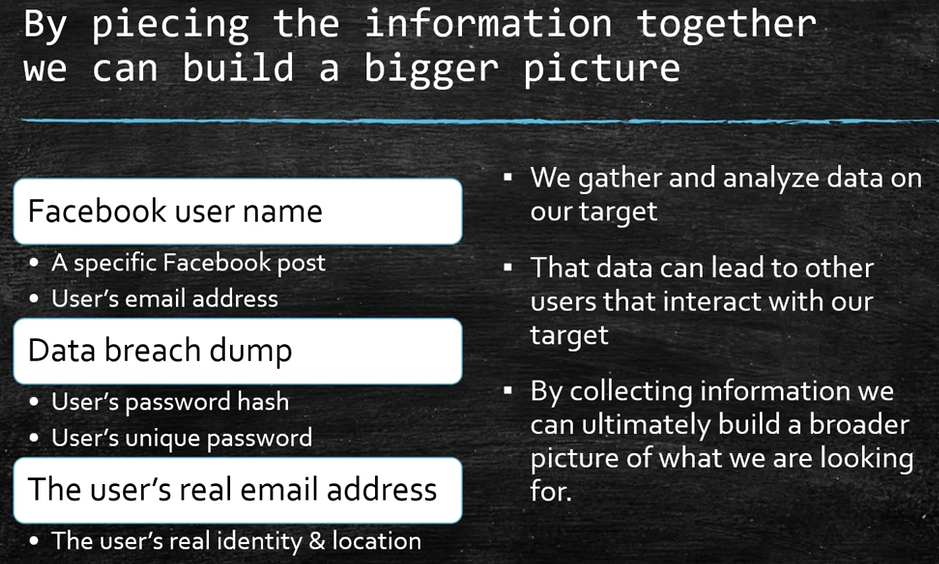

<br>

## Mental Preparation
- Have a plan of "attack", be organized
- Try to mentally prepare yourself
- Pace yourself (if you are able to)
- Be prepared for what you may uncover
- Take some time to decompress after your investigation if you need to

<br>

## OSINT Steps
- What is our goal and starting evidence?
- Example: How can we be certain that this post is legit?


- To solve this, we should outline our steps:

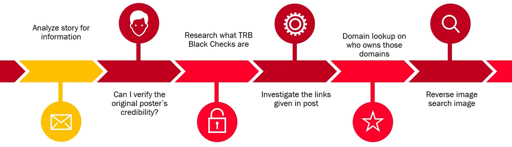

<br>

## Your tools will break
- Your favorite tool, whether it's a website or a tool that we'll install, **it is going to break at some point**.
- **Example:** When twitter got taken over when it got bought out. The twitter site, the servers, the API which these tools will hook into, came crashing down. And most of the tools that we use for OSINT no longer worked. 
- That's why whenever a tool breaks, we should have a couple of options. **One thing you could always rely on is your methodology**. -- Figure out how you're going to tackle the problem and take that manual approach again.

<br>

## Ask...
- Ask what information that the client already has.
- Ask what they are willing to share with you.
- Having information that they already have can save a lot of time.

<br>

## Crossing the line
- We are investigators, not criminals.
- We need to abide by local laws.
- We need to make sure we keep within the guidelines of our company or client.
- If we fail to comply we amy breach our contract, loose our job/client, be fined, or jailed.
- We may loose a legal case due to improper/illegal methods collecting the evidence.

<br>

## Documents

### Basic Contract
- Before starting your investigation you should have a basic contract made and signed beforehand.
- Names
- Dates
- Scope of Work
- Deliverables (dates, milestones, expectations, etc.)
- What is out of scope?
- Contacts
- Who will be working on what
- Emergency contacts with hours
- Date and sign

### Project Timeline

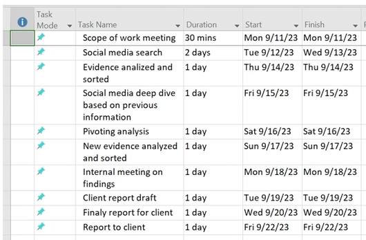

### Data Collection Notes

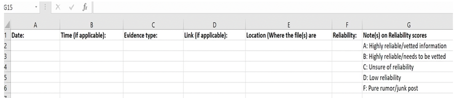

### Reports
- Consider making 2 reports.
    - A **technical report**: Detailed report designed for senior investigators, IT administrators, etc.
    - A **elevator pitch report**: A short and to the point report. Make sure it doesn't have any technical jargon or unnessary information. This report will be the executive report for the high level personnel that may not be technical of have the time to read through anything extra.

### Status Summary

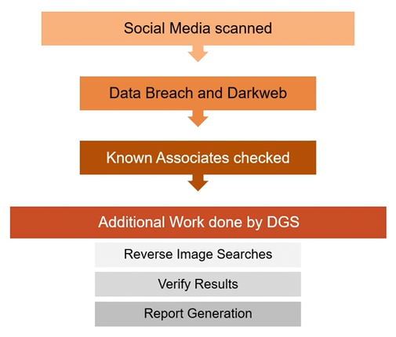

### Attention Areas

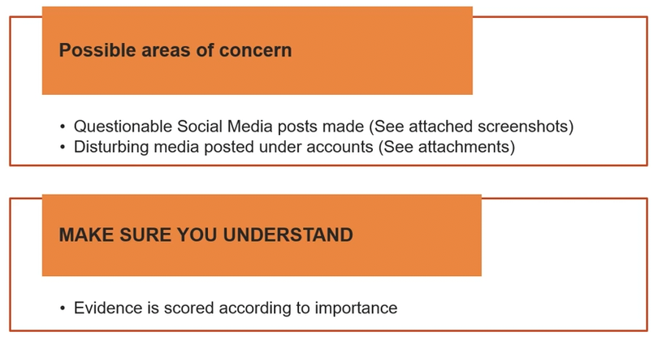

<br>
<br>
<br>

# 2. Sock Puppets

## Basics
- a.k.a. burner account.
- is an alternative account (e-mail, username, fake identiy, etc) that is no way associated with us.
- typically uses: an alternative name, location, username, email address, physical address, phone number, fake profile picture, job title/employer, etc.
- should not use any password we used before.
- varies in complexity.

<br>

## Sock Puppet Gmail
**Use a smartphone**
- use a burner smartphone (preferred)
- create an account as usual
- this does not require a phone number
- you can generally create 3 in a day
- any more tends to flag Google
- works with iOS and Android

<br>

## MySudo
### Uses
- **Hide real details:** Keep your real phone number, primary email, and financial details safe from third parties.
- **Stop spam:** Compartmentalize your life so that if a random shopping site or public form leaks your data, only that specific Sudo profile gets spam.
- **Encrypted connection:** Enjoy secure, private communications via Sudo handles without handing over personal registration info.

### Plans and Pricing
- **Free tier (SudoFree):** You can download the app and use Sudo Handles to make free, unlimited, end-to-end encrypted voice, video calls, and messages with other MySudo users. You also get basic private email features.
- **Paid tiers:** To get actual phone numbers that can call or text regular non-MySudo phone numbers, you must pay for a subscription plan.

<br>

## textfree.com
- TextFree is actually free. You get a real U.S. or Canadian phone number with unlimited texting and calling over Wi-Fi or mobile data at zero cost. It is funded by in-app ads, but you can upgrade to TextFree Plus for $9.99/month to remove ads and unlock extras. 
- While the base app is completely free, there are a few important limitations to keep in mind:
    - **No Verification Codes:** You generally cannot receive short-code SMS verification codes (like from banks or accounts) on the free tier.
    - **Inactivity Expiration:** If you do not use your phone number for 30 days, the number will expire and can be given to someone else.
    - **Ad Interruption:** You will see ads within the app, which can sometimes be intrusive.
 
<br>

## textnow.com
- TextNow is completely free for basic talk and text services.
- The company provides a real US or Canadian phone number with unlimited domestic calling and texting.
- **How It Works** Wi-Fi Only: You can download the app and use it immediately over Wi-Fi for $0 per month.

<br>

## Temp mail
- Temp mail is a free, disposable, short-lived email address used to receive messages without revealing your real identity or inbox. It requires no registration, works instantly, and self-destructs after a set time.

<br>

## CSI Linux Sock Puppets
- Click the `Menu -> OSINT and Online Investigations -> Sock Puppet Builder`
- And it will create you a new identity:

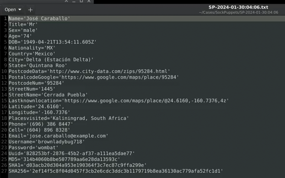

<br>
<br>
<br>

# 3. Data Collection

## Handling Data
- During your investigation you are likely to collect a large amount of data that can easily be overwhelming. The uncertainty of what to keep and what to get rid of can also be stressful.
- Tend to **collect information that is within the scope of work only**. That information is broken out into sections (phone numbers, names, etc.)
- Keep your investigation and data isolated to your VM. Encrypt them if needed.

<br>

## CherryTree
- Click `Menu -> Office -> CherryTree`
- CherryTree is a free, open-source, hierarchical note-taking application designed for desktop operating systems. Unlike linear note apps, it organizes information into a tree-like structure of "nodes" and "sub-nodes" (resembling folders and subfolders).

#### Key Features
- **Hierarchical Organization:** You can create parent nodes and child nodes in a left-hand side panel to structure your notes visually.
- **Syntax Highlighting:** It supports code execution and automatic syntax highlighting for numerous programming and markup languages, making it a favorite for developers and IT professionals.
- **Rich Text Editing:** You can customize foreground/background colors, fonts, tables, multi-level lists, and hyperlinks.
- **Multimedia & File Handling:** Easily insert, resize, and rotate images, embed external files directly into the text, and render LaTeX math equations.
- **Advanced Data Storage:** Notes can be saved in a single database file using SQLite or XML formats.
- **Security & Encryption:** It allows password protection and data encryption for the entire notebook document using 7-Zip compression.
- **Import & Export Flexibility:** You can import data from other note apps (like KeepNote or Zim) and export your notebooks to PDF, HTML, or plain text.

<br>

## Obsidian
- Obsidian is a powerful local-first note-taking and personal knowledge management application that handles data using plain text **Markdown files**.

#### How Obsidian Handles Data
- **Local Storage:** All your data stays right on your device as standard text files, meaning you can work fully offline and completely own your files.
- **No Lock-In:** Because it uses basic Markdown (.md) format, your notes are never trapped inside a hidden or closed database system.
- **Connected Links:** You can easily link one note to another using simple brackets, which builds a web of related ideas instead of a strict folder tree.
- **Vault System:** It groups your files into folders called vaults, letting you keep different areas of your life or work cleanly separated.

<br>

## Joplin
- Joplin is a free, open-source note-taking and to-do application designed to give you complete control over your data. It serves as a privacy-focused alternative to mainstream apps like Evernote and Microsoft OneNote.

#### Key Features
- **Markdown-First Formatting:** Notes are written using Markdown syntax, but a toggle switch allows for rich-text visual editing if you prefer a traditional interface.
- **Offline-First Storage:** Your notes reside directly on your local device. You do not even need an internet connection or a registered account to use the application.
- **End-to-End Encryption (E2EE):** Optional E2EE ensures your data is locked with a master password before leaving your device. No third party can read your notes.
- **Flexible Cloud Syncing:** You can synchronize your data across multiple devices using your own preferred storage provider—such as Dropbox, OneDrive, Nextcloud, WebDAV—or the official premium subscription service, Joplin Cloud.
- **Web Clipper Extension:** A browser tool for Chrome and Firefox lets you capture full web pages, selections, or screenshots directly into your notebooks.
- **Extensive Organization:** Features nested notebooks, tags, a comprehensive search tool, and an optical character recognition (OCR) system that can read text inside attached images or PDFs.

<br>

## Keeping your Data Safe

### KeePassXC
- https://keepassxc.org/
- safely store your passwords and auto-fill them into your favorite apps, so you can forget all about them.

#### Key Details
- **Cost:** $0 (Free forever)
- **License:** GNU General Public License (GPL) version 3
- **Data Storage:** Offline local database file that you control

#### Features
- **No Cloud Required:** Your data stays on your device unless you choose to sync it yourself.
- **Strong Encryption:** Uses 256-bit AES encryption.
- **Cross-Platform:** Works on Windows, macOS, and Linux.

<br>
<br>
<br>

# 4. Advanced Searching

## The Ultimate OSINT Research Resource
- As you continue your studies, the single best place to find up-to-date tools is the [⁠OSINT Framework](https://osintframework.com/).
- It is a completely free, interactive mind map used by professional intelligence analysts. 

<br>

## Google Dorking
- Google Dorking utilizes advanced search operators to filter, isolate, and uncover publicly indexed data.

### Core Google Dork Operators
- `site:` – Restricts results strictly to a specific domain or TLD (e.g., site:gov).
- `filetype:` / ext: – Filters by specific file extensions (e.g., filetype:xlsx).
- `intitle:` – Searches for explicit terms inside the webpage's title bar.
- `allintitle:` – Requires every word in the query to be present in the title.
- `inurl:` – Filters for specific strings or words found directly in the URL.
- `allinurl:` – Requires every word in the query to match the URL structure.
- `intext:` – Scans exclusively for keywords inside the visible body text of a webpage.
- `cache:` – Displays Google's last indexed snapshot of a webpage, even if deleted.
- `AROUND(X)` – Proximity search finding pages where two terms sit within X words of each other.
- `"" (Quotes)` – Forces an exact phrase match.
- `- (Minus)` – Excludes a specific keyword, site, or phrase from the results.

### High-Value OSINT Combinations (By Use Case)
The most practical applications of these operators are categorized into standard intelligence-gathering objectives:

1. **Domain & Subdomain Enumeration**
- Find hidden infrastructure, dev environments, or staging platforms without actively interacting with the target.
- `site:target.com -www -shop -blog`

2. **Exposed Sensitive Files & Leak Hunting**
- Locate public spreadsheets containing logs, employee rosters, financials, or database backups.
- `site:target.com filetype:xlsx OR filetype:docx OR filetype:pdf "confidential"`
- `site:target.com intitle:"index of" "backup" OR "dump"`

3. **Credentials & API Secrets Discovery**
- Search file metadata and public code configurations for hardcoded environment keys, configuration tokens, or passwords.
- `site:github.com OR site:pastebin.com "target.com" "api_key" OR "secret" OR "token"`
- `filetype:env "DB_PASSWORD"`

4. **People Tracking & Profile Cross-Searching**
- Locate resume documents, public email layouts, or specific staff footprint databases.
- `site:://linkedin.com "target company"`
- `"target name" filetype:pdf resume OR cv`
- `site:target.com intext:"@target.com" filetype:xls OR filetype:csv`

5. **Finding Exposed Login & Management Panels**
- Isolate administrative consoles, system access portals, or vulnerable web panels left exposed to the open web.
- `site:target.com inurl:admin OR inurl:login OR inurl:setup`
- `site:target.com intitle:"dashboard" OR intitle:"control panel"`

### OSINT Workflow Automation & Verification
When scaling up your investigation, manual dorking can trigger Google Captchas. You can cross-reference, automate, or verify your dorks using these specialized platforms:
- The **Offensive Security Exploit Database (GHDB)**: Use their classified dork repository to look up hyper-specific query structures for IoT devices, firewalls, and unique software stacks.
- **ShadowDragon Google Dork Assistant**: Use this free assistant to dynamically construct complex queries via a clean user interface without memorizing exact operator constraints.
- **Automation Frameworks**: For bulk domain mapping, tools like theHarvester automate the execution of multiple dork variables safely.

<br>
<br>

## Google Maps
- https://www.google.com/maps
- While everyday users rely on it for basic navigation, OSINT investigators exploit its metadata, historical imagery, and URL structures to gather intelligence.

### Advanced OSINT Features in Google Maps

- **Historical Street View (Time Travel):** You can access an archive of past Street View captures dating back to 2007. This allows investigators to track changes in storefronts, identify old signage, note structural modifications to buildings, or see what vehicles were frequently parked at a location over a decade.

- **Metadata and Exact Coordinates:** Google Maps uses precise decimal degrees in its URLs. Extracting these exact coordinates allows you to cross-reference locations across other geospatial tools (like Earth Explorer or Sentinel Hub) to verify satellite data without losing precision.

- **Sun Position and Shadow Analysis (Chronolocation):** By combining Google Maps' 3D Satellite view with the exact date and time a photo was taken, investigators can analyze the angles and lengths of shadows cast by buildings or trees. This helps estimate or verify the exact time of day an event occurred.

- **User-Contributed Photo Spheres:** Beyond official Google Street View cars, independent users frequently upload 360-degree photo spheres. In remote, restricted, or war-torn conflict zones where Google cars cannot travel, these user-submitted spheres provide critical, ground-level ground truth.

- **Reviewer Profile Exploitation:** Clicking on a user who reviewed a business reveals their public Google Maps profile. Investigators can analyze their entire review history, uploaded photos, and timelines to establish a target's patterns of life, frequent locations, and potential associates.

- **Custom Mapping via My Maps:** Investigators use Google My Maps to build private, layered intelligence databases. You can plot cellphone tower locations, map out a suspect's known addresses, sketch crime scene perimeters, and import large datasets (CSV/KML) to visualize geographic correlations.

### URL Triangulation Secrets for Investigators
The URL string of Google Maps changes dynamically and contains valuable data parameters that advanced investigators manipulate manually:

- **The `@` Parameter:** Contains the exact latitude, longitude, and camera zoom level (e.g., @40.7127,-74.0059,17z).

- **The `data=` Parameter:** Contains hex-encoded strings that dictate the exact imagery date, heading, pitch, and unique panorama IDs (panoid). Copying a panoid allows you to save and share the exact camera angle and vintage of a specific piece of evidence before it is updated or removed.

### Enhancing Google Maps with Extensions
To maximize Google Maps for OSINT, investigators rarely use it in isolation. They pair it with specific browser extensions and external tools:

1. **`Mapillary` & `KartaView`:** Crowdsourced street-level imagery platforms that often capture angles, backstreets, and dates that Google Maps missed.

2. **Google Earth Pro (Desktop Client):** Offers vastly superior historical satellite imagery timelines compared to the standard web version of Google Maps, allowing you to slide back through years of aerial photos.

<br>
<br>

## Google Images
- https://www.google.com/imghp
- OSINT investigators use free Google Images and Google Lens features to uncover hidden details, track down origins, and verify data.

### Reverse Image Search Modifiers
When using Google Images on a desktop, you can combine your visual search with text-based Google search operators to filter results drastically.

- **Filter by site:** Upload an image and add `site:instagram.com` or `site:linkedin.com` in the search bar to find if that specific image appears on those platforms.

- **Exclude terms:** Upload an image and type `-pinterest` to remove Pinterest clutter from your results.

- **Find specific file types:** Add `filetype:jpg` or `filetype:png` to hunt for specific formats.

###  Isolation and Cropping (Visual Anchors)
Investigators rarely search a whole image if it contains multiple objects. Google Lens allows you to adjust the bounding box corners to focus on tiny, specific details.

- **Crop for clues:** Focus strictly on a unique window frame, a distant mountain ridge, a car license plate, or a logo on a shirt.

- **Identify equipment:** Crop tightly on a security camera, a military patch, or a street lamp to determine the exact model and country of origin.

### Geolocation via Visual Landmarks
Google Lens is highly optimized for recognizing geographical markers that help investigators pinpoint where a photo was taken.

- **Architectural matching:** Lens can identify specific patterns in paving stones, historical building styles, or unique utility poles.

- **Natural features:** It maps flora, rock formations, and mountain silhouettes to known geographic regions.

### Text Extraction for Verification (OCR)
Beyond basic translation, the Optical Character Recognition (OCR) engine in Google Lens is a powerful verification tool.

- **Metadata matching:** Extract serial numbers, flight numbers, or shipping container codes from the image text, then cross-reference them with public logistics databases.

- **Time-stamping:** Copy text from signs or posters in the background to find local business names, which can be checked against registry databases to confirm if a business is still open or when it operated.

### Tracking Image History
You can use Google Lens to build a timeline of when and where an image first appeared.

- **Find the original context:** By looking at all indexed sources, investigators can find the oldest upload of an image. This reveals if a photo is being used out of context (e.g., an old war photo being passed off as current news).

- **Detect digital manipulation:** Comparing your uploaded image against the search results can instantly reveal if elements were photoshopped, cropped, or flipped horizontally.

### Other Free Image Search Engines

#### Yandex Visual Search
Yandex is a Russian search engine, and its reverse image search is entirely free via its website or mobile app.
- **Facial Recognition:** It uses a highly powerful facial recognition algorithm that outperforms Google Lens for matching human faces.
- **Angle Matching:** It can find matches even if the person in the photo is turned sideways or in low lighting.

####  InVID / WeVerify
This is a free, open-source browser extension funded by the European Union specifically for journalists and human rights investigators.
- **Video Deconstruction:** You paste a YouTube, Facebook, or X (Twitter) video link, and it automatically chops the video into keyframe images.
- **Forensic Analysis:** It includes built-in filters (like Lens Flare and Ghosting analysis) to detect if an image has been digitally altered or photoshopped.

<br>
<br>

## Google Alerts
- https://www.google.com/alerts
- OSINT investigators treat **Google Alerts** as a **passive monitoring system** and a **digital tripwire**. Instead of manually searching for updates every day, they use it to force Google to automatically email them the moment new information is indexed on the surface web.

### Advanced "Google Dorking" Integration
Investigators do not just type a person's name into Google Alerts. They inject complex search operators (known as Google Dorks) into the alert box to bypass generic news and catch deeply specific file uploads.

- **Document Leak Monitoring:** An investigator tracking a corrupt entity might set an alert for: `filetype:pdf "Confidential" "Company Name"`. If a disgruntled employee leaks a corporate PDF matching that description, the investigator receives an instant notification.

- **Filtering Noise:** To track sensitive events without getting flooded by generic training or marketing spam, they use negative filters: `intext:"active shooter" -training -exercise -consulting`.

### Social Media Live-Tracking
While Google cannot scrape every private social media post, it constantly indexes public profiles, forum threads, and handles.

- **Username/Handle Alerting:** If a target or a person of interest goes radio silent, investigators will set an alert for their known handle across specific domains: `site:instagram.com "target_handle"` or `site:reddit.com "target_handle"`. The moment that user makes a public post or gets tagged in a new thread that Google indexes, the investigator gets an alert.

### Cyber Threat Intelligence & Asset Monitoring
Security-focused OSINT professionals use alerts to spot data breaches or compromised infrastructure before they hit mainstream technical news.

- **Leaked Credentials Tripwires:** Corporations set up alerts for their unique, internal domain configurations or IP ranges. If a text snippet containing "`://company.com`" pops up on a random public forum, pastebin site, or code repository, it acts as an immediate warning of an active data leak.

- **Defacement and Hijacking Alerts:** Threat hunters set alerts for their own company domains combined with common exploit or spam terms (e.g., `site:mycompany.com "casino" OR "crypto scam"`) to immediately discover if their site has been silently hacked and used to host malicious links.

### Dynamic Timeline Building
For long-term tracking of fugitives, missing persons, or ongoing geopolitical conflicts, Google Alerts acts as a timeline builder.

- **Geographical Tracking:** Investigators pin alerts to specific rare place names or coordinates mentioned in local print blogs: `"Target Name" AND "Specific Small Village"`.

- **Corporate Entity Changes:** Setting alerts for specific business registry numbers allows investigators to catch sudden shell-company re-registrations or executive changes published in niche foreign gazettes.

### Weaponizing the RSS Option (The Professional Setup)
Receiving dozens of individual emails can ruin an investigator’s OpSec (Operational Security) and clutter their inbox.
- **How they use it:** Instead of choosing "Deliver to: Email", investigators click "Show options" and change it to **"Deliver to: RSS feed"**.

- They pipe these generated RSS links directly into professional OSINT dashboards, Discord Webhooks, or RSS readers (like Feeder.co or Inoreader). This centralizes their passive intelligence stream into an encrypted workspace without exposing their real email to Google's delivery systems.

<br>
<br>

## Geolocation
An investigator needs tools that find locations through pixels and clues, or advanced privacy-first metadata analysis.

### For "Pixel-Only" AI Geolocation (No Metadata)
When an image has no coordinates embedded, these free tools use AI to analyze terrain, flora, architecture, and visual indicators to guess the location.

- **Lenso.ai:** An incredibly powerful, free AI visual search tool built specifically to analyze landscapes and buildings. It is highly effective at matching obscure vacation spots or city streets by examining patterns across millions of online images.

- **Picarta.ai:** Uses artificial intelligence to look at the actual pixels of a photo (mountains, trees, road markings) and predicts the exact country or coordinates, even if the photo was taken in a remote area with zero Street View coverage.

### For True, Deep EXIF Metadata Extraction
If you are handed an original, raw image file from a target, you want a dedicated metadata forensics tool rather than a standard web map viewer.

- **Jeffrey's Image Metadata Viewer:** The undisputed classic, absolute gold standard for OSINT analysts. It extracts deep, hidden technical headers that basic sites ignore—showing not just GPS coordinates, but exact camera serial numbers, lens settings, software editing history, and true creation timestamps.

- **GeoTag.world:** A modern, completely free alternative that maps out embedded metadata instantly while prioritizing user privacy by processing everything quickly inside your browser session.

### For Privacy-Safe Internal Inquiries
When dealing with sensitive or classified evidence, uploading files to public web tools like **GeoImgr** violates operational safety (OpSec) because your files sit on their servers.

- **GeoMakers EXIF Viewer:** Unlike most web tools, this processes your image entirely inside your browser using local client-side JavaScript. Your photo is never transmitted to an external server, keeping the data completely confidential.

- **ExifTool (by Phil Harvey):** A free, command-line desktop application. It has zero graphical interface, but it is the single most powerful tool used by professional forensic investigators globally because it runs locally on your machine and cannot be blocked by an internet outage.

<br>
<br>

## Greynoise
- https://viz.greynoise.io/

- is an online portal used by cybersecurity analysts and OSINT investigators to filter out "internet background noise".

- Every second, thousands of automated bots, scanners, and crawlers sweep the globe probing for open doors, vulnerable servers, and exposed cameras. When an investigator spots a suspicious IP address probing an asset, GreyNoise acts as an immediate filter to determine if an IP is a **global, broad scanner** (meaning it scans everyone indiscriminately) or if it is conducting a **targeted, focused attack**.

### Key OSINT Capabilities of GreyNoise
Instead of manually diagnosing traffic logs, GreyNoise allows investigators to utilize specific features:

- **Triage Intent:** It tags IPs dynamically as **Benign** (like Google or Shodan indexers), **Unknown**, or **Malicious** (like known malware botnets or credential stuffers).

- **Vulnerability Mapping:** You can see exactly what an IP is searching for. For instance, a quick search will show you if an IP is looking for a specific vulnerability (CVE).

- **Spoofing Detection:** GreyNoise exposes compromised infrastructure. It will flag if a routine web host is secretly being used to blast out malicious scan traffic.

### Are There Better Free Alternatives?
While GreyNoise is the undisputed king of isolating "noise" vs. "targeted traffic", investigators rarely rely on just one platform. Depending on what you want to uncover about an IP address, several free platforms are better suited for different niches:

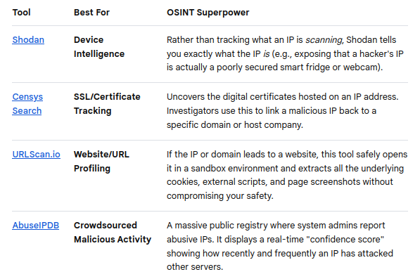

<br>
<br>
<br>

# 5. Reverse Searching

## Reverse Email

### Free Linux Tools for Email OSINT

#### holehe
- **What it does:** Checks if an email address is attached to an account on over 120 social media and major websites (like Twitter, Instagram, Imgur, etc.).
- **Why it's great:** It is fast, highly accurate, and does not alert the target. It helps you pivot from an email to find their social media usernames.
- **How to install/run:**
```bash
pip install holehe
holehe targetemail@example.com
```

#### GHunt
- **What it does:** An advanced OSINT tool designed specifically for investigating Google accounts.
- **Why it's great:** If your target email is a Gmail address, GHunt can extract the owner's Google ID, YouTube channel, active Google services (like Maps reviews), and sometimes their profile photo and location.
- **How to find it:** Available on the `⁠GHunt GitHub Repository`.

#### SpiderFoot
- **What it does:** A comprehensive OSINT automation platform that integrates dozens of open-source data sources.
- **Why it's great:** You can feed it an email address, and it will automatically query data leak repositories, domain registrars, and web scrapers to build a massive profile on the target completely for free.
- **How to find it:** Available on the ⁠`SpiderFoot Official Website`.

### Completely Free Websites

#### Have I Been Pwned (HIBP)
- **What it does:** Checks if an email address has been compromised in any known data breaches.
- **OSINT Value:** While it won't give you the person's name directly, it tells you exactly which websites they had accounts on (e.g., Adobe, LinkedIn, MySpace). Knowing what services they used provides massive clues for your investigation.
- **Access it here:** ⁠https://haveibeenpwned.com/

#### EPIEOS
- **What it does:** A specialized reverse email lookup tool.
- **OSINT Value:** It allows you to search a Gmail or corporate email address to retrieve associated Google profiles, profile pictures, and related data footprints across the web without paying a dime.
- **Access it here:** https://epieos.com/

#### CyberBackgroundChecks & TruePeopleSearch (US-Only)
- **What it does:** Free public records search engines.
- **OSINT Value:** Unlike BeenVerified, these sites provide a massive amount of address, phone, and email history completely free of charge. Note: You may need a US-based IP address or VPN to access them.
- **Access them here:** ⁠https://www.truepeoplesearch.com/ or ⁠https://www.cyberbackgroundchecks.com/

<br>
<br>

## Reverse Phone

### Free Web-Based Tools
These sites either maintain massive crowdsourced databases or help you find public data without charging fees:

#### ⁠Truecaller (Web Version) 
- By using their web directory (rather than the mobile app, which requires uploading your own contact book), you can search numbers globally for free. It relies on billions of crowdsourced contact lists and is highly accurate for identifying names and spam labels globally.

#### ⁠NumLookup
- A specialized, free web tool built primarily for US-based numbers. It performs API queries directly across telecommunication networks to pull the exact owner name, carrier, and line type without requesting registration.

#### ⁠FastPeopleSearch
- If you are researching a US-based mobile or landline number, this platform provides direct, un-paywalled name histories, current addresses, and associated family member lists for free.

#### ⁠Free Carrier Lookup
- If you don't care about the owner's name but strictly need to verify technical footprints, this tool determines whether a number is active, its specific carrier, and whether it is a VoIP number (like Google Voice) or a real mobile/landline.

#### Search Yellow Directory
- Search Yellow Directory functions as a global Open Source Intelligence (OSINT) and telephone registry tool. Its primary uses include International Reverse Phone Lookup, Global Dialing Assistance, Business & People Directory Access, and International Email Lookup

### Free Linux CLI Tools (OSINT Frameworks)

#### PhoneInfoga
- **What it does:** It scans any international phone number without requiring paid API keys. It analyzes the country code, detects the telecom registry carrier, and automatically executes localized Google Dorks to find where that number has been mentioned across social media, forums, and leaked directories.
- **How to run it:** It can be run straight from your terminal or served as a local Web GUI page on your machine:
```bash
# Download the binary or pull via Docker
docker pull sundowndev/phoneinfoga:latest

# Run a quick scan on a number
docker run --rm -it sundowndev/phoneinfoga scan -n +15551234567
```

#### Social-Scan
- **What it does:** If you manage to link a phone number or an associated username to a targeted target, you can feed it into `social-scan` to instantly check what social platforms (Instagram, Twitter, Pinterest, etc.) have a verified account attached to that exact piece of data.

#### Advanced Google Dorking via Terminal (Using lynx or googler)
Experienced Linux users often bypass third-party websites entirely by using search tools like [⁠Googler](https://github.com/jarun/googler) to perform search queries from the CLI. You can find phone references by wrapping the numbers in specific operators:
- `"555-123-4567"` — Forces Google to find that specific formatting.
- `site:facebook.com "555-123-4567"` — Limits the query entirely to Facebook profiles.
- `filetype:txt OR filetype:csv "555-123-4567"` — Searches for the phone number inside exposed data dumps or public spreadsheets.

### Tip for Reverse Phone Searching
In modern OSINT, standard "reverse lookups" are often blocked by privacy laws or paywalls. Because of this, analysts heavily rely on Pivot Points. For example, if a phone number doesn't yield a name directly, your next step in an investigation is usually to:
1. Try adding the number to a burner contact list on a phone to see if it populates a profile name or photo on **WhatsApp, Signal, or Telegram**.
2. Search the number on **Skype or PayPal** (via the "Send Money" interface) to see if a real name or profile picture is tied to the account.

<br>
<br>

## Deep Fake Detection

### Completely Free Web Tools (No-Cost / High-Utility Triage)

These websites allow you to spot-check files immediately without entering credit card information:

- [⁠BitMind AI Content Detector](https://bitmind.ai/detect): A direct, web-based interface that allows you to instantly upload an image or video to check if it was synthetically generated or altered.

- [⁠FotoForensics](https://fotoforensics.com/): A legendary tool among digital forensic experts and OSINT investigators. Instead of utilizing automated AI detection, it runs **Error Level Analysis (ELA)**. This maps the compression rates across an image. If a face has been digitally pasted or "deepfaked" into an existing photo, the ELA layer will highlight structural anomalies and mismatched pixel density.

- ⁠[Hive Moderation Demo](https://hivemoderation.com/): While Hive is primarily a enterprise API, they offer a highly reliable free browser-based web demo. It allows you to drag and drop single images or video clips to test them against their state-of-the-art synthetic media detection models.

- [⁠Deepware Scanner](https://deepware.ai/): A highly popular open platform focused specifically on finding anomalies in videos. It runs an uploaded clip through multiple open-source deepfake detection models simultaneously to output a unified consensus score.

### Free Linux Tools (Local Python & Command Line Utilities)
Running tools locally on Linux guarantees that the data you are investigating never leaves your machine. These open-source packages require a functional Python environment and are easily deployed via terminal.

#### Open-Source AI Detection Pipelines
- [⁠DeepSecure-AI](https://github.com/Divith123/DeepSecure-AI): A fantastic open-source project hosted on GitHub. It utilizes an EfficientNetV2 backbone coupled with MTCNN face detection and PyTorch. It breaks video files down frame-by-frame, extracts faces, and flags deepfakes locally. It includes a local Gradio web UI that runs directly in your Linux browser.
- [⁠DeepSafe](https://github.com/siddharthksah/DeepSafe): An enterprise-grade, fully open-source platform written in Python and FastAPI. It provides a full backend architecture and dashboard to run local visual and video ensemble models to score deepfake probabilities.
- [⁠Arman176001 / deepfake-detection](https://github.com/Arman176001/deepfake-detection): Specifically built to catch modern deepfakes generated by popular tools like DeepLiveCam and DeepFaceLive. It is written in Python and OpenCV and runs entirely offline on your Linux machine.

#### Media Forensics & Metadata Analysis
True OSINT relies heavily on metadata and origin tracing alongside AI detection:
- **ExifTool:** The ultimate command-line utility for reading, writing, and editing meta information across images and video. By running exiftool video.mp4 on Linux, you can look for software signatures (like Adobe Premiere, generative tools, or unique encoding profiles) that indicate manipulation or a lack of an original camera profile.
- **FFmpeg (Visual Inspection):** The Swiss Army knife of Linux video processing. For deepfake analysis, you can use FFmpeg to split video into individual frames to spot blending artifacts, or extract the audio spectrum to look for voice cuts:
```bash
ffmpeg -i input_video.mp4 -vf "select=not(mod(n\,10))" -vsync vscf frame_%03d.png
```
*(This extracts every 10th frame so you can manually examine skin-edges, eye reflections, and lighting inconsistencies in a photo viewer).*

### Free Linux Tools for Audio Deep Fake Detection
Running local tools ensures that raw audio files (which could be sensitive evidence) never leave your secure Linux environment.

####  Open-Source AI Classifiers (GitHub)
- [media-sec-lab / Audio-Deepfake-Detection](https://github.com/media-sec-lab/Audio-Deepfake-Detection): Hosted on GitHub, this is an excellent, curated master repository containing code, datasets, and pretrained pipelines based on the official academic **ASVspoof Challenge** (the global benchmark for voice spoofing and deepfake detection). It is heavily utilized by researchers deploying automated forensic models locally.

- ⁠[kaifanyu / DeepFake-Audio-Detection](https://github.com/kaifanyu/DeepFake-Audio-Detection): A highly accessible PyTorch- and TensorFlow-based Linux pipeline. It ingests raw audio, extracts features, and runs them through deep learning classification layers to flags clones offline.

- [⁠noorchauhan / DeepFake-Audio-Detection-MFCC](https://github.com/noorchauhan/DeepFake-Audio-Detection-MFCC): This tool converts audio into Mel-Frequency Cepstral Coefficients (MFCCs). MFCCs represent the power spectrum of an audio clip; human vocal tracts produce smooth, continuous transitions, while AI speech generators leave micro-gaps or repetitive digital patterns that this Python library exposes.

#### Signal Analysis & Command Line Utilities
- **SnaffCore / Audacity (via Linux Package Manager):** While Audacity is an open-source GUI tool, installing it via sudo apt install audacity is standard for audio forensics. By switching the track view from "Waveform" to **Spectrogram**, you can visually inspect the clip. AI voice models often struggle with high-frequency noise, leaving a sharp "cutoff" line around 8kHz or 16kHz, or they display unnatural, perfectly vertical energy spikes where an AI-generated word cut in.

- **Praat (Linux Port):** A specialized scientific tool for phonetics used extensively by linguistic forensic experts. You can install it on Linux to map formants, pitch (intonation changes), and jitter/shimmer (micro-instabilities in human vocal cords). AI audio often sounds "too smooth" or lacks the chaotic micro-instabilities of a real human throat.

- **FFmpeg (Audio Extraction & Metadata Analysis):** Essential for pulling uncompressed audio streams out of raw social media video files before feeding them into detectors:
```bash
ffmpeg -i target_video.mp4 -vn -acodec pcm_s16le -ar 16000 output_audio.wav
```
*(This extracts the video's audio, strips out container artifacts, and encodes it into a clean, uncompressed 16kHz WAV format ideal for local Python detection scripts).*

<br>
<br>
<br>

# 6. People Searching

## Black Book Online
- is a free, decentralized public records directory and search engine used in Open Source Intelligence (OSINT) **to find direct links to official government and corporate databases**.
- It serves as a **resource for locating criminal, property, and professional records**, while also functioning as the digital companion to "The Investigator's Little Black Book".
-  is **not completely free**; it operates on a "freemium" model. While you can perform basic searches and set up light tracking without paying, viewing the actual sensitive data requires a paid subscription or pay-as-you-go credits.
- **Access it here:** https://www.blackbookonline.info/

<br>

## DeHashed
- is a specialized cybersecurity search engine **used to find leaked credentials and personal data from deep web assets and historical data breaches**.
- It allows individuals, security professionals, and law enforcement agencies to **track compromised digital identities and prevent identity theft**.
- Unlike standard security tools that only tell you if you were breached, DeHashed provides actionable, deep-level data insights.
- **Access it here:** https://dehashed.com/

<br>

## Have I Been Pwned
- is a free website that **checks if your email address or phone number has been compromised in a data breach**.
- Created by cybersecurity expert Troy Hunt, it lets you safely search billions of leaked records to see exactly which companies or sites exposed your personal information.
- **DeHashed vs. Have I Been Pwned**

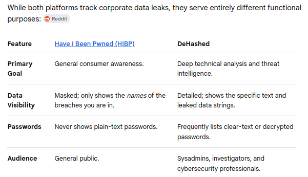

- **Access it here:** https://haveibeenpwned.com/

<br>

## Webmii
- is a **people search engine and online reputation tool** that aggregates publicly available information from across the web.
- By entering an individual's first and last name, users can view a compiled profile of social media accounts, professional listings, news mentions, and images.
- **Key Features** 
    - **Visibility Score:** Calculates a numerical rating indicating how prominent a person's digital footprint is online.
    - **Homonym Filters:** Allows users to narrow down search results by adding specific keywords or locations to separate people with identical names.
    - **Data Aggregation:** Pulls live public data dynamically rather than storing a private database of personal records.

<br>

## Linkedin
- Open-Source Intelligence (OSINT) professionals rely heavily on LinkedIn because it serves as a massive corporate directory, revealing org charts, employee locations, internal technologies, and personal connections.
- Operating with a real identity risks alerting the target and triggering a counter-response. To remain anonymous, investigators deploy specialized fake personas.
- **Building a Convincing Sock Puppet:**
    - **Isolated Infrastructure:** Built using dedicated, burner hardware or virtual machines. They connect through high-quality residential proxies or VPNs so LinkedIn does not link the account to the investigator's actual IP address or geographic location.
    - **AI-Assisted Personas:** Real-sounding names and resumes are designed. AI-generated or heavily edited portraits are sometimes used to avoid easy reverse-image searches.
    - **The "Boring" Persona:** They mimic common, low-threat profiles. A target will ignore an invite from a blank profile, but they are highly likely to accept a connection request from a regional corporate recruiter or a data analyst within their same industry.
    - **Gradual Warming:** Investigators do not immediately search for targets. They let the account sit, add non-target connections slowly, and write brief, generic comments to look like a normal, active user.

<br>

## Family Tree
- While `FamilyTree.com` itself functions primarily as a genealogy advice blog, directory, and hub for reviewing historical record repositories, using genealogy and family tree platforms is a highly effective, often overlooked strategy in Open Source Intelligence (OSINT).
- When investigators refer to "FamilyTree" for OSINT, they are usually leveraging massive collaborative family tree databases like FamilySearch, FamilyTreeNow, WikiTree, or Ancestry to build out a target's network.
- Access it here: https://www.familytree.com/
- Or you could also try `geni` that does the same thing: https://www.geni.com/ 

<br>

## Unmask Google Users Using Google Docs
If you only have a gmail address and you want to know the name of that account's owner. Follow the steps below. 

1. Go to google docs and share a blank document/folder.

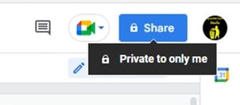

2. Make sure to **uncheck** the 'Notify poeple', because we don't want them to know that we are sharing a document.

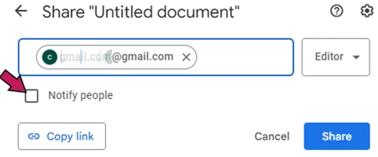

3. Click the **Share** button.

4. Then go back to the shared document to view the gmail address with the name of the owner.

<br>
<br>
<br>

# 7. Website Osint

## Spiderfoot
- is an **open-source, automated reconnaissance and intelligence-gathering tool** designed for cybersecurity professionals and researchers.
- automates the process of Open Source Intelligence (OSINT) collection by **querying over 100 public data sources simultaneously to map out an asset's digital footprint**.

#### Key Uses
- **Target Reconnaissance:** Mapping out domain names, IP addresses, netblocks, and subdomains during the initial phases of a penetration test.
- **Data Leak Detection:** Scanning public repositories and dark web sources to identify exposed credentials, API keys, or sensitive corporate files.
- **Threat Intelligence:** Identifying malicious infrastructure by cross-referencing targets against known blacklists and threat feeds.
- **Attack Surface Management:** Helping organizations view their own internet-facing infrastructure from an attacker's perspective to discover forgotten or unpatched assets.
- **Fraud Investigation:** Gathering background intelligence on email addresses, phone numbers, and usernames for digital forensics or fraud analysis.

<br>
<br>

## wget and HTTrack
Both are powerful, command-line and graphical tools used by investigators to clone websites, preserve evidence, and conduct offline analysis without alerting the target.

### wget
Wget is a free, command-line utility used for downloading files from the web using HTTP, HTTPS, and FTP protocols. It is lightweight, pre-installed on most Linux distributions, and highly efficient for targeted data scraping.

#### Key Uses
- **Evidence Preservation:** Downloads exact copies of specific web pages, images, or PDFs to create a local, forensic backup of a target's online content.
- **Media Scraping:** Automates the extraction of specific file types (like `.jpg, .mp4,` or `.pdf`) from a target directory or forum.
- **Log-In Navigation:** Uses cookies and custom user-agents to bypass basic access controls and scrape restricted or member-only forums.
- **Automated Intelligence Gathering:** Runs via cron jobs or scripts to periodically check and download updates from a target site over time.

### HTTrack
HTTrack is an open-source website crawler and archiver. Available as both a command-line tool and a graphical user interface (GUI), it is specifically designed to download an entire website recursively to a local directory.

#### Key Uses
- **Full Website Clones:** Mirrors an entire target website, including its original directory structure, HTML, images, and files, for comprehensive offline review.
- **Offline Link Analysis:** Allows investigators to safely browse a target's website offline, preventing the investigator's IP address from hitting the live site during deep navigation.
- **Disaster / Takedown Insurance:** Captures volatile websites (such as extremist forums, scam pages, or temporary blogs) before they are taken down by the host or altered by the suspect.
- **Hidden Asset Discovery:** Crawls deep into a site's architecture to uncover forgotten, unlinked, or archived pages that are not easily visible via standard browsing.

### Comparison

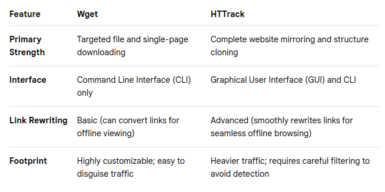

<br>
<br>

## Metagoofil
- is an open-source command-line tool designed **for extracting metadata** from public documents available on a target's website.
- **uses Google search queries to find and download specific file types, then parses their internal metadata** to help cybersecurity professionals map out an organization's network and personnel.

#### Key Uses
- **Information Gathering:** Extracting usernames, paths, and software versions hidden inside public corporate documents.
- **Network Mapping:** Discovering internal server names, local folder structures, and network paths revealed by document creation logs.
- **Social Engineering Prep:** Collecting real employee names and email addresses to design highly targeted phishing simulations.
- **Software Auditing:** Identifying outdated or vulnerable office suites used by the target organization based on document creation tags.
- **Data Leak Prevention:** Helping organizations audit their own public websites to find and remove sensitive metadata before attackers exploit it.

<br>
<br>

## Webpage Cache / History

### Wayback Machine
- is a **free, digital archive that captures and stores historical snapshots of the public internet**. In Open Source Intelligence (OSINT), it serves as a digital time machine, allowing investigators to view how websites looked weeks, months, or decades ago.
- **Access it here:** https://web.archive.org/

#### Key Uses
- **Recovering Deleted Content:** Retrieving critical information, such as scrubbed blog posts, removed social media updates, or deleted team pages.
- **Tracking Website Alterations:** Comparing different chronological snapshots to spot edited press releases, modified policies, or changed contact details.
- **Discovering Exposed Endpoints:** Scraping the archive's **CDX API** to find old URLs, forgotten configuration files, or exposed .env files containing credentials.
- **Preserving Digital Evidence:** Using the "Save Page Now" feature to lock a live webpage into a permanent archive link to counter future deletion or link rot.
- **Investigating Disinformation Networks:** Digging into historical source code to extract legacy Google Analytics trackers (UA codes), which can link multiple shell websites to a single threat actor.
- **Tracking Fraudulent Lifecycle:** Mapping out the timeline of scam domains, active e-commerce fraud, or old login portals from companies before they went out of business.

### archive ph
- works almost the same way like wayback machine
- **Access it here:** https://archive.md/

<br>
<br>

## BetaMeta
- is a specialized cybersecurity and digital forensics tool that functions as a Temporal Analysis Engine, **designed to extract and visualize hidden chronological details from websites**.
- is a platform that analyzes temporal signatures—including creation dates, archive snapshots, and SSL history—to map the lifecycle and verify the legitimacy of a URL.
- **Access it here:** https://meta.narka.io/

<br>
<br>

## dotDB
- is a specialized big data search engine and SaaS platform **designed for researching, tracking, and valuing domain names** across multiple extensions (TLDs).
- enables users to gauge market demand, monitor keyword trends, generate live website snapshots, and track domain portfolio changes. 
- **Access it here:** https://dotdb.com/

<br>
<br>
<br>

## Dark Web
**The dark web is a hidden network of websites that cannot be found by search engines and requires specialized software to access.** It is built entirely around **anonymity and privacy**, encrypting connections so that the identities and locations of both the users and the website creators remain masked.

### The Three Layers of the Internet
To truly understand the dark web, it helps to look at how the entire internet is structured, often compared to an iceberg:

- **The Surface Web (~5%):** This is the visible layer you use every day. It includes sites indexed by search engines like Google, such as news outlets, social media platforms, and online shops.

- **The Deep Web (~90–95%):** This refers to any internet content hidden behind a login wall, paywall, or encryption. It is massive and includes routine items like your personal email inbox, online banking portals, and corporate databases.

- **The Dark Web (<1%):** This is a very tiny, intentional subset of the deep web. It cannot be reached using a standard browser like Chrome or Safari, and its websites use unconventional domains (most commonly ending in `.onion` rather than `.com`).

### How It Works
- The dark web runs on **"darknets"**—overlay networks that operate on top of the standard internet but use complex encryption.
- The most popular network is called **Tor (The Onion Router)**. When a person browses via Tor, their connection is wrapped in multiple layers of encryption and bounced through a random path of servers across the globe. This "onion routing" technique strips away identifying information (like your IP address), making it incredibly difficult for anyone to track your digital footprint.

### Who Uses It?
Because it is built on dual-use technology, it attracts a diverse mix of people for both noble and criminal reasons:

- **The Illicit Side:** The anonymity naturally attracts cybercriminals. It houses underground marketplaces where bad actors buy and sell stolen data, hacked credentials, illegal substances, and malware.

- **The Legitimate Side:** It is a vital tool for privacy advocates, journalists, and whistleblowers. People living under strict, oppressive political regimes use the dark web to safely bypass internet censorship and report news without fear of government tracking. Even major platforms like the BBC or secure email providers run `.onion` mirror sites to ensure free information access globally.

Simply visiting the dark web is legal in most jurisdictions, but engaging in any illegal activity there carries heavy security and law enforcement risks.

<br>
<br>
<br>

# 8. Various Browser Plugins

## SurfSafe
- is a specialized browser **tool designed to combat fake news and misinformation** by checking online images against trusted fact-checking databases.

#### Key Features
- **Image Verification:** Instantly checks photos against over 100 trusted news and fact-checking platforms like Snopes.
- **Misinformation Detection:** Highlights altered, manipulated, or out-of-context images as you browse.
- **Real-Time Alerts:** Flags suspicious visual content directly on social media and web pages.

#### How It Works
- Right-click any image on a webpage to run a fast verification check.
- The extension reviews the image history to see where and when it previously appeared online.

<br>
<br>

## Video DownloadHelper
- is a highly popular browser extension **used to detect and download videos, audio, and images from thousands of web pages**.

#### Key Features
- **Broad Format Detection:** Automatically captures standard MP4s, streaming formats like HLS/DASH, and audio streams.
- **File Conversion:** Converts downloaded media directly into preferred configurations like MKV, MP4, or MP3.
- **Smart Naming:** Learns and applies intelligent file-naming rules to keep files organized.

#### Important Constraints
- **YouTube Restrictions:** Google's store policies block the Chrome version from downloading videos directly from YouTube. Use the Firefox or Edge variants for YouTube support.
- **Companion App Required:** Browsers restrict deep file system access and heavy processing. You must download their free, open-source companion app to unlock streaming aggregation (HLS/DASH) and format conversion.
- **Free Limitations:** Free usage handles basic video streams natively. However, if file conversion is required, the free tier inserts a QR code watermark onto the output unless a premium tier license is purchased.

<br>
<br>

## FireShot
- is a highly rated browser extension used to capture full webpage screenshots. It allows you to grab a scrolling page from top to bottom, save it locally, and export it into various file formats.

#### Key Features
- **Flexible Capturing:** Take screenshots of an entire scrolling page, just the visible area, or a specific manual selection.
- **Multiple Formats:** Save your captures as PDF, PNG, JPEG, GIF, or BMP files.
- **Hyperlink Support:** Exporting to PDF keeps web links clickable within the document.
- **Privacy-Focused:** Captures are processed locally on your machine and are not sent to external servers.
- **Multi-Tab Capture:** Automate capturing all open browser tabs at once.

<br>
<br>

## Nimbus
- is **a browser tool for taking screenshots, recording screen videos, and clipping web pages**.

#### Key Features
- Screen Capture: Take screenshots of selected areas, full web pages with scrolling, or entire browser windows.
- Video Recording: Record your screen, browser tabs, or webcam feed with audio.
- Editing & Annotations: Add arrows, text boxes, blur effects, and crop your captures before saving.
- Web Clipping: Save articles, text, images, or PDFs directly to your notes.

<br>
<br>

## User-Agent Switcher
- **allows you to change your browser's identification string** so websites think you are using a different device, operating system, or web browser.
- This is primarily used by developers to test responsive designs, bypass browser-specific restrictions, or obscure browsing habits from tracking networks.

### Top User-Agent Switcher Extensions
The most reliable, highly rated extensions available across major web stores include:

- **User-Agent Switcher and Manager:** Widely considered the best comprehensive tool. It spoofs both HTTP request headers and JavaScript navigator properties. It supports modern "Client Hints" and can set unique user-agents per browser tab or window. Available on the Chrome Web Store and Firefox Add-ons.
- **User-Agent Switcher for Chrome:** An official, straightforward tool built by Google. It lets you quickly switch profiles and set up automatic spoofing rules for specific URLs. Available on the Chrome Web Store.
- **Random User-Agent:** A privacy-focused extension that automatically cycles through different user-agent strings at defined intervals. This random behavior dilutes your browser fingerprint to combat persistent online tracking. Available on the Chrome Web Store and Firefox Add-ons.
- **User-Agent Switcher (by ntninja):** A popular, open-source choice for Firefox desktop and Android users. It features highly accurate emulation by bundling a stripped-down browser capabilities database. Available on Firefox Add-ons.

<br>
<br>

## Web Page Downloader
These extensions package an entire live website—including images, fonts, and styles—into one highly portable `.html` file.

- **SingleFile:** The undisputed gold standard for archiving. It compresses all CSS, images, and fonts directly into one webpage that works perfectly offline. It is available for Chrome, Firefox, Safari, and Edge.
- **Save Page WE:** A lightweight, excellent alternative to SingleFile that accurately captures complex elements on a page and saves them as a lone file.

<br>
<br>

## Start.me website
- is **a customizable start page** and **cloud-based bookmark manager** that organizes websites, news feeds, notes, and productivity widgets into a single dashboard.
- It **functions as a personalized browser homepage** or new tab replacement to keep web links synced across different devices.

#### Key Features
- **Bookmark Management:** Save, tag, and sort favorite URLs with drag-and-drop ease.
- **Widgets:** Add tools like weather, calendars, to-do lists, sticky notes, and RSS news feeds.
- **Cloud Sync:** Access identical layouts and saved links on any browser or device by logging into an account.
- **Collaboration:** Share specific pages or curated resource collections with team members, classmates, or the public.

<br>
<br>
<br>

# 9. Social Media

## Facebook Sock Puppet Account

### Current Steps to Take
- Dummy email (gmail, yahoo, etc.)
- Have a profile, image, activity:
    - https://datafakegenerator.com/ - for creating fake biodata
    - https://thispersondoesnotexist.com/ - for creating fake profile picture
- Only use this for OSINT

### Facebook ID
- Every facebook account has a **unique identifier**.
- You can see it by using this website: https://smallseotools.com/find-facebook-id/
- Example:

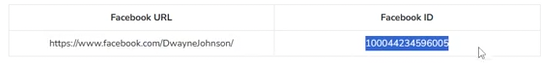

### Facebook Video Downloader
- **Access it here:** https://fdown.net/

<br>

## Twitter / X 

### Warning
Research studies and regulatory reports indicate that X (formerly Twitter) has experienced notable **increases in the presence and visibility of hate speech and unverified claims** since ownership changes in late 2022.

### Mind Map


### Search Tool
- is a **free OSINT utility that generates advanced X (Twitter) search queries** to find public information without requiring an account, enabling targeted filtering by location, keywords, and user history. 
- **Access it here:** https://www.aware-online.com/en/osint-tools/twitter-search-tool/

<br>

## Bypassing Youtube Login Requirement
Example:
- You can't view this video because you need to sign in and confirm your age: https://www.youtube.com/watch?v=aYsdfaDSdfs
- Delete the `watch?`. Then delete the `=` and replace it with `/`
- Final: https://www.youtube.com/v/aYsdfaDSdfs, then hit Enter to automatically download the video.

<br>

## Maigret
- is an advanced open-source intelligence (OSINT) tool **used to locate a person's online presence** across over 3,000 websites and social networks simultaneously **by using only their username**.
- Developed as a powerful Python-based fork of the popular Sherlock project, it automates the process of gathering a digital dossier from public platforms without requiring any API keys.

### Key Features
- **Massive Site Database:** Searches thousands of platforms, including X (Twitter), TikTok, Instagram, and Reddit.
- **Web Page Parsing:** Extracts metadata such as full names, gender, profile avatars, and locations directly from found account pages.
- **Recursive Searching:** Automatically utilizes newly discovered IDs or alternate names to launch deeper secondary searches.
- **Tor & I2P Support:** Capable of querying hidden services and deep-web forums safely.
- **Rich Reporting:** Generates structured dossiers in multiple formats, including HTML, PDF, JSON, and XMind maps.


### How Investigators Use It
- Unlike tools that merely check if a username is "taken," Maigret actively analyzes the returned pages to verify the presence of an active profile.
- Cybersecurity analysts, journalists, and forensic researchers utilize Maigret to track down bad actors, mapping an individual's digital footprint across geographic regions or platform categories by applying targeted search tags.

<br>

## Youtube Dataviewer
- One good web app is **MattW YouTube Metadata**
- Provides the exact upload timestamp (down to the second), absolute timezone tags, video thumbnail extractions, tag analyses, and localized geographic tags if provided by the uploader.
- **Access it here:** https://mattw.io/youtube-metadata/

<br>

## Profil3r
- is used to find a person's digital footprint across the internet. It searches for social media accounts, correlates email addresses, and checks for data breaches using a name or username.

### Core Functions
- **Social Media Search:** Looks up usernames or real names across popular websites and platforms like Twitter, Instagram, Facebook, and LinkedIn to find active profiles.
- **Email Correlation:** Generates and tests potential email addresses linked to the target person.
- **Data Breach Check:** Checks if the discovered email addresses have been compromised or leaked in public data breaches.
- **Report Generation:** Compiles the gathered information into a readable format, such as an HTML report.

<br>

## Bluesky
- is a decentralized microblogging social network built on the Authenticated Transfer (AT) Protocol.
- Its importance for Open Source Intelligence (OSINT) investigations lies in its open, unauthenticated architecture, permanent Decentralized Identifiers (DIDs), and public APIs that allow passive, **deep data extraction without requiring a logged-in user account**.

### Internect.info
- is a free, lightweight tool designed **to search and verify accounts, handles, and public profile metadata across the AT Protocol, including decentralized platforms like Bluesky**. It serves as an Open Source Intelligence (OSINT) utility for resolving DIDs, tracking handle changes, and inspecting public repository records. 

### OSoMeNet
- maps how information spreads and is shared across social platforms.
- The system pulls data using search APIs from Bluesky, Mastodon, TikTok, and OSoMe's historical archive.
- **Access it here:** https://osome.iu.edu/tools/osomenet/

<br>
<br>
<br>

# 10. Miscellaneous

## Maltego
- Maltego Community Edition (CE) is a free software used for open-source intelligence (OSINT) **gathering, link analysis, and data mining**. It visualizes hidden connections between data points like domain names, IP addresses, emails, and people using node graphs. 

### Core Capabilities
- **Link Analysis:** Displays relationships and degrees of separation between data entities on a visual map.
- **Automated Queries:** Runs built-in "transforms" to pull intelligence from DNS records, IP data, and search APIs.
- **Data Organization:** Uses collection nodes to group common entities and clear clutter from complex graphs. 

### Community Edition Limits
- Capped at 12 to 24 results per individual transform run, depending on the specific module version.
- Provides a baseline tier of monthly credits for accessing built-in data connectors.
- Includes standard export options like images, tabular data, and GraphML. 

<br>

## OSIRT
- OSIRT Ltd develops OSIRT iii, an advanced, locally run digital investigation platform designed for law enforcement, cybersecurity, and legal professionals to securely capture, manage, and report online evidence.
- The software maintains a defensible chain-of-custody by capturing metadata, automating case documentation, and providing features for live monitoring and mobile emulation.
- **Access it here:** https://osirt.co.uk/

<br>

## ExifTool
- is a powerful, free command-line tool **used to read, write, and edit metadata in images, videos, and other files**.
- It **handles hidden details** like camera settings, dates, and GPS locations.

### Key Features
- **Read Metadata:** Extract hidden details like camera models, shutter speeds, GPS coordinates, and creation timestamps from hundreds of file types.
- **Write and Edit:** Add, change, or fix metadata tags, such as correcting the date a photo was taken or adding copyright notices.
- **Remove Privacy Data:** Strip out sensitive personal information like GPS locations and device serial numbers before sharing files online.
- **Batch Processing:** Quickly process, organize, or rename thousands of files at once using automated scripts or simple commands.

<br>

## Canary Tokens
- is a free security service that **creates digital tripwires and honeytokens to alert you when an attacker accesses your network, files, or cloud infrastructure.**
- It generates fake credentials, trackable documents, or unique URLs that quietly notify you the moment they are triggered.
- **Access it here:** https://canarytokens.org/
- **Tip:** Shorten the URL first before sending it. Use something like: https://tinyurl.com/

### Core Features and Uses
- **Digital Tripwires:** Acts as an early warning system to catch unauthorized users during data reconnaissance or lateral movement.
- **No Cost or Sign-up:** Generates trackers instantly without requiring user account registration.
- **Alert Notifications:** Sends instant details—such as source IP addresses and timestamps—via email or webhooks when triggered.

<br>

## Bitcoin Address Lookup
- **BitcoinWhosWho.com** is a specialized cryptocurrency Open Source Intelligence (OSINT) tool and blockchain directory.
- Its primary purpose is to help users verify the identity or risk level behind Bitcoin addresses to prevent fraud and track illicit activity.
- **Access it here:** https://www.bitcoinwhoswho.com