# The Complete Graphic Design Theory Course

---

## Table of Contents

* [Color Theory](#color-theory)
    - [Common Terms to Describe the Properties of Color](#common-terms-to-describe-the-properties-of-color)
    - [Color for Digital and Print Media](#color-for-digital-and-print-media)
    - [Color Selections and Methods](#color-selections-and-methods)
    - [Color Meanings](#color-meanings)
    - [Color Harmonies](#color-harmonies)
    - [Create a Mood Board with Canva](#create-a-mood-board-with-canva)
    - [Selecting Color for a New Design](#selecting-color-for-a-new-design)
* [Typography Theory](#typography-theory)
    - [Typography in Design](#typography-in-design)
    - [Typography Anatomy](#typography-anatomy)
    - [Type Styles - Serif Fonts](#type-styles---serif-fonts)
    - [Type Styles - Sans Serif Fonts](#type-styles---sans-serif-fonts)
    - [Kerning and Spacing](#kerning-and-spacing)
    - [Type Hierarchy](#type-hierarchy)
    - [Font Pairing](#font-pairing)

---
 

## Color Theory

### Common Terms to Describe the Properties of Color

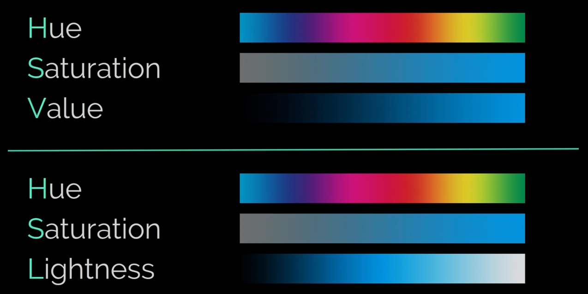

#### Hue
- It is what we call **color**.
- It is described as a color **with no values added** to it.
- It is the color in its **pure form**, with no extra white, black or grays added to that color.

#### Saturation
- The **intensity** of a color.
- **Highly Saturated** means showing the **purest form of its hue**.
- **Desaturated** means you'll only see its **grey tone**.

#### Value
- The **lightness** and **darkness** of a color.
    - **Tint** - when white is added to a color
    - **Tone** - when grey is added to a color
    - **Shade** - when black is added to a color

    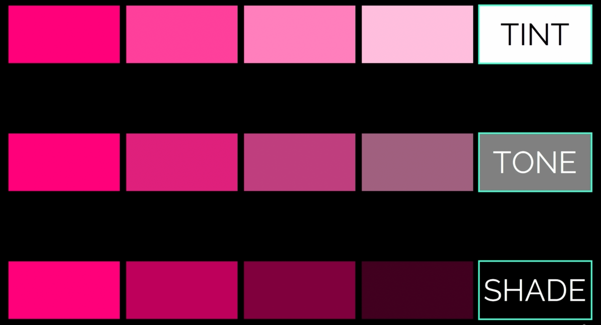

#### Contrast
- The **differences** in **hues**, **saturations**, and **values**.
- **Higher contrast** property means that the property is **further away from each other**.
- Providing **high contrast** in a design can help make the **element stand out**, while **lower contrast** helps the **element to blend in**.
    - **Hue**: High Contrast vs. Low Contrast

    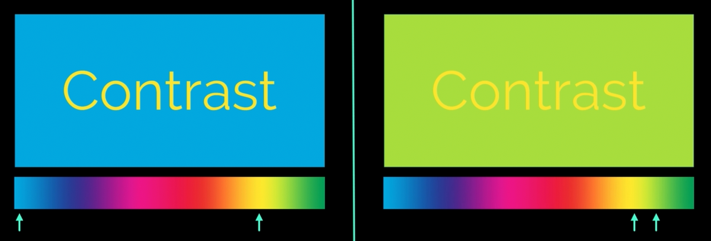

    - **Saturation**: High Contrast vs. Low Contrast

    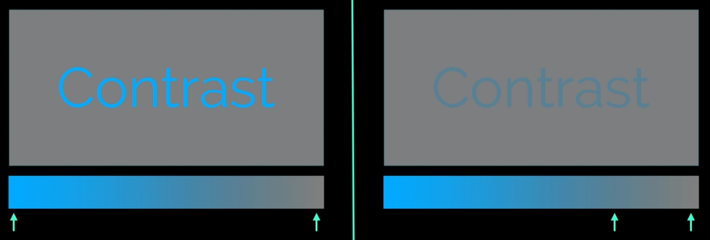

    - **Values**: High Contrast vs. Low Contrast

    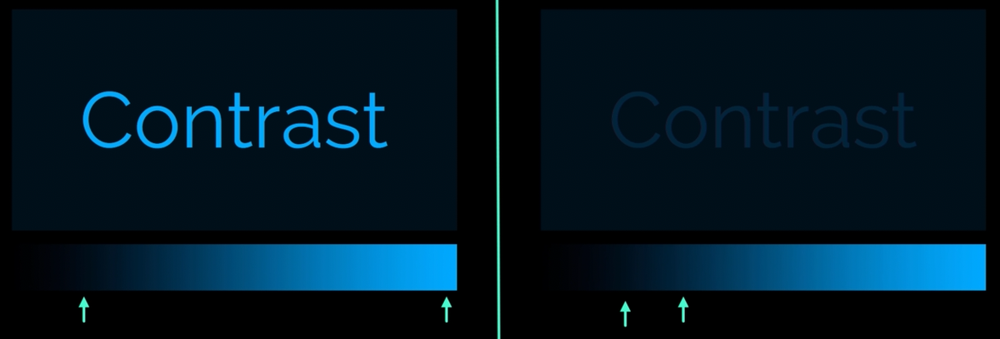

    - A **trick** that you can do when designing is to **turn your image into a greyscale image**. If you do this and the text becomes illegible, it's because there is no contrasting values and need adjusting.

    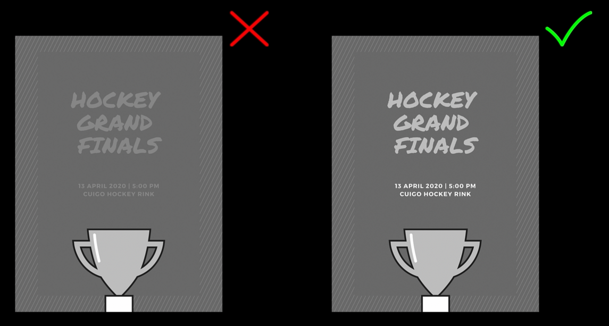

 

### Color for Digital and Print Media

#### Pixels
- Referred to **color (RGB) lights that are combined together**.

#### Resolution
- The **number of pixels in the X and Y dimensions of a display**.
- We can label the resolution of a screen or monitor by its **pixel dimensions**.
- Example: Some monitors are 1920(W) x 1080(H). Meaning it has 2,073,600 pixels total.

#### Pixel Density
- Standard measurement of Pixels Per Inch (PPI).

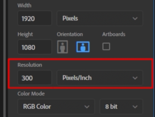

- This is the number used to say **how densely compacted the pixels are to a certain size like inches**.
- Examples:

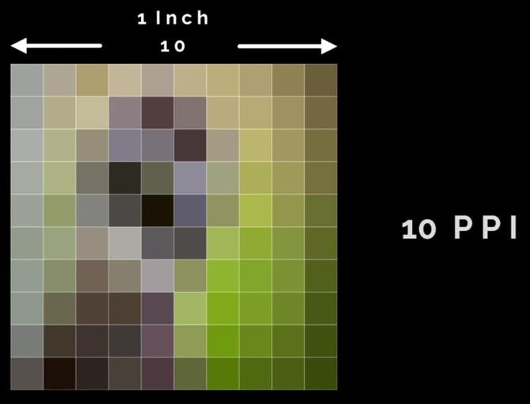

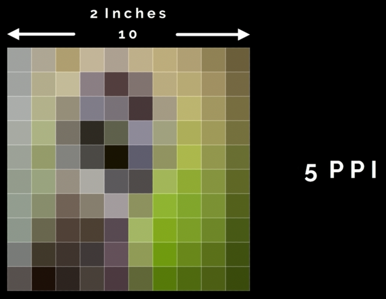

- The **more pixels per inch** you have for your image, the **smoother the image will look** because of the density of the pixels.
- Example: 1920 x 1080 looks great on a smartphone because the pixels are tightly compacted into a smaller space, but could be look pixelated on a larger screen.

#### Dots Per Inch (DPI)
- This is also exactly how print media works only it's generally called DPI or dots per inch.
- That means how many dots of pigment will be laid down per inch for your image.
- Typically you will want to have a very smooth image for print, then use a high resolution like (example) 300dpi or more, if file size is not an issue.

#### Web Design
- You generally want the lowest file size available without sacrificing quality. Because **the lower the file size the faster the website can load**.
- **Typical image resolution for web design work is 72dpi or ppi**.

#### Bit Depth
- The **amount of colors that can be stored in a channel**.
- 1 bit = 2 colors per channel (black and white), 2 bit = 4 colors per channel and so on.
- Usually you will use **8 bit (256 colors) for web design**.
- 16 bit is good for print work, and 32 bit is good for bigger prints.

 

### Color Selections and Methods

#### Color Picker
- Extract **color information** from individual **pixels**.

#### hexadecimal or hex color codes
- are 3 byte hexadecimal values that help in selecting color for things like web design. They are RGB values from zero to FF.
- Example: #FF0000 for red, #00FF00 for green, and #0000FF for blue.

#### Color Swatches 
- are samples of color.

#### Adobe Color
- https://color.adobe.com/create/color-wheel
- Use the color palette generator to create harmonious color schemes for any project.
- If you like the combination of colors from an image, you can upload this image to automatically select its colors.
    - You can search the internet for mood boards for inspiration later on in the future.

#### Pantone Matching System (PMS)
- is a **standardized numbering system** used globally in design and printing. It gives every exact shade a unique code. This ensures that a printed color looks the exact same, no matter who prints it or where in the world it is made.

#### Duotone
- **Multi-tone** prints with individual **color channels**.
- You can easily do a monotone, duotone, tritone, quadtone in Adobe Photoshop using this process:
    - Image -> Mode -> Grayscale
    - Image -> Mode -> Duotone
        - You can then select here the colors that you want or change its type to monotone, duotone, tritone, or quadtone.

#### Gradient
- A **blend** of diffrent **colors** and/or **patterns**.
- You can do this in Adobe Photoshop.
    - Go to the Layers panel.
    - Click to add an adjustment layer and click on Gradient Map.

    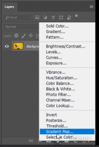

 

### Color Meanings

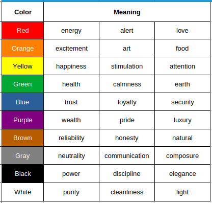

#### Red, Orange, Yellow
- These are warm colors that make you think of **fire and heat**.

#### Green, Blue, Violet
- These are cool colors that are usually associated with feelings of being **cool or cold**.

 

### Color Harmonies

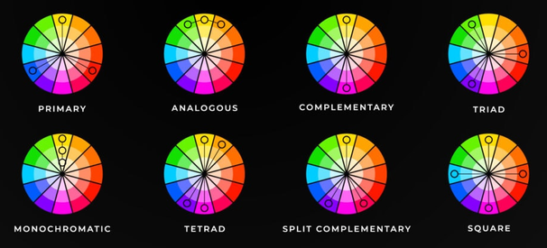

#### Monochromatic
- all the color fall within the **same color** of the color wheel.

#### Analogous
- **different hues close to the main color** on the color wheel.
- commonly found when referring to **warm and cool palettes**.

#### Complementary
- These are colors **directly across from each other**.
- These colors just work **really well together**.
- Are great for use in **all kinds of designs**.

#### Triad
- **3 colors are evenly spaced** across the color wheel

 

### Create a Mood Board with Canva

#### Canva
- https://www.canva.com/colors/color-palette-generator/
- Upload an image and it will provide color palettes.
- Click `Use palette` button to also see some examples using the generated color palette.
- To create the mood board open canva:
    - On the left, click **Elements -> Grids**

    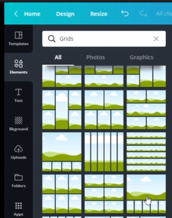

    - Click the **Uploads** on the left to upload your image.
    - Click and drag your image on the large top grid.
    - Copy the hex codes that you get from the **canva color palette generator**
    - Click the small grid on the bottom then click the small color wheel button on the top left.
        - Click the `+`
        - Paste the hex code.

##### Adobe
- https://color.adobe.com/create/color-wheel?tab=image
- Same with canva, you can upload an image and it will provide color palettes.

 

### Selecting Color for a New Design
- Get the color from the client, or
- You can pull a real image with good color combinations, and generate a color pallete from it using canva or adobe.
- Consider everthing that you learned -- color meaning, color harmony, contrast, etc.

 

---

 

## Typography Theory

### Typography in Design

#### Typography
- is the art or technique of displaying words or text in a **readable, digestible, and appealing** way.

#### Typeface
- are groups of fonts that **share a similar style or characteristic**.

#### Font
- refers to one of the many fonts that make up a whole typeface or type family.
- refers to just **one style or weight of any given font in any given typeface**.

#### Typeface Classifications
- **Serif** - are fonts that have these little tails at the end of each letter stem. **These tails make smaller type easier to read**. That's why you see like Times New Roman **appear frequently in books and smaller printed text**.

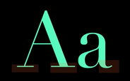

- **Sans-serif** - means **without** those little tails at the end. These make **for great headlines because of the simplicity**.

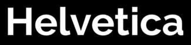

- **Script** - it has **beautiful curves and stroke weights**. They **demand attention**, and harder to read. They can look custom and authentic, giving the design a very unique look.

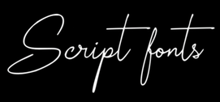

- **Decorative** - This feel more like graphics instead of type. These typefaces are **so detailed that they can stand alone** as a statement without the need for photos, so be careful **not to overuse**.

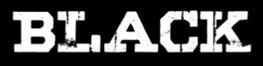

 

### Typography Anatomy

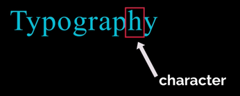

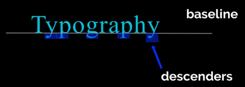

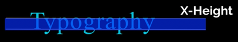

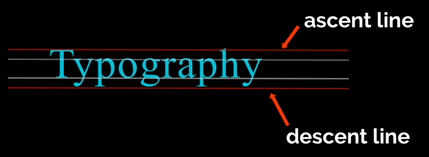

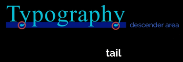

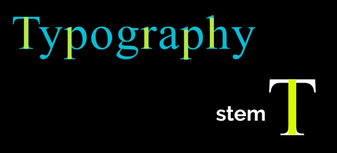

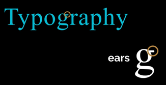

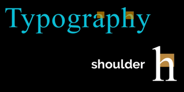

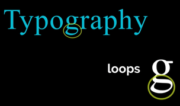

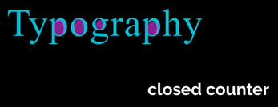

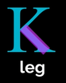

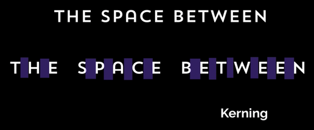

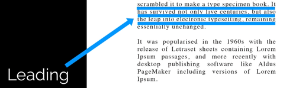

 

### Type Styles - Serif Fonts
- I suggest you keep a **special list of 20 to 30 handpicked, commonly used fonts** you can use on projects. Like the Times New Roman - is the default serif font that you see on most programs.

#### History of Serif Typefaces

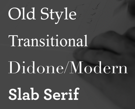

- **Old Style** - this was created a very long time ago, the type that was **easy to read for book printing**. Examples:
    - Garamond
    - Berkeley
    - Minion
    - Palatino

- **Transitional** - Tend to end with **ball terminals**. Example:
    - Times New Roman

- **Didone / Modern** - are highly stylized, that's why they're **commonly found in high end fashion brands**. They can also be good **for dramatic poster headlines** with simple solid backgrounds. Examples:
    - Didot
    - Bodoni

- **Slab Serif** - designed to **demand one's attention** on posters, like political statements. Examples:
    - Rockwell
    - Archer / Archer Pro

 

### Type Styles - Sans Serif Fonts
- tend to have a **modern, clean and sleek appearance**, but they sometimes **lack the elegance or charm** needed in a particular situation.
- are fantastic **for big, bold headlines**.
- are **great for websites and digital mediums**.
- **works well with tight spacing**.
- not good with small blocks of text.
- Examples:
    - Helvetica
    - Futura
    - Avant Garde Gothic

 

### Kerning and Spacing

#### Font Weights
- **Bold Weights** 
    - are **strong**, have high impact and **grab your attention**.
    - it highlights the most important to the viewer

- **Lighter Weights** 
    - thin weight, can feel **streamlined and modern**
    - they could be a way to highlight something by being **soft and subtle**
    - do not make them smaller as lighter fonts tend to be **hard to read at a certain size level**

- **Regular Weights**
    - are perfect for **body copy**. 

#### Spacing
- **Wide** spacing
    - can elevate the type to make it seem more **elegant and high-end**
    - **don't use it on longer phrase** or paragraph as it can be overwhelming
    - **works well** with uppercase letters
    - almost **never works** with lowercase letters

- **Tight** spacing
    - can make a design have a **sense of urgency**
    - it can make a strong type seem **cohesive and connected**

#### Kerning 
- is a term used for the **manual spacing between characters**
- is very important as not all characters in a font have perfect spacing by default

#### Alignment
- **Left** Alignment
    - Nothing beats the power of **left alignment** and anchoring text and providing a strong balance design, **especially with longer headlines and phrases**.

- **Center** Alignment
    - can be powerful when **used on shorter words and phrasing**

- **Right** Alignment
    - use this alignment the least. Use **left alignment** as much as possible. Use **right alignment** just to help balance a design.

- **No** Alignment
    - sometimes you can have a little fun and break the alignment, **as long as the words flow in order** down the page.

- **Curves, Bends** Alignment
    - Do not feel like text has to go in straight lines. They can have curves **to show movement**. Text can wrap around object to show movement.

#### Fuse Design Elements
- The cool and trendy thing to do today is have **text go behind objects** like they're weaving in and out of layers and becoming one unified element.
- But be careful to make sure they are **still readable**.

 

### Type Hierarchy

- **Headline** (Ex. MASKIPAPS)
    - Biggest. You may use a typeface that is **strong or bold or a different color**.

- **Subtitle** (Ex. INDIE FESTIVAL)
    - You may not need a subtitle for all designs, but it **helps to break up a large body of informatio**n having one or two lines stand out in the beginning.

- **Body Copy**
    - Contains the **smallest text size**. We will want to **make it short** and enticing for those who are interested in reading more.

- **Action** (Ex. WWW.RESERVETICKET.COM)
    - Usually at the end, has the most important job to **call the viewer to some sort of action**. Needs to be **bold or different color**. But not that big to not compete with the headline or subtitle.

- See example below:

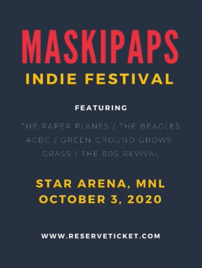

 

### Font Pairing
- Make sure the fonts you pair **have enough contrast**.
    - **Sans Serif** & **Serif** fonts work well together.
    - Pair all **small case letters** with **all caps**.
    - Pair **Script** fonts with **All bold Sans Serif** fonts.
    - Pair **Script** fonts with **Slab Serif** fonts.
    - You have to be careful pairing 2 **Script** fonts, as this is difficult.
- Use only **2-3** fonts per design.
    - A good healine font.
    - A simple body copy font.
    - And a third complementary font for variety.

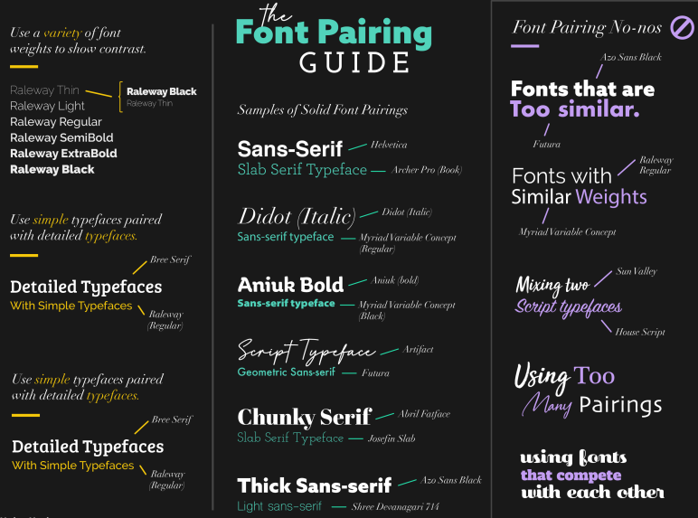

 

---

 