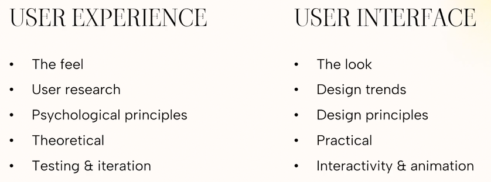

# Principles and Practices for Great UI UX Design
---
 

## Table of Contents
* [Introduction](#introduction)
    - [User Interface (UI)](#user-interface-ui)
    - [User Experience (UX)](#user-experience-ux)

 

---

 

## Introduction

### User Interface (UI)
UI is the literal **"face" of a website or app**. It handles everything a user sees, hears, or clicks.

- **Visuals:** Typography, color schemes, graphics, and images.
- **Interactivity:** Buttons, scrolling effects, animations, and form dropdowns.
- **Goal:** To make the interface visually beautiful, clear, and brand-consistent.

### User Experience (UX)
UX is the **structural blueprint and internal framework** of the product. It encompasses a person's entire experience from start to finish.

- **Research:** Mapping user needs, analyzing behaviors, and testing logical flows.
- **Structure:** Wireframes, information layout, and step-by-step navigation.
- **Goal:** To make the application intuitive, efficient, accessible, and frustration-free.

 

---

 
